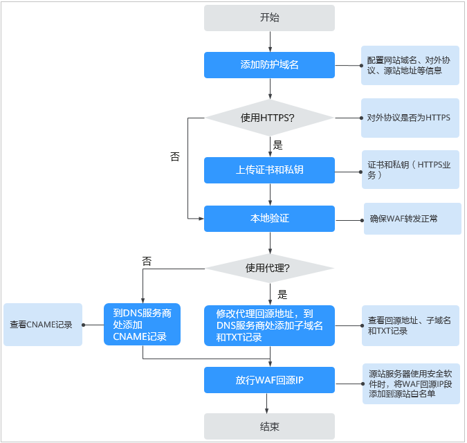
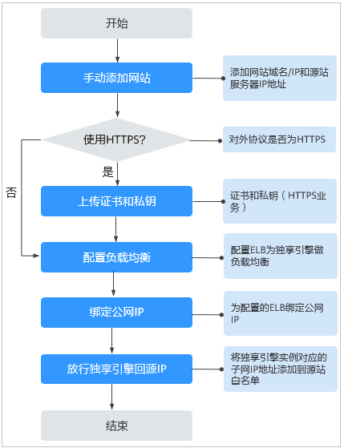

# WAF使用概览

开通Web应用防火墙（WAF）服务后并将您的网站域名接入WAF，使网站的访问流量全部流转到WAF进行监控防护。

Web应用防火墙的使用概览如[表1](#table186068221358)所示。

**表 1**  Web应用防火墙的使用概览

<table><thead align="left"><tr id="row760782211359"><th class="cellrowborder" valign="top" width="29.03%" id="mcps1.2.3.1.1">
子流程

</th>
<th class="cellrowborder" valign="top" width="70.97%" id="mcps1.2.3.1.2">
说明

</th>
</tr>
</thead>
<tbody><tr id="row181711555123513"><td class="cellrowborder" valign="top" width="29.03%" headers="mcps1.2.3.1.1 ">
开通WAF

</td>
<td class="cellrowborder" valign="top" width="70.97%" headers="mcps1.2.3.1.2 ">
支持包年包月（云模式）和按需计费（独享模式）方式开通WAF。

详细操作请参见<a href="开通WAF.md">开通WAF</a>。

</td>
</tr>
<tr id="row837775104313"><td class="cellrowborder" valign="top" width="29.03%" headers="mcps1.2.3.1.1 ">
添加防护网站

</td>
<td class="cellrowborder" valign="top" width="70.97%" headers="mcps1.2.3.1.2 ">
添加需要防护的网站。

<ul id="ul19732161718483"><li>云模式：详细操作请参见<a href="添加防护域名.md">添加防护域名</a>。</li><li>独享模式：详细操作请参见<a href="添加防护网站.md">添加防护网站</a>。</li></ul>
</td>
</tr>
<tr id="row460742212359"><td class="cellrowborder" valign="top" width="29.03%" headers="mcps1.2.3.1.1 ">
开启WAF防护

</td>
<td class="cellrowborder" valign="top" width="70.97%" headers="mcps1.2.3.1.2 ">
添加防护域名后，可开启WAF防护，保护网站业务安全稳定。

 说明： 
<ul id="ul697716015340"><li>WAF引擎不是运行在客户的Web服务器上的，所以对客户的Web服务器的资源性能没有影响。</li><li>接入WAF之后，根据请求页面的大小和数量，会有几十毫秒的延迟。</li></ul>

</td>
</tr>
<tr id="row1960762215351"><td class="cellrowborder" valign="top" width="29.03%" headers="mcps1.2.3.1.1 ">
配置自定义规则

</td>
<td class="cellrowborder" valign="top" width="70.97%" headers="mcps1.2.3.1.2 ">
WAF除了内置的防护规则外，还提供了丰富全面的自定义防护配置规则，全方位的防护您的网站。详细操作请参见<a href="配置防护规则.md">配置防护规则</a>。

</td>
</tr>
<tr id="row16914191884019"><td class="cellrowborder" valign="top" width="29.03%" headers="mcps1.2.3.1.1 ">
开启告警通知

</td>
<td class="cellrowborder" valign="top" width="70.97%" headers="mcps1.2.3.1.2 ">
开启告警通知后，用户可以第一时间接收被拦截和仅记录的攻击日志。详细操作请参见<a href="开启告警通知.md">开启告警通知</a>。

</td>
</tr>
<tr id="row758655211510"><td class="cellrowborder" valign="top" width="29.03%" headers="mcps1.2.3.1.1 ">
处理误报事件

</td>
<td class="cellrowborder" valign="top" width="70.97%" headers="mcps1.2.3.1.2 ">
WAF拦截或者记录的攻击事件为误报时，可对误报进行屏蔽处理。详细操作请参见<a href="处理误报事件.md">处理误报事件</a>。

</td>
</tr>
<tr id="row1999341519405"><td class="cellrowborder" valign="top" width="29.03%" headers="mcps1.2.3.1.1 ">
安全总览

</td>
<td class="cellrowborder" valign="top" width="70.97%" headers="mcps1.2.3.1.2 ">
可查看到昨天、今天、3天、7天或者30天范围内的访问与攻击统计次数、攻击分布、受攻击域名 TOP10、攻击源IP TOP10和受攻击URL TOP10的次数。详细操作请参见<a href="安全总览.md">安全总览</a>。

</td>
</tr>
</tbody>
</table>

网站接入WAF的操作流程图如[图1](#fig11714343123618)和[图2](#fig188812509288)所示。

**图 1**  网站接入WAF的操作流程图-云模式  

**图 2**  网站接入WAF的操作流程图-独享模式  

