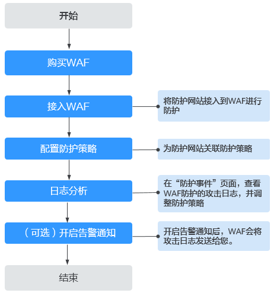

# WAF操作指南

开通Web应用防火墙（WAF）服务后并将您的网站域名接入WAF，使网站的访问流量全部流转到WAF进行防护。

## 使用流程

相关流程如[图1](#fig107710194117)，具体说明如[表1](#table19118111420519)所示。

**图 1**  WAF使用流程  

**表 1**  WAF使用流程说明

<table><thead align="left"><tr id="row191192141459"><th class="cellrowborder" valign="top" width="25.979999999999997%" id="mcps1.2.3.1.1">
操作

</th>
<th class="cellrowborder" valign="top" width="74.02%" id="mcps1.2.3.1.2">
说明

</th>
</tr>
</thead>
<tbody><tr id="row811915141959"><td class="cellrowborder" valign="top" width="25.979999999999997%" headers="mcps1.2.3.1.1 ">
<a href="购买WAF.md">购买WAF</a>

</td>
<td class="cellrowborder" valign="top" width="74.02%" headers="mcps1.2.3.1.2 ">
云模式支持包年/包月或按需计费方式开通，独享模式支持按需计费方式开通。

 须知： 
<ul id="ul10277126131319"><li>ELB模式需要<a href="https://support.huaweicloud.com/usermanual-ticket/zh-cn_topic_0127038618.html" target="_blank" rel="noopener noreferrer">提交工单</a>申请开通后才能使用，购买云模式标准版及以上版本后，可同时使用ELB模式。</li><li>WAF的API接口目前是免费支持调用，暂不收费。</li></ul>

</td>
</tr>
<tr id="row171193141051"><td class="cellrowborder" valign="top" width="25.979999999999997%" headers="mcps1.2.3.1.1 ">
<a href="网站设置.md">接入WAF</a>

</td>
<td class="cellrowborder" valign="top" width="74.02%" headers="mcps1.2.3.1.2 ">
添加需要防护的网站，WAF保护网站业务安全稳定。

<ul id="ul1895920115151"><li>云模式：详细操作请参见<a href="步骤一-添加防护域名（云模式）.md">网站接入（云模式）</a>。</li><li>独享模式：详细操作请参见<a href="步骤一-添加防护网站（独享模式）.md">网站接入（独享模式）</a>。</li><li>ELB模式：详细操作请参见<a href="添加防护网站（ELB模式）.md">网站接入（ELB模式）</a>。</li></ul>

 说明： 
<ul id="ul1764161013179"><li>WAF引擎不是运行在客户的Web服务器上的，所以对客户的Web服务器的资源性能没有影响。</li><li>接入WAF之后，根据请求页面的大小和数量，会有几十毫秒的延迟。</li></ul>

</td>
</tr>
<tr id="row17119141415513"><td class="cellrowborder" valign="top" width="25.979999999999997%" headers="mcps1.2.3.1.1 ">
<a href="配置防护策略.md">配置防护策略</a>

</td>
<td class="cellrowborder" valign="top" width="74.02%" headers="mcps1.2.3.1.2 ">
防护策略是多种防护规则的合集，用于配置和管理Web基础防护、黑白名单、精准访问防护等防护规则，一条防护策略可以适用于多个防护域名，但一个防护域名只能绑定一个防护策略。

</td>
</tr>
<tr id="row13119714754"><td class="cellrowborder" valign="top" width="25.979999999999997%" headers="mcps1.2.3.1.1 ">
<a href="管理防护事件.md">日志分析</a>

</td>
<td class="cellrowborder" valign="top" width="74.02%" headers="mcps1.2.3.1.2 ">
Web应用防火墙将拦截或者仅记录攻击事件记录在“防护事件”页面，通过查看并分析防护日志，对网站的防护策略进行调整，也可以对误报时间进行屏蔽。

</td>
</tr>
<tr id="row1442213518183"><td class="cellrowborder" valign="top" width="25.979999999999997%" headers="mcps1.2.3.1.1 ">
<a href="开启告警通知.md">（可选）开启告警通知</a>

</td>
<td class="cellrowborder" valign="top" width="74.02%" headers="mcps1.2.3.1.2 ">
开启告警通知后，用户可以第一时间接收被拦截和仅记录的攻击日志。

同时，您也可以配置证书到期通知，证书即将到期时，WAF将通过用户设置的接收通知方式（例如邮件或短信）通知用户。

</td>
</tr>
</tbody>
</table>

## 配套功能

按照[使用流程](#section47661922219)完成网站配置后，您也可以使用以下功能增强网站的安全性能。

**表 2**  配套功能

<table><thead align="left"><tr id="row13242124102719"><th class="cellrowborder" valign="top" width="33.160000000000004%" id="mcps1.2.3.1.1">
功能

</th>
<th class="cellrowborder" valign="top" width="66.84%" id="mcps1.2.3.1.2">
说明

</th>
</tr>
</thead>
<tbody><tr id="row931314355567"><td class="cellrowborder" valign="top" width="33.160000000000004%" headers="mcps1.2.3.1.1 ">
<a href="配置内容安全检测.md">配置内容安全检测服务</a>

</td>
<td class="cellrowborder" valign="top" width="66.84%" headers="mcps1.2.3.1.2 ">
Web应用防火墙提供内容安全检测服务，基于丰富的违规样例库和内容审核专家经验，通过机器审核加人工审核结合的方式，帮助您准确检测出Web网站和新媒体平台上的关于涉黄、涉赌、涉毒、暴恐、涉政、惊悚、违禁广告等敏感违规内容，并提供文本内容纠错审校（错别字、生僻字、语法表述不当等有违准确性内容）。并提供专业检测报告助您自纠自查，降低内容违规风险。

</td>
</tr>
<tr id="row16591562345"><td class="cellrowborder" valign="top" width="33.160000000000004%" headers="mcps1.2.3.1.1 ">
<a href="安全总览.md">安全总览</a>

</td>
<td class="cellrowborder" valign="top" width="66.84%" headers="mcps1.2.3.1.2 ">
可查看到昨天、今天、3天、7天或者30天范围内的防护数据。

</td>
</tr>
<tr id="row168671532193514"><td class="cellrowborder" valign="top" width="33.160000000000004%" headers="mcps1.2.3.1.1 ">
<a href="配置安全报告.md">配置安全报告</a>

</td>
<td class="cellrowborder" valign="top" width="66.84%" headers="mcps1.2.3.1.2 ">
WAF可根据您创建的日志报告模板，生成安全日报、周报、月报、或者自定义安全报告统计的时间范围内的报告，并将报告在您设置的报告发送时间段以您配置的接收方式发送给您。

</td>
</tr>
<tr id="row82891544277"><td class="cellrowborder" valign="top" width="33.160000000000004%" headers="mcps1.2.3.1.1 ">
<a href="配置PCI-DSS-3DS合规与TLS.md">配置PCI DSS/3DS合规与TLS配置TLS最低版本和加密套件</a>

</td>
<td class="cellrowborder" valign="top" width="66.84%" headers="mcps1.2.3.1.2 ">
WAF默认配置的最低TLS版本为TLS v1.0，加密套件为加密套件1，为了确保网站安全，建议您将网站的最低TLS版本和TLS加密套件配置为安全性更高TLS版本和加密套件。

</td>
</tr>
<tr id="row7289174162713"><td class="cellrowborder" valign="top" width="33.160000000000004%" headers="mcps1.2.3.1.1 ">
<a href="开启IPv6防护.md">开启IPv6防护</a>

</td>
<td class="cellrowborder" valign="top" width="66.84%" headers="mcps1.2.3.1.2 ">
开启IPv6防护后，WAF将为域名分配IPv6的接入地址，WAF直接通过IPv6地址访问源站。

</td>
</tr>
<tr id="row1128974162714"><td class="cellrowborder" valign="top" width="33.160000000000004%" headers="mcps1.2.3.1.1 ">
<a href="开启HTTP2协议.md">开启HTTP2协议</a>

</td>
<td class="cellrowborder" valign="top" width="66.84%" headers="mcps1.2.3.1.2 ">
HTTP2协议仅适用于客户端到WAF之间的访问，且“对外协议”必须包含HTTPS才能支持使用。

</td>
</tr>
<tr id="row1028917492711"><td class="cellrowborder" valign="top" width="33.160000000000004%" headers="mcps1.2.3.1.1 ">
<a href="配置WAF到网站服务器的连接超时时间.md">配置网站连接超时时间</a>

</td>
<td class="cellrowborder" valign="top" width="66.84%" headers="mcps1.2.3.1.2 "><ul id="ul692755013585"><li>浏览器到WAF引擎的连接超时时长默认是120秒，该值取决于浏览器的配置，该值在WAF界面不可以手动设置。</li><li>WAF到客户源站的连接超时时长默认为60秒，该值可以在WAF界面手动设置。</li></ul>
</td>
</tr>
<tr id="row1428913417271"><td class="cellrowborder" valign="top" width="33.160000000000004%" headers="mcps1.2.3.1.1 ">
<a href="开启连接保护.md">配置连接保护</a>

</td>
<td class="cellrowborder" valign="top" width="66.84%" headers="mcps1.2.3.1.2 ">
网站接入WAF防护之后，若您访问网站时出现大量的502 Bad Gateway，504 Gateway Timeout错误或者等待处理的请求，为了保护源站的安全，可使用WAF的宕机保护和连接保护功能。当502/504请求数量或读等待URL请求数量以及占比阈值达到您设置的值时，将触发WAF熔断功能开关，实现宕机保护和读等待URL请求保护。

</td>
</tr>
<tr id="row42891546274"><td class="cellrowborder" valign="top" width="33.160000000000004%" headers="mcps1.2.3.1.1 ">
<a href="配置攻击惩罚的流量标识.md">配置攻击惩罚的流量标识</a>

</td>
<td class="cellrowborder" valign="top" width="66.84%" headers="mcps1.2.3.1.2 ">
WAF根据配置的流量标识识别客户端IP、Session或User标记，以分别实现IP、Cookie或Params恶意请求的攻击惩罚功能。

</td>
</tr>
<tr id="row141271731183519"><td class="cellrowborder" valign="top" width="33.160000000000004%" headers="mcps1.2.3.1.1 ">
<a href="修改拦截返回页面.md">修改拦截返回页面</a>

</td>
<td class="cellrowborder" valign="top" width="66.84%" headers="mcps1.2.3.1.2 ">
当访问者触发WAF拦截时，默认返回WAF“系统默认”的拦截返回页面，您也可以根据自己的需要，配置“自定义”或者“重定向”的拦截返回页面。

</td>
</tr>
<tr id="row0128193119351"><td class="cellrowborder" valign="top" width="33.160000000000004%" headers="mcps1.2.3.1.1 ">
<a href="配置Header字段转发.md">配置Header字段转发</a>

</td>
<td class="cellrowborder" valign="top" width="66.84%" headers="mcps1.2.3.1.2 ">
如果您想通过WAF添加额外的Header头部信息，例如$request_id让整个链路的请求都可以关联起来。可参考本章节配置字段转发，WAF会将添加的字段插到Header中，转发给源站。配置的Key值不能跟nginx原生字段重复。

</td>
</tr>
<tr id="row4128173112351"><td class="cellrowborder" valign="top" width="33.160000000000004%" headers="mcps1.2.3.1.1 ">
<a href="管理证书.md">管理证书</a>

</td>
<td class="cellrowborder" valign="top" width="66.84%" headers="mcps1.2.3.1.2 ">
将证书上传到WAF，添加防护网站时可直接选择上传到WAF的证书。

</td>
</tr>
<tr id="row115136352355"><td class="cellrowborder" valign="top" width="33.160000000000004%" headers="mcps1.2.3.1.1 ">
<a href="管理黑白名单IP地址组.md">管理黑白名单IP地址组</a>

</td>
<td class="cellrowborder" valign="top" width="66.84%" headers="mcps1.2.3.1.2 ">
IP地址组集中管理IP地址或网段，被黑白名单规则引用时可以批量设置IP/IP地址段。

</td>
</tr>
<tr id="row15514153516351"><td class="cellrowborder" valign="top" width="33.160000000000004%" headers="mcps1.2.3.1.1 ">
<a href="管理独享引擎.md">管理独享引擎</a>

</td>
<td class="cellrowborder" valign="top" width="66.84%" headers="mcps1.2.3.1.2 ">
创建WAF独享引擎实例后，您可以查看实例信息、查看实例的监控信息、升级实例版本以及删除实例。

</td>
</tr>
<tr id="row13280203614409"><td class="cellrowborder" valign="top" width="33.160000000000004%" headers="mcps1.2.3.1.1 ">
<a href="查看产品信息.md">查看产品信息</a>

</td>
<td class="cellrowborder" valign="top" width="66.84%" headers="mcps1.2.3.1.2 ">
您可以在产品信息界面查看WAF产品信息，包括购买的WAF版本、域名规格等信息。

</td>
</tr>
</tbody>
</table>

