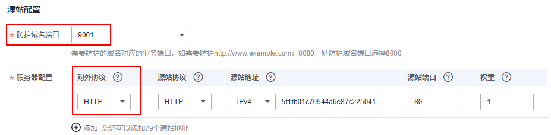

# WAF支持的端口范围

Web应用防火墙（Web Application Firewall，简称WAF）支持防护标准端口和非标端口。您在网站接入配置中添加防护网站对应的业务端口，WAF将通过您设置的业务端口为网站提供流量的接入与转发服务。本文介绍WAF支持防护的标准端口和非标端口。

例如，如[WAF支持的端口范围](WAF支持的端口范围.md)中，云模式标准版及以上版本、独享模式的HTTP协议支持防护9001端口，如果您需要防护网站的9001业务端口，则需要购买云模式标准版及以上版本中任一版本或者独享模式，且在[步骤一：添加防护域名（云模式）](步骤一-添加防护域名（云模式）.md)中，配置如[WAF支持的端口范围](WAF支持的端口范围.md)所示。

**图 1**  端口配置  

> **须知：** 
>不同Region支持的端口范围略有差异，以实际的支持范围为准。
>云模式的专业版和铂金版支持定制非标准端口，您可以[提交工单](https://support.huaweicloud.com/usermanual-ticket/zh-cn_topic_0127038618.html)申请开通定制的非标准端口。

## 标准端口

WAF支持防护如下标准端口：

-   HTTP协议端口：80
-   HTTPS协议端口：443

## 云模式支持防护的非标端口

云模式支持的非标端口是由WAF指定的任意非标端口，而不是您业务中的任意一个自定义非标端口。不同版本的WAF支持的非标准端口范围有所不同。

**表 1**  云模式支持的非标端口

<table><thead align="left"><tr id="row1231616674019"><th class="cellrowborder" rowspan="2" valign="top" id="mcps1.2.4.1.1">
服务版本

</th>
<th class="cellrowborder" colspan="2" valign="top" id="mcps1.2.4.1.2">
支持的非标端口范围

</th>
</tr>
<tr id="zh-cn_topic_0110861244_row13318184291118"><th class="cellrowborder" valign="top" id="mcps1.2.4.2.1">
HTTP协议

</th>
<th class="cellrowborder" valign="top" id="mcps1.2.4.2.2">
HTTPS协议

</th>
</tr>
</thead>
<tbody><tr id="zh-cn_topic_0110861244_row129411938101817"><td class="cellrowborder" valign="top" width="19.451945194519453%" headers="mcps1.2.4.1.1 mcps1.2.4.2.1 ">
入门版

</td>
<td class="cellrowborder" valign="top" width="43.694369436943695%" headers="mcps1.2.4.1.2 mcps1.2.4.2.2 ">
不支持

</td>
<td class="cellrowborder" valign="top" width="36.85368536853685%" headers="mcps1.2.4.1.2 ">
不支持

</td>
</tr>
<tr id="zh-cn_topic_0110861244_row163194421116"><td class="cellrowborder" valign="top" width="19.451945194519453%" headers="mcps1.2.4.1.1 mcps1.2.4.2.1 ">
标准版

</td>
<td class="cellrowborder" valign="top" width="43.694369436943695%" headers="mcps1.2.4.1.2 mcps1.2.4.2.2 ">
81, 82, 83, 84, 86, 87, 88, 89, 800, 808, 5000, 7009, 8000, 8001, 8002, 8003, 8008, 8009, 8010, 8011, 8012, 8013, 8014, 8015, 8016, 8017, 8020, 8021, 8022, 8025, 8026, 8070, 8077, 8078, 8080, 8085, 8086, 8087, 8088, 8089, 8090, 8091, 8092, 8093, 8094, 8095, 8096, 8097, 8098, 8106, 8118, 8181, 8334, 8336, 8686, 8800, 8888, 8889, 8999, 9001

</td>
<td class="cellrowborder" valign="top" width="36.85368536853685%" headers="mcps1.2.4.1.2 ">
4443, 5048, 5049, 5443, 6443, 7072, 7073, 7443, 8033, 8081, 8082, 8083, 8084, 8443, 8712, 8803, 8804, 8805, 8843, 9443, 8553, 8663, 9553, 9663, 18000, 18110, 18381, 18443, 18980, 19000, 28443

</td>
</tr>
<tr id="zh-cn_topic_0110861244_row1531904261114"><td class="cellrowborder" valign="top" width="19.451945194519453%" headers="mcps1.2.4.1.1 mcps1.2.4.2.1 ">
专业版

</td>
<td class="cellrowborder" valign="top" width="43.694369436943695%" headers="mcps1.2.4.1.2 mcps1.2.4.2.2 ">
81, 82, 83, 84, 85, 86, 87, 88, 89, 97, 133, 134, 140, 141, 144, 151, 800, 808, 881, 1000, 1090, 1135, 1139, 1688, 3128, 3333, 3501, 3601, 4444, 5000, 5001, 5080, 55222, 5555, 5601, 6001,  6666, 6699, 6788, 6789, 6842, 6868,  6969, 7000, 7001, 7002, 7003, 7004, 7005, 7006, 7009, 7010, 7011, 7012, 7013, 7014, 7015, 7016, 7018, 7019, 7020, 7021, 7022, 7023, 7024, 7025, 7026, 7070, 7080, 77081, 7082, 7083, 7088, 7097, 7510, 7777, 7800, 7979, 8000, 8001, 8002, 8003, 8004, 8007, 8008, 8009, 8010, 8011, 8012, 8013, 8014, 8015, 8016, 8017, 8020, 8021, 8022, 8024, 8025, 8026, 8070, 8077, 8078, 8080, 8085, 8086, 8087, 8088, 8089, 8090, 8091, 8092, 8093, 8094, 8095, 8096, 8097, 8098, 8106, 8118, 8181, 8182, 8232, 8334, 8336, 8686, 8800, 8888, 8889, 8989, 8999, 9000, 9001, 9002, 9003, 9007, 9020, 9021, 9022, 9023, 9024, 9025, 9026, 9027, 9028, 9029, 9037, 9050, 9077, 9080, 9081, 9082, 9083, 9084, 9085, 9086, 9087, 9088, 9089, 9099, 9180, 9200, 9201, 9205, 9207, 9208, 9209, 9210, 9211, 9212, 9213, 9802, 9898, 9908, 9916, 9918, 9919, 9928, 9929, 9939, 9945, 9770,  10000, 10001, 10080, 10087, 11000, 12601, 13000, 14000, 18080, 18180, 18280, 19101, 19501, 21028, 23333, 27777, 28080, 30002, 30086, 33332, 33334, 33702, 40010, 48299, 48800, 52725, 52726, 60008, 60010

</td>
<td class="cellrowborder" valign="top" width="36.85368536853685%" headers="mcps1.2.4.1.2 ">
447, 882, 1818, 4006, 4430, 4443, 5048, 5049, 5100, 5443, 6443, 7072, 7073, 7443, 8033, 8043, 8081, 8082, 8083, 8084, 8211, 8221, 8224, 8231, 8243, 8244, 8281, 8443, 8445, 8553, 8663,  8712, 8750, 8803, 8804, 8805, 8810, 8815, 8817, 8836, 8838, 8840, 8842, 8843, 9005, 9053, 9090, 9443, 9553, 9663, 9681, 9682, 9999, 10002, 10300, 10301, 11001, 11003, 13001, 13003, 13080, 14003, 14443, 17618, 17718, 17818, 18000, 18001, 18010, 18110, 18381, 18443, 18980, 19000, 20000, 28443,  60009

</td>
</tr>
<tr id="zh-cn_topic_0110861244_row93200424119"><td class="cellrowborder" valign="top" width="19.451945194519453%" headers="mcps1.2.4.1.1 mcps1.2.4.2.1 ">
铂金版

</td>
<td class="cellrowborder" valign="top" width="43.694369436943695%" headers="mcps1.2.4.1.2 mcps1.2.4.2.2 ">
81, 82, 83, 84, 85, 86, 87, 88, 89, 97, 133, 134, 140, 141, 144, 151, 800, 808, 881, 1000, 1090, 1135, 1139, 1688, 3128, 3333, 3501, 3601, 4444, 5000, 5001, 5080, 5222, 5555, 5601, 6001, 6666, 6699, 6788, 6789, 6842, 6868, 6969, 7000, 7001, 7002, 7003, 7004, 7005, 7006, 7009, 7010, 7011, 7012, 7013, 7014, 7015, 7016, 7018, 7019, 7020, 7021, 7022, 7023, 7024, 7025, 7026, 7070, 7081, 7082, 7083, 7088, 7097, 7510, 7777, 7800, 7979, 8000, 8001, 8002, 8003, 8004, 8006, 8007, 8008, 8009, 8010, 8011, 8012, 8013, 8014, 8015, 8016, 8017, 8020, 8021, 8022, 8024, 8025, 8026,  8070, 8077, 8078, 8080, 8085, 8086, 8087, 8088, 8089, 8090, 8091, 8092, 8093, 8094, 8095, 8096, 8097, 8098, 8106, 8118, 8181, 8182, 8232, 8334, 8336, 8686, 8800,  8888, 8889, 8899, 8989, 8999, 9000, 9001, 9002, 9003, 9007, 9020, 9021, 9022, 9023, 9024, 9025, 9026, 9027, 9028, 9029, 9037, 9050, 9077, 9080, 9081, 9082, 9099, 9180, 9200, 9201, 9205, 9207, 9208, 9209, 9210, 9211, 9212, 9213, 9770, 9802, 9898, 9908, 9916, 9918, 9919, 9928, 9929, 9939, 9945, 10000, 10001, 10080, 10087, 11000, 12601, 13000, 14000, 18080, 18180, 18280, 23333, 27777, 28080, 30086, 33702, 48299, 48800

</td>
<td class="cellrowborder" valign="top" width="36.85368536853685%" headers="mcps1.2.4.1.2 ">
447, 882, 1818, 4006, 4430, 4443, 5048, 5049, 5443, 6443, 7072, 7073, 7443, 8033, 8043, 8081, 8082, 8083, 8084, 8211, 8221, 8224, 8231, 8243, 8244, 8281, 8443, 8445, 8553, 8663, 8712, 8750, 8803, 8804, 8805, 8810, 8815, 8817, 8836, 8838, 8840, 8842, 8843, 8848,  8910, 8920, 8950, 9005, 9053, 9090, 9182, 9184, 9190, 9443, 9553, 9663, 9681, 9682, 9999, 10002,10300, 10301, 11001, 11003, 13001, 13003, 13080, 14003, 17618, 17718, 17818, 18000, 18001, 18010, 18110, 18381, 18443, 18980, 19000, 28443, 60009

</td>
</tr>
</tbody>
</table>

## 独享模式支持防护的非标端口

使用独享模式接入WAF时，支持防护[表2](#table10923203144616)中的任意非标端口。

**表 2**  独享模式支持的非标端口

<table><thead align="left"><tr id="row15924734461"><th class="cellrowborder" valign="top" width="54.25%" id="mcps1.2.3.1.1">
HTTP协议

</th>
<th class="cellrowborder" valign="top" width="45.75%" id="mcps1.2.3.1.2">
HTTPS协议

</th>
</tr>
</thead>
<tbody><tr id="row2926183184616"><td class="cellrowborder" valign="top" width="54.25%" headers="mcps1.2.3.1.1 ">
81, 82, 83, 84, 86, 87, 88, 89, 97, 800, 808, 1000, 1090, 3128, 3333, 3501, 3601, 4444, 5000, 5080, 5222, 5555, 5601, 6001, 6666, 6699, 6788, 6789, 6842, 6868, 6969, 7000, 7001, 7002, 7003, 7004, 7005, 7006, 7009, 7010, 7011, 7012, 7013, 7014, 7015, 7016, 7018, 7019, 7020, 7021, 7022, 7023, 7024, 7025, 7026, 7070, 7080, 7081, 7082, 7083, 7088, 7097, 7510, 7777, 7800, 7979, 8000, 8001, 8002, 8003, 8008, 8009, 8010, 8011, 8012, 8013, 8014, 8015, 8016, 8017, 8020, 8021, 8022, 8025, 8026, 8070, 8077, 8078, 8080, 8085, 8086, 8087, 8088, 8089, 8090, 8091, 8092, 8093, 8094, 8095, 8096, 8097, 8098, 8106, 8118, 8181, 8334, 8336, 8686, 8800, 8888, 8889, 8989, 8999, 9000, 9001, 9002, 9003, 9021, 9023, 9027, 9037, 9080, 9081, 9082, 9083, 9084, 9085, 9086, 9087, 9088, 9089, 9180, 9200, 9201, 9205, 9207, 9208, 9209, 9210, 9211, 9212, 9213, 9770, 9802, 9945, 9898, 9908, 9916, 9918, 9919, 9928, 9929, 9939, 10000, 10001, 10080, 12601, 19101, 19501, 19998, 21028, 28080, 30002, 33332, 33334, 33702, 40010, 48800, 52725, 52726, 60008, 60010

</td>
<td class="cellrowborder" valign="top" width="45.75%" headers="mcps1.2.3.1.2 ">
4443, 5443, 6443, 7072, 7073, 7443, 8033, 8081, 8082, 8083, 8084, 8443, 8445, 8553, 8663, 8712, 8750, 8803, 8804, 8805, 8843, 9443, 9553, 9663, 9999, 18000, 18010, 18110, 18381, 18443, 18980, 19000, 28443

</td>
</tr>
</tbody>
</table>

