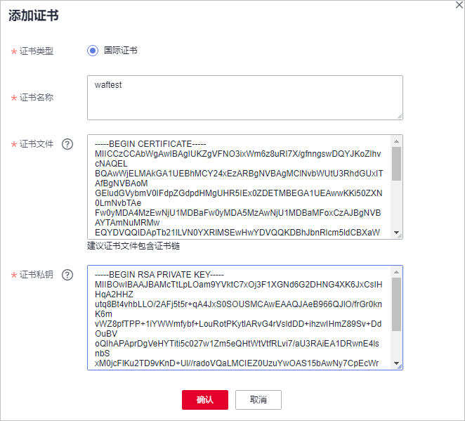

# 上传证书

当防护网站的部署模式为“云模式“或“独享模式“且“对外协议“为“HTTPS“时，您需要选择证书使证书绑定到防护网站。

将证书上传到WAF，添加防护网站时可直接选择上传到WAF的证书。

> **说明：** 
>如果您已开通企业项目，您可以在“企业项目“下拉列表中选择您所在的企业项目，为该企业项目上传证书。

## 前提条件

已获取证书文件和证书私钥信息。

## 规格限制

WAF支持上传的证书套数和WAF支持防护的域名的个数相同。例如，购买了标准版WAF（支持防护10个域名）、1个独享版WAF（支持防护2,000个域名）和域名扩展包（20个域名），WAF可以防护2,030个域名，则WAF支持上传2,030套证书。

## 约束条件

-   如果您在SCM管理控制台购买证书并成功推送到WAF，该证书将直接添加到“证书管理“页面的证书列表中，且该证书会统计到创建的证书套数中。有关SCM证书推送到WAF的详细操作，请参见[推送证书到云产品](https://support.huaweicloud.com/usermanual-ccm/ccm_01_0141.html)。

    > **须知：** 
    >目前华为云SCM证书只能推送到“default“企业项目下。如果您使用其他企业项目，则不能使用SCM推送的SSL证书。

-   添加防护网站或更新证书时导入的新证书，将直接添加到“证书管理“页面的证书列表中，且导入的新证书会统计到创建的证书套数中。

## 应用场景

当域名的“对外协议“设置为“HTTPS“时，需要配置证书。

## 操作步骤

1.  [登录管理控制台](https://console.huaweicloud.com/?locale=zh-cn)。
2.  单击管理控制台左上角的，选择区域或项目。
3.  单击页面左上方的，选择“安全与合规  \>  Web应用防火墙 WAF“。
4.  在左侧导航树中，选择“对象管理  \>  证书管理“，进入“证书管理“页面。
5.  在证书列表左上方，单击“添加证书“，弹出添加证书的对话框。
6.  输入“证书名称“，并将“证书文件“和“证书私钥“分别粘贴到对应的文本框中。

    **图 1** “上传证书“对话框  
    

    WAF当前仅支持PEM格式证书。如果证书为非PEM格式，请参考[表1](#waf_01_0002_table1292125414516)在本地将证书转换为PEM格式，再上传。

    **表 1**  证书转换命令

    
    <table><thead align="left"><tr id="waf_01_0002_row1029335416459"><th class="cellrowborder" valign="top" width="21.990000000000002%" id="mcps1.2.3.1.1">
格式类型

    </th>
    <th class="cellrowborder" valign="top" width="78.01%" id="mcps1.2.3.1.2">
转换方式

    </th>
    </tr>
    </thead>
    <tbody><tr id="waf_01_0002_row229345416453"><td class="cellrowborder" valign="top" width="21.990000000000002%" headers="mcps1.2.3.1.1 ">
CER/CRT

    </td>
    <td class="cellrowborder" valign="top" width="78.01%" headers="mcps1.2.3.1.2 ">
将“cert.crt”证书文件直接重命名为“cert.pem”。

    </td>
    </tr>
    <tr id="waf_01_0002_row19294654194516"><td class="cellrowborder" valign="top" width="21.990000000000002%" headers="mcps1.2.3.1.1 ">
PFX

    </td>
    <td class="cellrowborder" valign="top" width="78.01%" headers="mcps1.2.3.1.2 "><ul id="waf_01_0002_ul122945545457"><li>提取私钥命令，以“cert.pfx”转换为“key.pem”为例。
<strong id="waf_01_0002_b1294125484517">openssl pkcs12 -in cert.pfx -nocerts -out key.pem -nodes</strong>

    </li><li>提取证书命令，以“cert.pfx”转换为“cert.pem”为例。
<strong id="waf_01_0002_b1629465420458">openssl</strong> <strong id="waf_01_0002_b1529417548459">pkcs12</strong> <strong id="waf_01_0002_b10294145414520">-in</strong> <strong id="waf_01_0002_b20294105444511">cert.pfx</strong> <strong id="waf_01_0002_b1294205444519">-nokeys</strong> <strong id="waf_01_0002_b9294185410455">-out</strong> <strong id="waf_01_0002_b729425411459">cert.pem</strong>

    </li></ul>
    </td>
    </tr>
    <tr id="waf_01_0002_row1529419542456"><td class="cellrowborder" valign="top" width="21.990000000000002%" headers="mcps1.2.3.1.1 ">
P7B

    </td>
    <td class="cellrowborder" valign="top" width="78.01%" headers="mcps1.2.3.1.2 "><ol id="waf_01_0002_ol1729475464511"><li>证书转换，以“cert.p7b”转换为“cert.cer”为例。
<strong id="waf_01_0002_b1629510544452">openssl</strong> <strong id="waf_01_0002_b16295105404518">pkcs7</strong> <strong id="waf_01_0002_b729555444513">-print_certs</strong> <strong id="waf_01_0002_b20295145464510">-in</strong> <strong id="waf_01_0002_b17295145454517">cert.p7b</strong> <strong id="waf_01_0002_b629595411457">-out</strong> <strong id="waf_01_0002_b13295125494519">cert.cer</strong>

    </li><li>将“cert.cer”证书文件直接重命名为“cert.pem”。</li></ol>
    </td>
    </tr>
    <tr id="waf_01_0002_row8295195414451"><td class="cellrowborder" valign="top" width="21.990000000000002%" headers="mcps1.2.3.1.1 ">
DER

    </td>
    <td class="cellrowborder" valign="top" width="78.01%" headers="mcps1.2.3.1.2 "><ul id="waf_01_0002_ul162956542452"><li>提取私钥命令，以“privatekey.der”转换为“privatekey.pem”为例。
<strong id="waf_01_0002_b12295165414514">openssl</strong> <strong id="waf_01_0002_b429514549453">rsa</strong> <strong id="waf_01_0002_b19295165474516">-inform</strong> <strong id="waf_01_0002_b42951954164520">DER</strong> <strong id="waf_01_0002_b529525444512">-outform</strong> <strong id="waf_01_0002_b429525484510">PEM</strong> <strong id="waf_01_0002_b142955543457">-in</strong> <strong id="waf_01_0002_b1029535454514">privatekey.der</strong> <strong id="waf_01_0002_b829675424513">-out</strong> <strong id="waf_01_0002_b1296115410454">privatekey.pem</strong>

    </li><li>提取证书命令，以“cert.cer”转换为“cert.pem”为例。
<strong id="waf_01_0002_b729675419451">openssl</strong> <strong id="waf_01_0002_b19296175424511">x509</strong> <strong id="waf_01_0002_b3296954134515">-inform</strong> <strong id="waf_01_0002_b3296754204513">der</strong> <strong id="waf_01_0002_b17296254134510">-in</strong> <strong id="waf_01_0002_b829645412454">cert.cer</strong> <strong id="waf_01_0002_b929625474518">-out cert.pem</strong>

    </li></ul>
    </td>
    </tr>
    </tbody>
    </table>

    > **说明：** 
    >-   执行openssl命令前，请确保本地已安装[openssl](https://www.openssl.org/)。
    >-   如果本地为Windows操作系统，请进入“命令提示符“对话框后，再执行证书转换命令。

7.  单击“确认“，证书创建成功。

## 生效条件

成功创建的证书将显示在证书列表中。

## 相关操作

-   当鼠标移到目标证书的名称后时，单击，您可以修改证书的名称。

    > **须知：** 
    >如果证书正在使用中，请先解除域名和证书的绑定关系，否则无法修改证书名称。

-   在目标证书所在行的“操作“列中，单击“查看“，您可以查看证书的证书文件和证书私钥信息。
-   在目标证书所在行的“操作“列中，单击“应用“，您可以将证书绑定到对应的域名。
-   在目标证书所在行的“操作“列中，单击“更多  \>  删除“，您可以删除该证书。
-   在目标证书所在行的“操作“列中，单击“更多  \>  更新“，您可以重新更新该域名绑定的证书。
-   在目标证书所在行的“操作“列中，单击“共享“，您可以将证书共享给其他企业项目使用。

