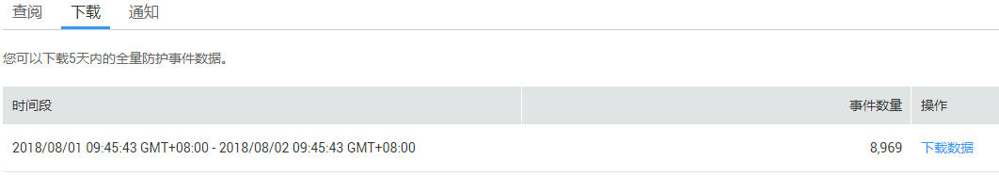

# 下载防护事件数据

该任务指导用户通过Web应用防火墙服务下载防护事件数据，可下载5天内的全量防护事件数据。

## 前提条件

-   已获取管理控制台的帐号和密码。
-   已添加防护域名。
-   已添加了配置防护规则。

## 操作步骤

1.  登录管理控制台（https://console.huaweicloud.com/）。
2.  单击页面上方的“服务列表“，选择“安全  \>  Web应用防火墙“，在左侧导航树中选择“防护事件“，进入“防护事件“页面，选中“下载“页签，如[图1](#fig667514141105)所示。

    **图 1**  下载页面  
    

3.  在目标时间段所在行的“操作“列，单击“下载数据“，自动下载到本地。

