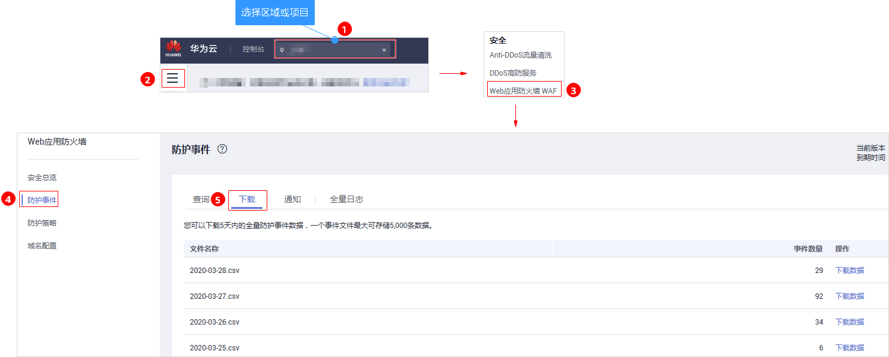

# 下载防护事件数据

该章节指导您通过Web应用防火墙服务下载仅记录和拦截的攻击事件数据，可下载5天内的所有防护域名的防护事件数据，当天的防护事件数据，在次日凌晨生成到防护事件数据csv文件。

> **说明：**   
>在WAF控制台只能查看最近30天的防护事件数据，如果您需要查看更长时间的防护事件数据，可联系华为云技术支持。  

## 前提条件

-   已获取管理控制台的账号和密码。
-   已生成了防护事件数据文件。

## 操作步骤

1.  [登录管理控制台](https://console.huaweicloud.com/?locale=zh-cn)。
2.  进入下载防护事件数据入口，如[图1](#fig27981475361)所示，参数说明如[表1](#table117074311366)。

    **图 1**  下载防护事件数据入口  
    

    **表 1**  参数说明

    
    <table><thead align="left"><tr id="row16701943193619"><th class="cellrowborder" valign="top" width="36.57%" id="mcps1.2.3.1.1">
参数名称

    </th>
    <th class="cellrowborder" valign="top" width="63.43%" id="mcps1.2.3.1.2">
参数说明

    </th>
    </tr>
    </thead>
    <tbody><tr id="row18701443123617"><td class="cellrowborder" valign="top" width="36.57%" headers="mcps1.2.3.1.1 ">
文件名称

    </td>
    <td class="cellrowborder" valign="top" width="63.43%" headers="mcps1.2.3.1.2 ">
样式为<i>文件名称</i>.csv。

    </td>
    </tr>
    <tr id="row117014311367"><td class="cellrowborder" valign="top" width="36.57%" headers="mcps1.2.3.1.1 ">
事件数量

    </td>
    <td class="cellrowborder" valign="top" width="63.43%" headers="mcps1.2.3.1.2 ">
被拦截和仅记录的事件总数量。

    
 说明： 

单个文件的事件总数量最大值为10000，超过10000就会生成另一个文件。

    

    </td>
    </tr>
    </tbody>
    </table>

3.  在目标时间段所在行的“操作“列，单击“下载数据“，下载到本地。

