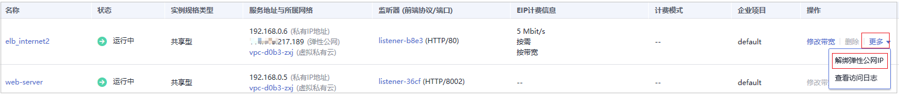
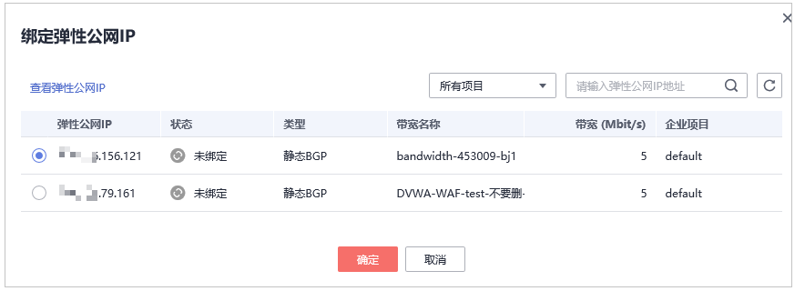

# 为弹性负载均衡绑定弹性公网IP

解绑源站服务器的弹性公网IP，将解绑的弹性公网IP绑定到WAF独享引擎实例配置的负载均衡上。绑定后，请求流量会先经过WAF独享引擎进行攻击检测，然后转发到源站服务器，从而确保源站安全、稳定、可用。

本章节以解绑源站服务器的弹性公网IP（Elastic IP，简称EIP），将解绑的EIP绑定到WAF独享引擎的华为云弹性负载均衡（Elastic Load Balance，简称ELB）上为例说明，具体操作请以实际业务为准。

## 前提条件

已为WAF独享引擎实例配置负载均衡。

## 操作步骤

1.  [登录管理控制台](https://console.huaweicloud.com/?locale=zh-cn)。
2.  单击管理控制台左上角的，选择区域或项目。
3.  单击页面左上方的，选择“网络  \>  弹性负载均衡“，进入“负载均衡器“页面。
4.  在“负载均衡器“页面，目标源站的负载均衡器所在行“操作“列，选择“更多  \>  解绑弹性公网IP“，如[图1](#fig116641742207)所示。

    **图 1**  解绑弹性公网IP  
    

5.  在弹出的对话框中，单击“是“，解绑EIP。
6.  在“负载均衡器“页面，WAF独享引擎的ELB的负载均衡器所在行“操作“列，选择“更多  \>  绑定弹性公网IP“。
7.  在“绑定弹性公网IP“对话框中，选择[4](#li11870192512125)中解绑的EIP，单击“确定“，绑定EIP。

    **图 2**  绑定弹性公网IP  
    

