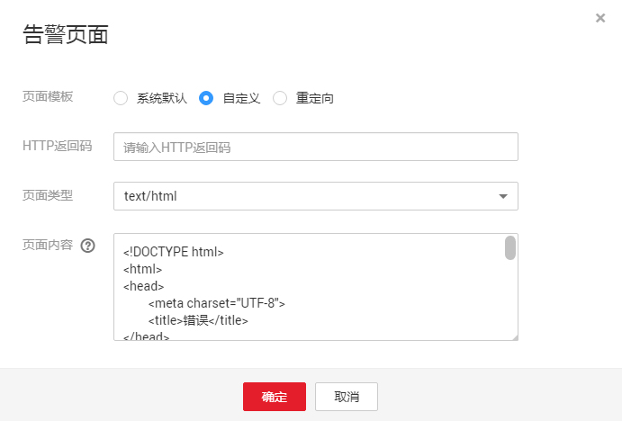

# 修改告警页面

当访问者触发WAF拦截时，默认返回WAF“系统默认“的拦截返回页面，您也可以根据自己的需要，配置“自定义“或者“重定向“的拦截返回页面。

-   “自定义“的拦截返回页面支持配置text/html、text/xml和application/json三种页面类型的页面内容。
-   “重定向“地址的根域名必须和当前被防护的域名（包括泛域名）保持一致。例如，被防护的域名为www.example.com，端口为8080，则重定向URL可设置为“http://www.</sapn>example.com:8080/error.html“。

## 前提条件

-   已获取管理控制台的账号和密码。
-   已添加防护域名。

## 操作步骤

1.  [登录管理控制台](https://console.huaweicloud.com/&locale=zh-cn)。
2.  进入目标域名基本信息页面入口，如[图1](#waf_01_0079_fig1373412710218)所示。

    **图 1**  进入基本信息页面  
    

3.  在“告警页面“所在行的页面模板名称后，单击，在弹出的“告警页面“对话框中，选择“页面模板“进行配置。
    -   “页面模板“选择“系统默认“时，默认返回WAF内置的HTTP返回码为418的拦截页面。
    -   “页面模板“选择“自定义“时，如[图2](#fig1539442518417)所示。

        -   HTTP返回码：自定义页面配置的返回码。
        -   页面类型：可选择text/html、text/xml和application/json三种类型。
        -   页面内容：根据选择的“页面类型“配置对应的页面内容。

        **图 2**  自定义告警页面  
        

    -   “页面模板“选择“重定向“时，根据界面提示配置重定向URL。

        重定向URL的根域名必须和当前被防护的域名（包括泛域名）保持一致。例如，被防护的域名为www.example.com，端口为8080，则重定向URL可设置为“http://www.example.com:8080/error.html“。

4.  单击“确定“，告警页面配置成功。

