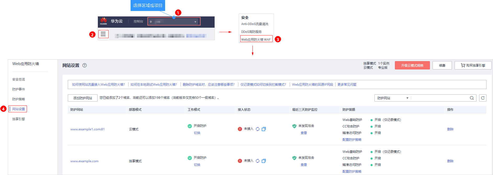
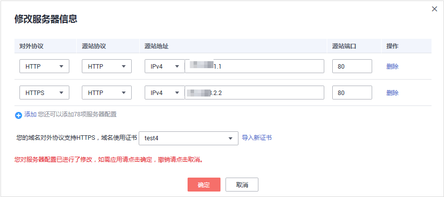

# 修改服务器信息

当您需要修改防护网站的服务器信息或者需要添加服务器信息时，可参考本章节进行操作。

本章节可对以下场景提供指导：

-   修改服务器信息，即修改对外协议、源站协议、VPC、源站地址、源站端口。
-   添加服务器配置。
-   更新证书，关于证书更新的详细内容可参见[更新证书](zh-cn_topic_0125242652.md)。

## 前提条件

已添加防护网站。

## 操作步骤

1.  [登录管理控制台](https://console.huaweicloud.com/?locale=zh-cn)。
2.  进入网站配置页面入口，如[图1](#zh-cn_topic_0110861354_fig172535820151)所示。

    **图 1**  网站列表入口  
    

3.  在目标网站所在行的“防护网站“列中，单击目标网站，进入网站基本信息页面。
4.  在“服务器信息“栏中，单击，如[图2](#fig165215137120)所示。

    **图 2**  服务器信息  
    

5.  在“修改服务器信息“页面，根据需要修改服务器的各项配置以及已绑定的证书，如[图3](#fig828241818418)所示。

    > **说明：** 
    >-   关于证书更新的详细内容可参见[更新证书](zh-cn_topic_0125242652.md)。
    >-   WAF支持配置多个后端服务器，如果需要增加后端服务器，可单击“添加“，增加服务器。

    **图 3**  修改服务器信息  
    

6.  单击“确定“，完成服务器信息修改。

