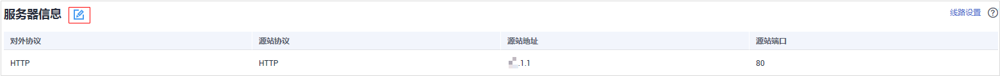

# 修改服务器配置信息

当您以“云模式“或“独享模式“添加防护网站后，如果需要修改防护网站的服务器信息或者需要添加服务器信息时，可以修改服务器配置信息。

本章节可对以下场景提供指导：

-   修改服务器信息。
    -   云模式：修改对外协议、源站协议、源站地址、源站端口
    -   独享模式：修改对外协议、源站协议、VPC、源站地址、源站端口

-   添加服务器配置。
-   更新证书，关于证书更新的详细内容可参见[更新证书](更新证书.md)。

> **说明：** 
>如果您已开通企业项目，您需要在“企业项目“下拉列表中选择您所在的企业项目并确保已开通操作权限，才能为该企业项目下域名的服务器配置信息。

## 前提条件

已添加防护网站。

## 系统影响

修改服务器配置信息对业务无影响。

## 操作步骤

1.  [登录管理控制台](https://console.huaweicloud.com/?locale=zh-cn)。
2.  单击管理控制台左上角的，选择区域或项目。
3.  单击页面左上方的，选择“安全与合规  \>  Web应用防火墙 WAF“。
4.  在左侧导航树中，选择“网站设置“，进入“网站设置“页面。
5.  在目标网站所在行的“域名“列中，单击目标网站，进入网站基本信息页面。
6.  在“服务器信息“栏中，单击，如[图1](#fig165215137120)所示。

    **图 1**  服务器信息  
    

7.  在“修改服务器信息“页面，根据需要修改服务器的各项配置以及已绑定的证书。
    -   关于证书更新的详细内容可参见[更新证书](更新证书.md)。
    -   WAF支持配置多个后端服务器，如果需要增加后端服务器，可单击“添加“，增加服务器。
    -   如果需要开启IPv6防护，在“IPv6防护“所在行，单击“开启“。

8.  单击“确认“，完成服务器信息修改。

## 生效条件

修改服务器信息，大约需要2分钟同步生效。

