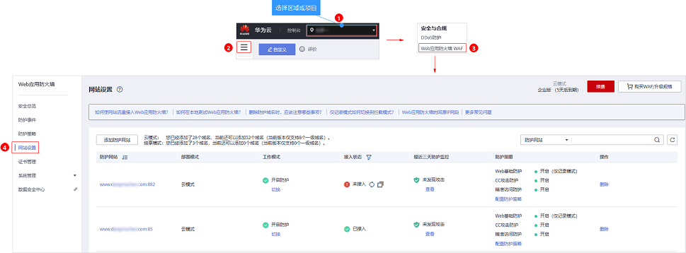
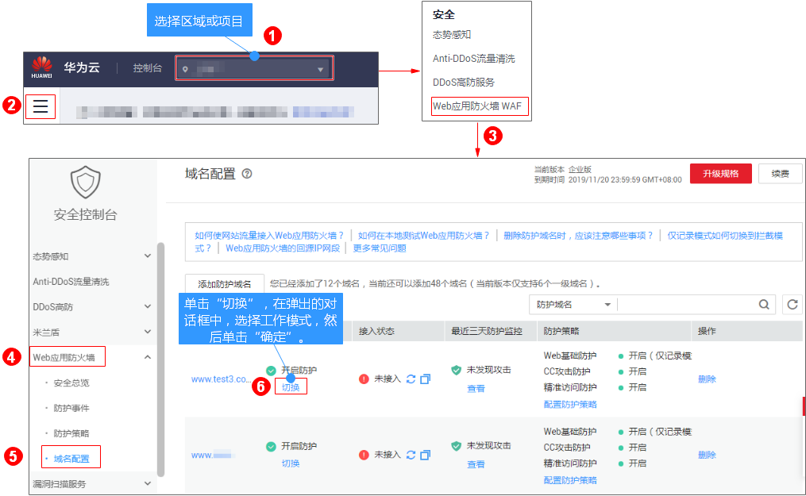

# 切换工作模式

您可以通过Web应用防火墙服务切换工作模式。Web应用防火墙提供了开启防护、暂停防护、Bypass三种工作模式。

> **说明：** 
>如果您已开通企业项目，您可以在“企业项目“下拉列表中选择您所在的企业项目，切换该企业项目下域名的工作模式。

## 前提条件

防护域名已接入WAF。

## 约束条件

防护网站的“部署模式“为“云模式“时，才能切换“Bypass“工作模式。

## 应用场景

-   开启防护：开启防护模式后，WAF会根据您配置的策略进行攻击检测。
-   暂停防护：如果大量的正常业务被拦截，比如大量返回418返回码，可以将“工作模式“切换为“暂停防护“。该模式下，WAF对所有的流量请求只转发不检测。该模式存在风险，建议您优先选择误报屏蔽规则处理正常业务拦截问题。
-   Bypass：该域名的请求直接到达其后端服务器，不再经过WAF。只有出现以下情况，才能将“工作模式“切换为“Bypass“：
    -   当有测试等特殊场景，需要将业务恢复到没有接入WAF的状态，可以通过Bypass功能切换。
    -   排查网站异常，例如报502、504或其他不兼容等问题。
    -   在Web应用防火墙前面未使用代理。

## 系统影响

切换为暂停模式后，WAF只转发流程请求，网站安全可能存在风险，建议您优先选择误报屏蔽规则处理正常业务拦截问题。

## 操作步骤

1.  [登录管理控制台](https://console.huaweicloud.com/?locale=zh-cn)。
2.  进入网站设置页面入口，如[图1](#waf_01_0002_fig172535820151)所示。

    **图 1**  网站设置入口  
    

3.  在目标网站所在行的“工作模式“列，单击“切换“。
4.  在弹出的“切换工作模式“对话框中，选择目标工作模式，单击“确定“。

    **图 2**  切换工作模式  
    

## 相关操作

-   [处理误报事件](处理误报事件.md)
-   [如何排查404/502/504错误？](https://support.huaweicloud.com/waf_faq/waf_01_0066.html)

