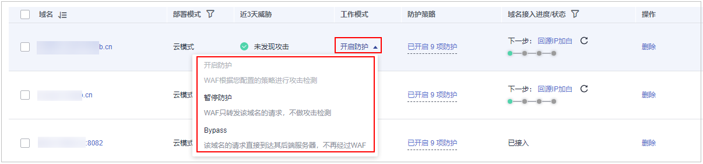

# 切换工作模式

您可以通过Web应用防火墙服务切换工作模式。Web应用防火墙提供了开启防护、暂停防护、Bypass三种工作模式。

> **说明：** 
>如果您已开通企业项目，您需要在“企业项目“下拉列表中选择您所在的企业项目并确保已开通操作权限，才能切换该企业项目下域名的工作模式。

## 前提条件

防护域名已接入WAF。

## 约束条件

-   防护网站的“部署模式“为“云模式“时，才能切换“Bypass“工作模式。
-   切换“Bypass“工作模式前，请务必保证已放通了源站业务的安全策略端口。

## 应用场景

-   开启防护：开启防护模式后，WAF会根据您配置的策略进行攻击检测。
-   暂停防护：如果大量的正常业务被拦截，比如大量返回418返回码，可以将“工作模式“切换为“暂停防护“。该模式下，WAF对所有的流量请求只转发不检测，日志也不会记录。该模式存在风险，建议您优先选择全局白名单（原误报屏蔽）规则处理正常业务拦截问题。
-   Bypass：该域名的请求直接到达其后端服务器，不再经过WAF，此时需要先放通源站业务的安全策略端口，才能保证模式切换后，业务运行正常。只有出现以下情况，才能将“工作模式“切换为“Bypass“：
    -   当有测试等特殊场景，需要将业务恢复到没有接入WAF的状态，可以通过Bypass功能切换。
    -   排查网站异常，例如报502、504或其他不兼容等问题。
    -   在Web应用防火墙前面未使用代理。

## 系统影响

切换为暂停模式后，WAF只转发流程请求，网站安全可能存在风险，建议您优先选择全局白名单（原误报屏蔽）规则处理正常业务拦截问题。

## 操作步骤

1.  [登录管理控制台](https://console.huaweicloud.com/?locale=zh-cn)。
2.  单击管理控制台左上角的，选择区域或项目。
3.  单击页面左上方的，选择“安全与合规  \>  Web应用防火墙 WAF“。
4.  在左侧导航树中，选择“网站设置“，进入“网站设置“页面。
5.  在目标域名所在行的“工作模式“列，单击，选择工作模式。

    **图 1**  切换工作模式  
    

## 相关操作

-   [处理误报事件](处理误报事件.md)
-   [如何排查404/502/504错误？](https://support.huaweicloud.com/waf_faq/waf_01_0066.html)

