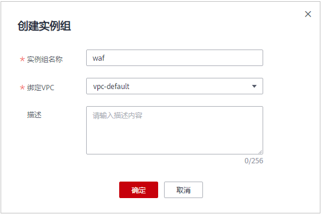

# 创建实例组

购买ELB模式时，您需要选择实例所属的实例组，您可以先创建实例组。

## 前提条件

已购买华为云独享型ELB。

## 约束条件

独享型ELB必须与ELB模式实例在同一个VPC内，否则，可能导致业务接入异常。

## 操作步骤

1.  [登录管理控制台](https://console.huaweicloud.com/?locale=zh-cn)。
2.  进入实例组管理页面，如[图1](#waf_01_0288_fig7658182717546)所示。

    **图 1**  进入实例组管理页面  
    

3.  在实例组列表左上角，单击“创建实例组“。
4.  在弹出的对话框中，输入实例组名称并选择绑定的VPC，如[图2](#fig10582227195319)所示。

    > **须知：** 
    >选择的“绑定VPC“必须为独享型ELB所在的VPC。

    **图 2**  创建实例组  
    

5.  单击“确定“。

