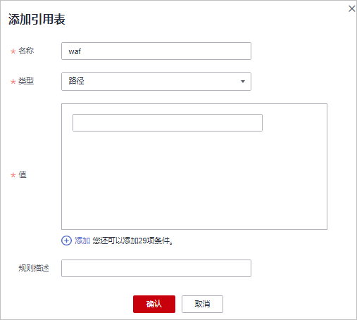

# 创建引用表

该任务指导您创建引用表，引用表能够被精准访问防护中的规则所引用。

## 前提条件

-   已获取管理控制台的帐号和密码。
-   已添加防护域名。

## 操作步骤

1.  登录管理控制台（https://console.huaweicloud.com/）。
2.  单击管理控制台左上角的，选择区域或项目。
3.  单击页面上方的“服务列表“，选择“安全  \>  Web应用防火墙“，在左侧导航树中选择“域名配置“，进入“域名配置“页面，如[图1](#waf_01_0008_fig164792010154510)所示。

    **图 1**  域名配置页面  
    

4.  在目标域名所在行的“防护策略“栏中，单击“配置防护策略“，进入“防护配置“页面。

1.  在“精准访问防护“配置框中，用户可根据自己的需要更改“状态“，单击“自定义精准访问防护规则“，进入精准访问防护规则配置页面，如[图2](#waf_01_0010_fig275911394277)所示。

    **图 2**  精准访问防护配置框  
    

1.  在列表左上角，单击“引用表管理“。
2.  在“引用表管理“界面，单击“添加引用表“，如[图3](#fig19224237165813)所示。

    **图 3**  引用表管理界面  
    

3.  在弹出的“添加引用表“对话框中，添加引用表，如[图4](#fig8225337135816)所示，参数说明如[表1](#table22291637155812)所示。

    **图 4**  添加引用表  
    

    **表 1**  添加引用表参数说明

    
    <table><thead align="left"><tr id="row112251237185816"><th class="cellrowborder" valign="top" width="19.801980198019802%" id="mcps1.2.4.1.1">
参数名称

    </th>
    <th class="cellrowborder" valign="top" width="40.59405940594059%" id="mcps1.2.4.1.2">
参数说明

    </th>
    <th class="cellrowborder" valign="top" width="39.603960396039604%" id="mcps1.2.4.1.3">
取值样例

    </th>
    </tr>
    </thead>
    <tbody><tr id="row192251937125810"><td class="cellrowborder" valign="top" width="19.801980198019802%" headers="mcps1.2.4.1.1 ">
名称

    </td>
    <td class="cellrowborder" valign="top" width="40.59405940594059%" headers="mcps1.2.4.1.2 ">
用户自定义为引用表取的名字。

    </td>
    <td class="cellrowborder" valign="top" width="39.603960396039604%" headers="mcps1.2.4.1.3 ">
test

    </td>
    </tr>
    <tr id="row42281837115815"><td class="cellrowborder" valign="top" width="19.801980198019802%" headers="mcps1.2.4.1.1 ">
类型

    </td>
    <td class="cellrowborder" valign="top" width="40.59405940594059%" headers="mcps1.2.4.1.2 "><ul id="ul16778520183811"><li>路径：设置的防护路径，不包含域名。</li><li>User Agent：设置为需要防护的扫描器的用户代理。</li><li>IP：设置为需要防护的访问者IP地址。</li><li>Params：设置为需要防护的请求参数。</li><li>Cookie：根据Cookie区分的Web访问者。</li><li>Referer：设置为需要防护的自定义请求访问的来源。
例如：防护路径设置为“/admin/xxx”，若用户不希望访问者从“www.test.com”访问该页面，则“Referer”对应的“内容”设置为“http://www.test.com”。

    </li><li>Header：设置为需要防护的自定义HTTP首部。</li></ul>
    </td>
    <td class="cellrowborder" valign="top" width="39.603960396039604%" headers="mcps1.2.4.1.3 ">
路径

    </td>
    </tr>
    <tr id="row9229237185820"><td class="cellrowborder" valign="top" width="19.801980198019802%" headers="mcps1.2.4.1.1 ">
值

    </td>
    <td class="cellrowborder" valign="top" width="40.59405940594059%" headers="mcps1.2.4.1.2 ">
对应“类型”的取值。

    
 说明： 

可单击“添加”设置多个值。

    

    </td>
    <td class="cellrowborder" valign="top" width="39.603960396039604%" headers="mcps1.2.4.1.3 ">
/buy/phone/

    </td>
    </tr>
    </tbody>
    </table>

4.  单击“确认添加“，在页面右上角弹出“添加成功“，则说明引用表创建成功。

    > **说明：**   
    >-   若需要修改创建的引用表，可单击待修改的引用表所在行的“修改“，修改引用表。  
    >-   若需要删除创建的引用表，可单击待删除的引用表所在行的“删除“，删除引用表。  

