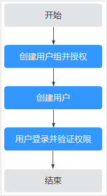

# 创建用户组并授权使用WAF

如果您需要对您所拥有的WAF进行精细的权限管理，您可以使用[统一身份认证服务](https://support.huaweicloud.com/usermanual-iam/iam_01_0001.html)（Identity and Access Management，简称IAM），通过IAM，您可以：

-   根据企业的业务组织，在您的华为云账号中，给企业中不同职能部门的员工创建IAM用户，让员工拥有唯一安全凭证，并使用WAF资源。
-   根据企业用户的职能，设置不同的访问权限，以达到用户之间的权限隔离。
-   将WAF资源委托给更专业、高效的其他华为云账号或者云服务，这些账号或者云服务可以根据权限进行代运维。

如果华为云账号已经能满足您的要求，不需要创建独立的IAM用户，您可以跳过本章节，不影响您使用WAF服务的其它功能。

本章节为您介绍对用户授权的方法，操作流程如[图1](#fig673713328586)所示。

## 前提条件

给用户组授权之前，请您了解用户组可以添加的WAF权限，并结合实际需求进行选择，WAF支持的系统权限如[表1](#table59949279269)所示。若您需要对除WAF之外的其它服务授权，IAM支持服务的所有权限请参见[系统权限](https://support.huaweicloud.com/permissions/policy_list.html?product=waf)。

**表 1**  WAF系统角色

<table><thead align="left"><tr id="zh-cn_topic_0169881967_row1346222921318"><th class="cellrowborder" valign="top" width="21.7%" id="mcps1.2.5.1.1">
系统角色/策略名称

</th>
<th class="cellrowborder" valign="top" width="30.94%" id="mcps1.2.5.1.2">
描述

</th>
<th class="cellrowborder" valign="top" width="12.950000000000001%" id="mcps1.2.5.1.3">
类别

</th>
<th class="cellrowborder" valign="top" width="34.410000000000004%" id="mcps1.2.5.1.4">
依赖关系

</th>
</tr>
</thead>
<tbody><tr id="zh-cn_topic_0169881967_row1462142915137"><td class="cellrowborder" valign="top" width="21.7%" headers="mcps1.2.5.1.1 ">
WAF Administrator

</td>
<td class="cellrowborder" valign="top" width="30.94%" headers="mcps1.2.5.1.2 ">
Web应用防火墙服务的管理员权限。

</td>
<td class="cellrowborder" valign="top" width="12.950000000000001%" headers="mcps1.2.5.1.3 ">
系统角色

</td>
<td class="cellrowborder" valign="top" width="34.410000000000004%" headers="mcps1.2.5.1.4 ">
依赖Tenant Guest和Server Administrator角色。

<ul id="zh-cn_topic_0169881967_ul11985658102319"><li>Tenant Guest：全局级角色，在全局项目中勾选。</li><li>Server Administrator：项目级角色，在同项目中勾选。</li></ul>
</td>
</tr>
<tr id="zh-cn_topic_0169881967_row01828458393"><td class="cellrowborder" valign="top" width="21.7%" headers="mcps1.2.5.1.1 ">
WAF FullAccess

</td>
<td class="cellrowborder" valign="top" width="30.94%" headers="mcps1.2.5.1.2 ">
Web应用防火墙服务的所有权限。

</td>
<td class="cellrowborder" valign="top" width="12.950000000000001%" headers="mcps1.2.5.1.3 ">
系统策略

</td>
<td class="cellrowborder" rowspan="2" valign="top" width="34.410000000000004%" headers="mcps1.2.5.1.4 ">
无。

</td>
</tr>
<tr id="zh-cn_topic_0169881967_row17174015181314"><td class="cellrowborder" valign="top" headers="mcps1.2.5.1.1 ">
WAF ReadOnlyAccess

</td>
<td class="cellrowborder" valign="top" headers="mcps1.2.5.1.2 ">
Web应用防火墙的只读访问权限。

</td>
<td class="cellrowborder" valign="top" headers="mcps1.2.5.1.3 ">
系统策略

</td>
</tr>
</tbody>
</table>

## 示例流程

**图 1**  给用户授权服务权限流程  

1.  [创建用户组并授权](https://support.huaweicloud.com/usermanual-iam/iam_03_0001.html)

    在IAM控制台创建用户组，并授予Web应用防火墙权限“WAF Administrator“。

2.  [创建用户并加入用户组](https://support.huaweicloud.com/usermanual-iam/iam_02_0001.html)

    在IAM控制台创建用户，并将其加入[1](#li16514141414819)中创建的用户组。

3.  [用户登录](https://support.huaweicloud.com/usermanual-iam/iam_01_0552.html)并验证权限

    新创建的用户登录控制台，切换至授权区域，验证权限：

    在“服务列表“中选择除Web应用防火墙外（假设当前策略仅包含“WAF Administrator“）的任一服务，若提示权限不足，表示“WAF Administrator“已生效。

