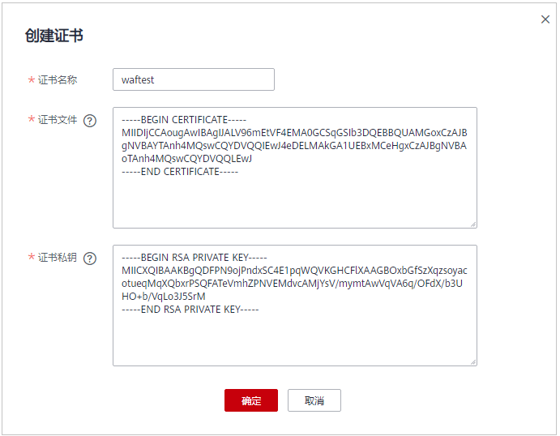

# 创建证书

当防护网站的部署模式为“云模式“或“独享模式“且“对外协议“为“HTTPS“时，您需要选择证书使证书绑定到防护网站。

您可以通过创建证书，将证书上传到WAF，使防护网站直接选择上传的证书。

> **说明：** 
>如果您已开通企业项目，您可以在“企业项目“下拉列表中选择您所在的企业项目，为该企业项目创建证书。

## 前提条件

已获取证书文件和证书私钥信息。

## 规格限制

WAF支持创建的证书套数和WAF支持防护的域名的个数相同。例如，购买了专业版WAF（支持防护10个域名）、1个独享版WAF（支持防护2,000个域名）和域名带宽扩展包（20个域名），WAF可以防护2,030个域名，则WAF支持创建2,030套证书。

## 约束条件

-   如果您在SCM管理控制台购买证书并成功推送到WAF，该证书将直接添加到“证书管理“页面的证书列表中，且该证书会统计到创建的证书套数中。有关SCM证书推送到WAF的详细操作，请参见[推送证书到云产品](https://support.huaweicloud.com/usermanual-scm/scm_01_0030.html)。
-   添加防护网站或更新证书时导入的新证书，将直接添加到“证书管理“页面的证书列表中，且导入的新证书会统计到创建的证书套数中。

## 应用场景

当域名的“对外协议“设置为“HTTPS“时，需要配置证书。

## 操作步骤

1.  [登录管理控制台](https://console.huaweicloud.com/?locale=zh-cn)。
2.  进入证书管理页面，如[图1](#fig96651149116)所示。

    **图 1**  进入证书管理页面  
    

3.  在证书列表左上方，单击“创建证书“，弹出“创建证书“对话框。
4.  在“创建证书“对话框中，输入“证书名称“，并将“证书文件“和“证书私钥“分别粘贴到对应的文本框中，如[图2](#fig1473112334013)所示。

    **图 2** “创建证书“对话框  
    

    WAF当前仅支持PEM格式证书。如果证书为非PEM格式，请参考[表1](#waf_01_0002_zh-cn_topic_0154713246_table1184924815910)将证书转换为PEM格式，再上传。

    **表 1**  证书转换命令

    
    <table><thead align="left"><tr id="waf_01_0002_zh-cn_topic_0154713246_row2847448797"><th class="cellrowborder" valign="top" width="21.990000000000002%" id="mcps1.2.3.1.1">
格式类型

    </th>
    <th class="cellrowborder" valign="top" width="78.01%" id="mcps1.2.3.1.2">
转换方式（通过<a href="https://www.openssl.org/" target="_blank" rel="noopener noreferrer">openssl</a>工具进行转换）

    </th>
    </tr>
    </thead>
    <tbody><tr id="waf_01_0002_zh-cn_topic_0154713246_row1784719481093"><td class="cellrowborder" valign="top" width="21.990000000000002%" headers="mcps1.2.3.1.1 ">
CER/CRT

    </td>
    <td class="cellrowborder" valign="top" width="78.01%" headers="mcps1.2.3.1.2 ">
将“cert.crt”证书文件直接重命名为“cert.pem”。

    </td>
    </tr>
    <tr id="waf_01_0002_zh-cn_topic_0154713246_row1484714481196"><td class="cellrowborder" valign="top" width="21.990000000000002%" headers="mcps1.2.3.1.1 ">
PFX

    </td>
    <td class="cellrowborder" valign="top" width="78.01%" headers="mcps1.2.3.1.2 "><ul id="waf_01_0002_ul3496153515520"><li>提取私钥命令，以“cert.pfx”转换为“key.pem”为例。
<strong id="waf_01_0002_b11888204916494">openssl</strong> <strong id="waf_01_0002_b9417135615497">pkcs12</strong> <strong id="waf_01_0002_b113841017509">-in</strong> <strong id="waf_01_0002_b13236615504">cert.pfx</strong> <strong id="waf_01_0002_b02951111205015">-nocerts</strong> <strong id="waf_01_0002_b15636191518504">-out</strong> <strong id="waf_01_0002_b2231162113502">key.pem</strong>

    </li><li>提取证书命令，以“cert.pfx”转换位“cert.pem”为例。
<strong id="waf_01_0002_b14387129568">openssl</strong> <strong id="waf_01_0002_b73871924562">pkcs12</strong> <strong id="waf_01_0002_b173871245618">-in</strong> <strong id="waf_01_0002_b18387152205613">cert.pfx</strong> <strong id="waf_01_0002_b83875219562">-nokeys</strong> <strong id="waf_01_0002_b17387029563">-out</strong> <strong id="waf_01_0002_b1038718215565">cert.pem</strong>

    </li></ul>
    </td>
    </tr>
    <tr id="waf_01_0002_zh-cn_topic_0154713246_row15847548495"><td class="cellrowborder" valign="top" width="21.990000000000002%" headers="mcps1.2.3.1.1 ">
P7B

    </td>
    <td class="cellrowborder" valign="top" width="78.01%" headers="mcps1.2.3.1.2 "><ol id="waf_01_0002_ol44712212610"><li>证书转换，以“cert.p7b”转换为“cert.cer”为例。
<strong id="waf_01_0002_b1757415260517">openssl</strong> <strong id="waf_01_0002_b24213295111">pkcs7</strong> <strong id="waf_01_0002_b13387737165115">-print_certs</strong> <strong id="waf_01_0002_b526034115514">-in</strong> <strong id="waf_01_0002_b3215646135110">cert.p7b</strong> <strong id="waf_01_0002_b15714195014512">-out</strong> <strong id="waf_01_0002_b17145610518">cert.cer</strong>

    </li><li>将“cert.cer”证书文件直接重命名为“cert.pem”。</li></ol>
    </td>
    </tr>
    <tr id="waf_01_0002_zh-cn_topic_0154713246_row12849154819915"><td class="cellrowborder" valign="top" width="21.990000000000002%" headers="mcps1.2.3.1.1 ">
DER

    </td>
    <td class="cellrowborder" valign="top" width="78.01%" headers="mcps1.2.3.1.2 "><ul id="waf_01_0002_ul1919945225610"><li>提取私钥命令，以“privatekey.der”转换为“privatekey.pem”为例。
<strong id="waf_01_0002_b118388511524">openssl</strong> <strong id="waf_01_0002_b230514121526">rsa</strong> <strong id="waf_01_0002_b8918101618522">-inform</strong> <strong id="waf_01_0002_b39092214525">DER</strong> <strong id="waf_01_0002_b71249294522">-outform</strong> <strong id="waf_01_0002_b1831923365219">PEM</strong> <strong id="waf_01_0002_b10511337145214">-in</strong> <strong id="waf_01_0002_b15578841115215">privatekey.der</strong> <strong id="waf_01_0002_b9264174610529">-out</strong> <strong id="waf_01_0002_b7957205113522">privatekey.pem</strong>

    </li><li>提取证书命令，以“cert.cer”转换为“cert.pem”为例。
<strong id="waf_01_0002_b6746102816599">openssl</strong> <strong id="waf_01_0002_b59891133175915">x509</strong> <strong id="waf_01_0002_b666054212595">-inform</strong> <strong id="waf_01_0002_b18740346165916">der</strong> <strong id="waf_01_0002_b6707111414173">-in</strong> <strong id="waf_01_0002_b1166222161712">cert.cer</strong> <strong id="waf_01_0002_b12373192781717">-out cert.pem</strong>

    </li></ul>
    </td>
    </tr>
    </tbody>
    </table>

5.  单击“确定“，证书创建成功。

## 生效条件

成功创建的证书将显示在证书列表中。

## 相关操作

-   当鼠标移到目标证书的名称后时，单击，您可以修改证书的名称。
-   在目标证书所在行的“操作“列中，单击“查看“，您可以查看证书的证书文件和证书私钥信息。

