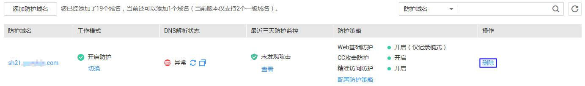
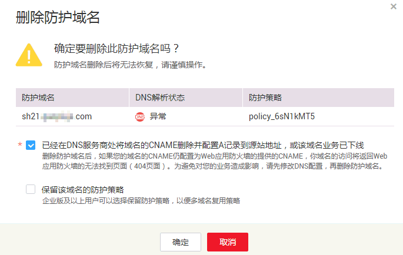
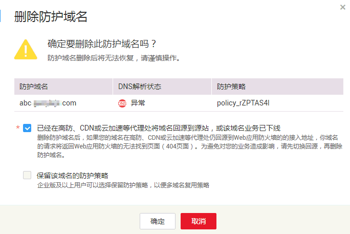

# 删除防护域名

该任务指导用户通过Web应用防火墙服务对不再防护的域名执行删除操作。

> **注意：**   
>-   如果要删除的防护域名已经接入Web应用防火墙，在删除防护域名前，请您先到DNS服务商处将域名重新解析，指向源站服务器IP地址，否则该域名的流量将无法切回服务器，影响正常访问。  
>-   删除域名后，1分钟内生效，且不可恢复，请谨慎删除防护域名。  

## 前提条件

-   已获取管理控制台的帐号和密码。
-   待删除域名已指向源站服务器地址。

## 操作步骤

1.  登录管理控制台（https://console.huaweicloud.com/）。
2.  单击管理控制台左上角的，选择区域或项目。
3.  单击页面上方的“服务列表“，选择“安全  \>  Web应用防火墙“，在左侧导航树中选择“域名配置“，进入“域名配置“页面，如[图1](#zh-cn_topic_0110861354_fig15593418182219)所示。

    **图 1**  域名配置  
    

4.  在目标防护域名所在行的“操作“列中，单击“删除“，进入删除防护域名对话框界面。
    -   未使用代理，如[图2](#fig11194454171217)所示。

        > **说明：**   
        >-   确保已完成并勾选“已经在DNS服务商处将域名的CNAME删除并配置A记录到源站地址，或该域名业务已下线“。  
        >-   如果需要保留该域名绑定的防护策略，可以勾选“保留该域名的防护策略“。  

        **图 2**  未使用代理对话框  
        

    -   使用代理，如[图3](#fig8903356111915)所示。

        > **说明：**   
        >-   确保已完成并勾选“已经在高防、CDN或云加速等代理处将域名回源到源站，或该域名业务已下线“。  
        >-   如果需要保留该域名绑定的防护策略，可以勾选“保留该域名的防护策略“。  

        **图 3**  使用了代理对话框  
        

5.  单击“确定“，页面右上角弹出“删除成功“，则说明删除防护域名操作成功。

