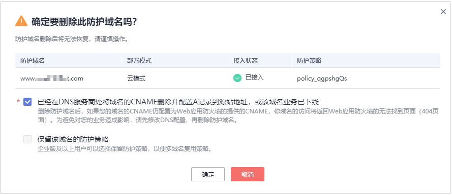
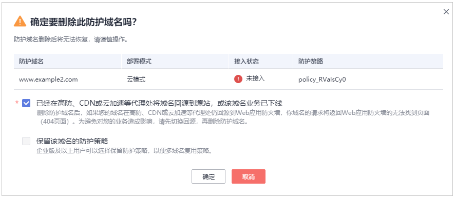

# 删除防护域名

您可以通过Web应用防火墙服务对不再防护的网站执行删除操作。

> **须知：** 
>-   防护网站“部署模式“为“云模式“时，如果要删除的防护网站已经接入Web应用防火墙，在删除防护网站前，请您先到DNS服务商处将域名重新解析，指向源站服务器IP地址，否则该域名的流量将无法切回服务器，影响正常访问。
>-   删除网站后，1分钟内生效，且不可恢复，请谨慎删除防护网站。

## 前提条件

-   已获取管理控制台的账号和密码。
-   待删除域名已指向源站服务器地址。

## 操作步骤

1.  [登录管理控制台](https://console.huaweicloud.com/?locale=zh-cn)。
2.  进入网站设置页面入口，如[图1](#waf_01_0002_fig172535820151)所示。

    **图 1**  网站设置入口  
    

3.  在目标防护域名所在行的“操作“列中，单击“删除“，进入删除防护域名对话框界面。
4.  在删除防护网站对话框中，确认删除防护网站。
    -   云模式
        -   未使用代理

            **图 2**  删除防护域名（未使用代理）  
            

            > **说明：** 
            >-   确保已完成并勾选“已经在DNS服务商处将域名的CNAME删除并配置A记录到源站地址，或该域名业务已下线“。
            >-   如果需要保留该域名绑定的防护策略，可以勾选“保留该域名的防护策略“。

        -   使用代理

            **图 3**  删除防护域名（使用代理）  
            

            > **说明：** 
            >-   确保已完成并勾选“已经在高防、CDN或云加速等代理处将域名回源到源站，或该域名业务已下线“。
            >-   如果需要保留该域名绑定的防护策略，可以勾选“保留该域名的防护策略“。

    -   独享模式

        如果需要保留该域名绑定的防护策略，可以勾选“保留该域名的防护策略“。

5.  单击“确定“，页面右上角弹出“删除成功“，则说明删除操作成功。

