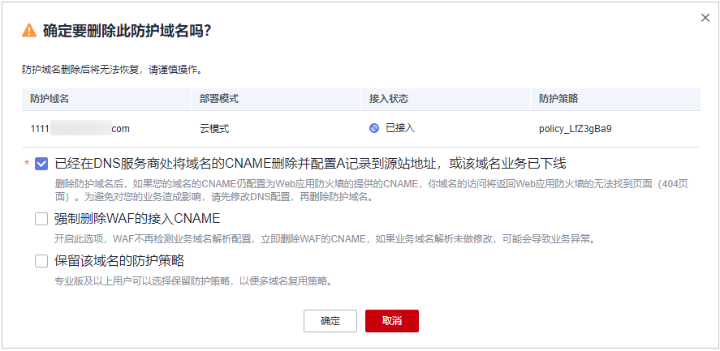
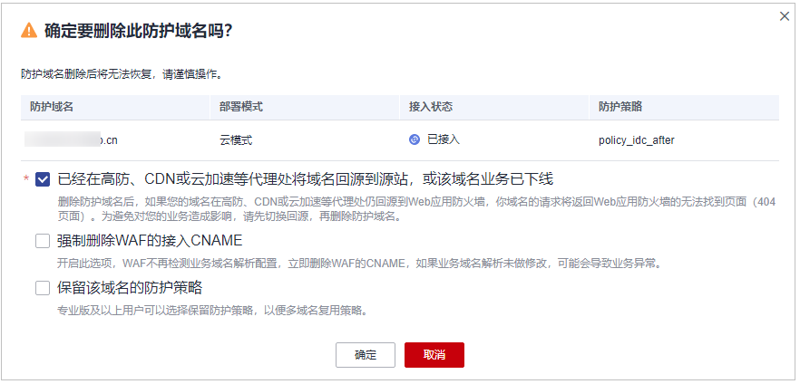

# 删除防护域名

您可以通过Web应用防火墙服务对不再防护的网站执行删除操作。

删除防护网站前，请您先到DNS服务商处将域名重新解析，指向源站服务器IP地址，否则该域名的流量将无法切回服务器，影响正常访问。

防护网站删除后，如果需要再次添加到WAF中进行防护，需要重新按照[网站设置](网站设置.md)的操作完成域名接入。

> **说明：** 
>如果您已开通企业项目，您需要在“企业项目“下拉列表中选择您所在的企业项目并确保已开通操作权限，才能删除该企业项目下域名。

## 前提条件

已添加防护域名。

## 系统影响

-   防护网站“部署模式“为“云模式“时，如果要删除的防护网站已经接入Web应用防火墙，在删除防护网站前，请您先到DNS服务商处将域名重新解析，指向源站服务器IP地址，否则该域名的流量将无法切回服务器，影响正常访问。
-   勾选“强制删除WAF的接入CNAME“后，WAF不再检测业务域名解析配置，立即删除WAF的CNAME，如果业务域名解析未做修改，可能会导致业务异常。
-   删除网站后，1分钟内生效，且不可恢复，请谨慎删除防护网站。

## 操作步骤

1.  [登录管理控制台](https://console.huaweicloud.com/?locale=zh-cn)。
2.  单击管理控制台左上角的，选择区域或项目。
3.  单击页面左上方的，选择“安全与合规  \>  Web应用防火墙 WAF“。
4.  在左侧导航树中，选择“网站设置“，进入“网站设置“页面。
5.  在目标防护域名所在行的“操作“列中，单击“删除“，进入删除防护域名对话框界面。
6.  在删除防护网站对话框中，确认删除防护网站。
    -   云模式
        -   未使用代理

            **图 1**  删除防护域名（未使用代理）  
            

            > **说明：** 
            >-   确保已完成并勾选“已经在DNS服务商处将域名的CNAME删除并配置A记录到源站地址，或该域名业务已下线“。
            >-   勾选“强制删除WAF的接入CNAME“后，WAF不再检测业务域名解析配置，立即删除WAF的CNAME，如果业务域名解析未做修改，可能会导致业务异常。
            >-   如果需要保留该域名绑定的防护策略，可以勾选“保留该域名的防护策略“。

        -   使用代理

            **图 2**  删除防护域名（使用代理）  
            

            > **说明：** 
            >-   确保已完成并勾选“已经在高防、CDN或云加速等代理处将域名回源到源站，或该域名业务已下线“。
            >-   勾选“强制删除WAF的接入CNAME“后，WAF不再检测业务域名解析配置，立即删除WAF的CNAME，如果业务域名解析未做修改，可能会导致业务异常。
            >-   如果需要保留该域名绑定的防护策略，可以勾选“保留该域名的防护策略“。

    -   独享模式

        如果需要保留该域名绑定的防护策略，可以勾选“保留该域名的防护策略“。

7.  单击“确定“，页面右上角弹出“删除成功“，则说明删除操作成功。

## 相关操作

如果您想批量删除域名，批量勾选域名后，在网站列表上方，单击“批量删除“。

