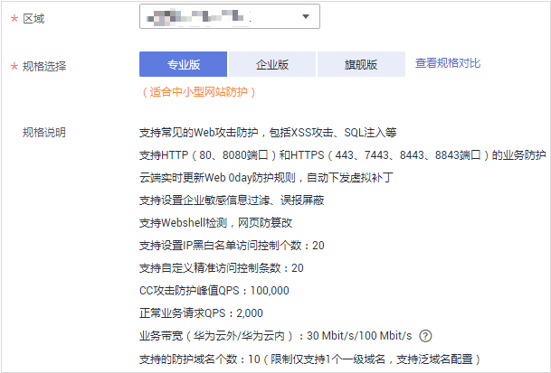
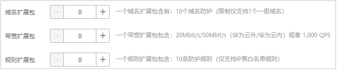

# 升级云模式版本和规格

购买了云模式后，您可以从较低版本的WAF升级到任一更高版本，也可以根据需求增加域名扩展包和带宽扩展包的数量。

## 前提条件

-   已获取管理控制台的登录帐号（拥有WAF Administrator与BSS Administrator权限）与密码。
-   已购买任一版本的云模式。

## 规格限制

-   检测版不支持购买域名扩展包和带宽扩展包，需要升级到专业版或更高版本才能购买域名扩展包和带宽扩展包。
-   一个域名包支持防护10个域名，限制仅支持1个一级域名和与一级域名相关的子域名或泛域名。
-   一个带宽扩展包包含20Mbit/s/50Mbit/s（华为云外/华为云内）或者1,000QPS（Query Per Second，即每秒钟的请求量，例如一个HTTP GET请求就是一个Query）。

## 约束条件

已到期的服务版本，不支持直接升级，请先完成续费再升级。

## 应用场景

当前云模式版本不支持相关功能或者防护域名数和带宽不能满足业务需求。有关各服务支持的功能特性说明，请参见[云模式、独享模式和ELB模式说明](https://support.huaweicloud.com/productdesc-waf/waf_01_0106.html)。

## 系统影响

升级服务版本时，对已防护的网站业务没有任何影响。

## 操作步骤

1.  [登录管理控制台](https://console.huaweicloud.com/?locale=zh-cn)。
2.  单击管理控制台左上角的，选择区域或项目。
3.  单击页面左上方的，选择“安全  \>  Web应用防火墙 WAF“。
4.  在界面右上角，单击“购买WAF“。
5.  （可选）在“企业项目“下拉列表中选择您所在的企业项目。

    企业项目针对企业用户使用，只有开通了企业项目的客户，或者权限为企业主帐号的客户才可见。如需使用该功能，请[开通企业管理功能](https://support.huaweicloud.com/usermanual-em/em_am_0008.html)。企业项目是一种云资源管理方式，企业项目管理服务提供统一的云资源按项目管理，以及项目内的资源管理、成员管理。

    > **说明：** 
    >-   “default“为默认企业项目，帐号下原有资源和未选择企业项目的资源均在默认企业项目内。
    >-   只有注册的华为云帐号购买WAF时，“企业项目“下拉列表中才可以选择到“default“。

6.  在“购买Web应用防火墙“界面，选择“云模式“。
7.  “规格选择“默认为当前服务版本，您可以选择比当前服务规格更高的任一服务版本，如[图1](#zh-cn_topic_0110861184_fig147341962012)所示。

    “规格选择“从左到右，服务版本的规格越高。

    **图 1**  选择服务版本  
    

8.  选择“域名扩展包“和“带宽扩展包“的数量。

    **图 2**  选择扩展包  
    

9.  在页面右下角，单击“立即购买“。
10. 确认订单详情无误并阅读《华为云Web应用防火墙免责声明》后，勾选“我已阅读并同意《华为云Web应用防火墙免责声明》“，单击“去支付“，完成购买操作。
11. 进入“付款“页面，选择付款方式进行付款。

## 生效条件

付费成功后，购买的版本和扩展包规格将立即生效。

## 相关操作

-   [如何为Web应用防火墙续费？](https://support.huaweicloud.com/waf_faq/waf_01_0115.html)
-   [云模式域名扩展包说明](云模式域名扩展包说明.md)
-   [云模式带宽扩展包说明](云模式带宽扩展包说明.md)

