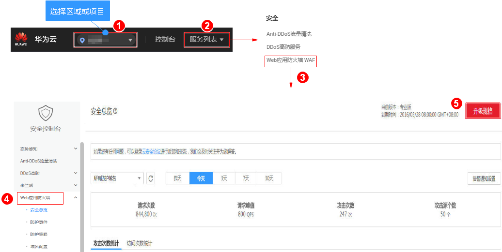

# 升级版本和规格

较低版本的服务可以升级到任一更高版本，您也可以根据需求增加域名扩展包和带宽扩展包的数量，或购买产品专家服务。

> **说明：**   
>-   已到期的服务版本，不支持直接升级，请先完成续费再升级。  
>-   Web应用防火墙升级服务版本时，对已防护的网站业务没有任何影响。  

## 前提条件

-   已获取管理控制台的登录账号（拥有WAF Administrator与BSS Administrator权限）与密码。
-   已购买任一版本的Web应用防火墙服务。

## 操作步骤

1.  [登录管理控制台](https://console.huaweicloud.com/?locale=zh-cn)。
2.  进入升级规格入口，如[图1](#zh-cn_topic_0110861184_fig8867145661611)所示。

    **图 1**  升级规格入口  
    

3.  在购买Web应用防火墙界面，“规格选择“默认为当前服务版本，您可以选择比当前服务规格更高的任一服务版本，如[图2](#zh-cn_topic_0110861184_fig147341962012)所示。

    “规格选择“从左到右，服务版本的规格越高。

    **图 2**  选择服务版本  
    

4.  选择“域名扩展包“和“带宽扩展包“的数量。

    **图 3**  选择扩展包  
    

5.  选择“产品专家服务“，推荐选择“产品托管“。如[图4](#zh-cn_topic_0110861184_zh-cn_topic_0110861189_fig1526014115320)所示。

    **图 4**  选择产品专家服务  
    

    -   “远程支持“：提供WAF使用咨询、接入配置指导、安全事件辅助分析、简单安全规则配置等。
    -   “产品托管“：提供网站日常巡检和监控、可根据网站架构和业务进行深度策略定制、7\*24小时快速响应安全事件，默认支持10个域名（仅包含1个一级域名）。选择“产品托管“时，您需要设置“产品托管购买数量“。
    -   “暂不购买“：如果您不想购买该项服务，选择“暂不购买“。

6.  在页面右下角，单击“立即购买“。
7.  确认订单详情无误并阅读《华为云Web应用防火墙免责声明》后，勾选“我已阅读并同意《华为云Web应用防火墙免责声明》“，单击“去支付“，完成购买操作。
8.  进入“付款“页面，选择付款方式进行付款。

