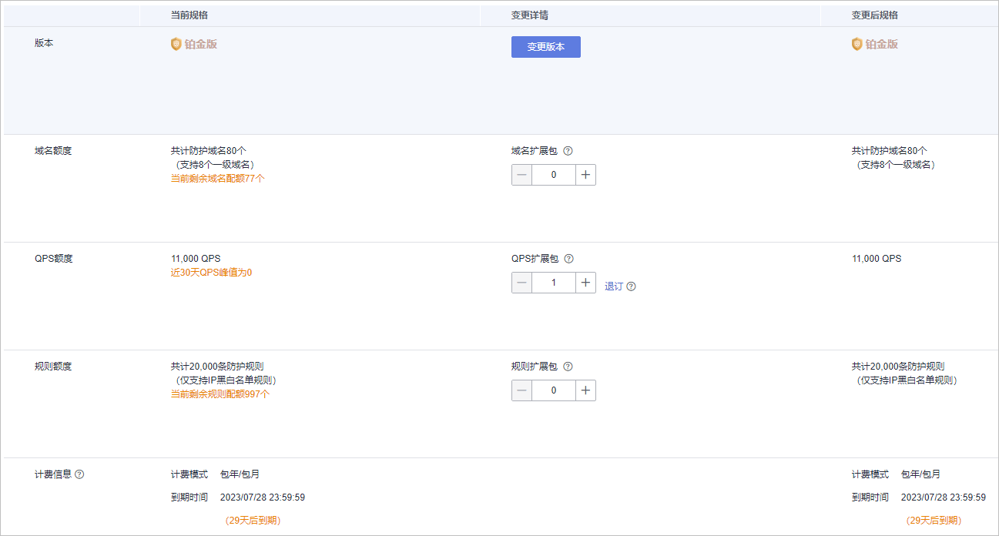

# 变更WAF云模式版本和规格

购买了云模式后，您可以变更服务版本和扩展包数量，即可以升级WAF的版本，也可增加域名扩展包、QPS扩展包、规则扩展包的数量。

## 前提条件

-   已获取管理控制台的登录账号（拥有WAF Administrator与BSS Administrator权限）与密码。
-   已购买任一版本的云模式。

## 规格限制

-   入门版不支持购买扩展包，需要升级到标准版或更高版本才能购买。
-   变更规格不改变计费模式与到期时间。
-   一个域名包支持10个域名，限制仅支持1个一级域名和与一级域名相关的子域名或泛域名。
-   一个QPS扩展包包含1000QPS（Query Per Second，即每秒钟的请求量，例如一个HTTP GET请求就是一个Query），大约相当于25Mbit/s带宽。
-   一个规则扩展包包含10条IP黑白名单防护规则。

## 约束条件

已到期的服务版本，不支持变更规格，请先完成续费再变更规格。

## 应用场景

当前云模式版本不支持相关功能，或者防护域名数、QPS或IP黑白名单防护规则不能满足业务需求时，可使用该功能升级服务规格。有关各服务支持的功能特性说明，请参见[服务版本差异](https://support.huaweicloud.com/productdesc-waf/waf_01_0106.html)。

## 系统影响

变更服务版本和扩展包（域名扩展包、QPS扩展包、规则扩展包 ）时，对已防护的网站业务没有任何影响。

## 操作步骤

1.  [登录管理控制台](https://console.huaweicloud.com/?locale=zh-cn)。
2.  单击管理控制台左上角的，选择区域或项目。
3.  单击页面左上方的，选择“安全与合规  \>  Web应用防火墙 WAF“。
4.  在页面的右上角，单击“变更“，进入“变更Web应用防火墙规格“页面。

    -   **变更版本**：在“版本“所在行的“变更详情“列，单击“变更版本“，选择规格版本并单击“确定“。
    -   **变更扩展包**：分别在“域名额度“、“QPS额度“、“规则额度“所在行的变更详情列，增加扩展包数量。
    -   计费信息：变更规格不改变计费模式与到期时间。

    **图 1**  变更规格  
    

5.  在页面右下角，单击“下一步“。
6.  确认订单详情无误并阅读《华为云Web应用防火墙免责声明》后，勾选“我已阅读并同意《华为云Web应用防火墙免责声明》“，单击“去支付“，完成购买操作。
7.  进入“付款“页面，选择付款方式进行付款或退款。

