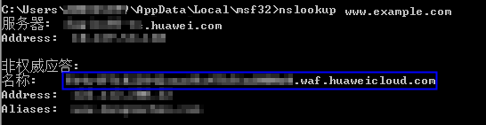

# 域名接入

该任务指导用户进行域名接入，使网站流量接入Web应用防火墙。

域名接入前，为了确保WAF转发正常，建议您先参照[本地验证](本地验证.md)通过本地验证确保一切配置正常。

## 前提条件

-   已获取管理控制台的帐号和密码。
-   已添加防护域名且域名未接入成功。

## 操作步骤

1.  登录管理控制台（https://console.huaweicloud.com/）。
2.  单击管理控制台左上角的，选择区域或项目。
3.  单击页面上方的“服务列表“，选择“安全  \>  Web应用防火墙“，在左侧导航树中选择“域名配置“，进入“域名配置“页面，如[图1](#waf_01_0001_zh-cn_topic_0110861354_fig15593418182219)所示。

    **图 1**  域名配置页面  
    

4.  在目标域名所在行的“防护域名“列中，单击域名，进入域名基本信息页面，完成域名接入。

    -   未使用代理
        1.  在“CNAME“行中，单击，复制“CNAME”值，页面右上角弹出“复制成功”，则表示CNAME值复制成功。

            **图 2**  复制CNAME值  
            

        1.  到该域名的DNS服务商处，配置防护域名的别名解析，具体操作请咨询您的域名服务提供商。

            以下为当前主流的域名服务商的CNAME绑定方法，仅供参考。如与实际配置不符，请以各自域名服务商的信息为准。

            1.  登录域名服务提供商（如：万网、DNSPod、新网）的管理控制台。
            2.  进入域名解析记录页。
            3.  设置CNAME解析记录。
                -   “记录类型“选择为“CNAME“。
                -   “主机记录“一般填写域名前缀，例如：防护域名为 “admin.demo.com“，“主机记录“填写为“admin“。
                -   “记录值“填写为WAF生成的CNAME，例如： “xxxxxxx.waf.huaweicloud.com“。
                -   “解析线路“，“TTL“  保持默认值即可。

            4.  填写完成后，单击“保存“，完成解析设置。

            > **注意：**   
            >以上解析方法为第三方解析方法。本文档不对任何第三方内容进行控制或负责，包括但不限于其准确性、兼容性、可靠性、可用性、合法性、适当性、性能、不侵权、更新状态等。  

        2.  验证域名的CNAME是否配置成功。
            1.  在Windows操作系统中，选择“开始  \>  运行“，在弹出框中输入“cmd“，按“Enter“。
            2.  执行以下命令，查询CNAME。如果回显的域名是配置的CNAME，则表示配置成功，示例如[图3](#fig04371756152219)所示。

                **nslookup www.**_domain_**.com**

                **图 3**  查询CNAME  
                

    -   使用代理
        1.  在接入地址、子域名、TXT记录所在行中，单击，复制“接入地址“、“子域名“和“TXT记录“。

            **图 4**  复制接入地址和TXT记录  
            

        2.  将使用的代理类服务（高防DDOS、CDN服务等）的回源地址修改为复制的目标域名的接入地址，具体的方法请参见[网站业务接入](https://support.huaweicloud.com/usermanual-cad/cad_01_0110.html)，并且前往您的DNS服务商处添加子域名，并为它配置TXT记录，具体的方法请参见[修改DNS解析](https://support.huaweicloud.com/usermanual-cad/cad_01_0113.html)。域名接入成功后，网站流量正常接入Web应用防火墙。

    > **说明：**   
    >默认情况下，服务每隔一小时就会自动检测每个防护域名的DNS解析状态。如果您确认已完成域名接入，“DNS解析状态“为“正常“，则表示域名接入成功。  

