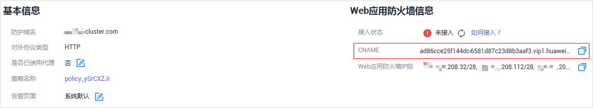

# 域名接入WAF<a name="waf_01_0079"></a>

该章节指导用户进行域名接入，使网站流量接入Web应用防火墙。

域名接入前，为了确保WAF转发正常，建议您先参照[本地验证](本地验证.md)通过本地验证确保一切配置正常。

## 工作原理<a name="section6836114910249"></a>

-   未使用代理

    当网站没有接入到WAF前，DNS直接解析到源站的IP，所以当网站接入WAF后，需要把DNS解析到WAF的CNAME，这样流量才会先经过WAF，WAF再将流量转到源站，实现网站流量检测和攻击拦截。

-   使用了DDoS高防等代理

    当网站没有接入到WAF前，DNS解析到DDoS高防等代理，流量先经过DDoS高防等代理，DDoS高防等代理再将流量直接转到源站。网站接入WAF后，需要将DDoS高防等代理回源地址修改为WAF的“CNAME“，这样流量才会被DDoS高防等代理转发到WAF，WAF再将流量转到源站，实现网站流量检测和攻击拦截。

    > **说明：**   
    >-   为了确保WAF转发正常，在修改DNS解析配置前，建议您参照[本地验证](https://support.huaweicloud.com/usermanual-waf/waf_01_0073.html)进行本地验证确保一切配置正常。  
    >-   为了防止其他用户提前将您的域名配置到Web应用防火墙上，从而对您的域名防护造成干扰，建议您到DNS服务商处添加“子域名“，并为它配置“TXT记录“。WAF会据此判断域名的所有权真正属于哪个用户。具体的配置方法请参见[未配置子域名和TXT记录的影响](https://support.huaweicloud.com/waf_faq/waf_01_0056.html)。  


## 操作指导<a name="section0983101620477"></a>

添加域名后，WAF会根据添加的域名是否已在WAF前使用了代理，生成CNAME值或者CNAME、子域名和TXT记录，用于域名解析，使网站流量切入WAF，相关操作指导参见[表1](#zh-cn_topic_0110861247_table265885742511)。

**表 1**  操作指导

<a name="zh-cn_topic_0110861247_table265885742511"></a>
<table><thead align="left"><tr id="zh-cn_topic_0110861247_row14659145772510"><th class="cellrowborder" valign="top" width="25.962596259625965%" id="mcps1.2.4.1.1"><p id="zh-cn_topic_0110861247_p1365955722519"><a name="zh-cn_topic_0110861247_p1365955722519"></a><a name="zh-cn_topic_0110861247_p1365955722519"></a>场景</p>
</th>
<th class="cellrowborder" valign="top" width="38.173817381738175%" id="mcps1.2.4.1.2"><p id="zh-cn_topic_0110861247_p11659125792513"><a name="zh-cn_topic_0110861247_p11659125792513"></a><a name="zh-cn_topic_0110861247_p11659125792513"></a>生成的参数值</p>
</th>
<th class="cellrowborder" valign="top" width="35.863586358635864%" id="mcps1.2.4.1.3"><p id="zh-cn_topic_0110861247_p865975713255"><a name="zh-cn_topic_0110861247_p865975713255"></a><a name="zh-cn_topic_0110861247_p865975713255"></a>域名解析的相关操作</p>
</th>
</tr>
</thead>
<tbody><tr id="zh-cn_topic_0110861247_row1765965782514"><td class="cellrowborder" valign="top" width="25.962596259625965%" headers="mcps1.2.4.1.1 "><p id="zh-cn_topic_0110861247_p26300792610"><a name="zh-cn_topic_0110861247_p26300792610"></a><a name="zh-cn_topic_0110861247_p26300792610"></a>未使用代理</p>
</td>
<td class="cellrowborder" valign="top" width="38.173817381738175%" headers="mcps1.2.4.1.2 "><p id="zh-cn_topic_0110861247_p176591057192517"><a name="zh-cn_topic_0110861247_p176591057192517"></a><a name="zh-cn_topic_0110861247_p176591057192517"></a>CNAME</p>
</td>
<td class="cellrowborder" valign="top" width="35.863586358635864%" headers="mcps1.2.4.1.3 "><p id="zh-cn_topic_0110861247_p10659857102513"><a name="zh-cn_topic_0110861247_p10659857102513"></a><a name="zh-cn_topic_0110861247_p10659857102513"></a>把DNS解析到WAF的<span class="parmname" id="zh-cn_topic_0110861247_parmname167142818279"><a name="zh-cn_topic_0110861247_parmname167142818279"></a><a name="zh-cn_topic_0110861247_parmname167142818279"></a>“CNAME”</span>。</p>
</td>
</tr>
<tr id="zh-cn_topic_0110861247_row36596573259"><td class="cellrowborder" valign="top" width="25.962596259625965%" headers="mcps1.2.4.1.1 "><p id="zh-cn_topic_0110861247_p12659105762513"><a name="zh-cn_topic_0110861247_p12659105762513"></a><a name="zh-cn_topic_0110861247_p12659105762513"></a>使用代理</p>
</td>
<td class="cellrowborder" valign="top" width="38.173817381738175%" headers="mcps1.2.4.1.2 "><p id="zh-cn_topic_0110861247_p394917568261"><a name="zh-cn_topic_0110861247_p394917568261"></a><a name="zh-cn_topic_0110861247_p394917568261"></a>CNAME、子域名和TXT记录</p>
</td>
<td class="cellrowborder" valign="top" width="35.863586358635864%" headers="mcps1.2.4.1.3 "><a name="zh-cn_topic_0110861247_ul5602949102720"></a><a name="zh-cn_topic_0110861247_ul5602949102720"></a><ul id="zh-cn_topic_0110861247_ul5602949102720"><li>将DDoS高防等代理回源地址修改为WAF的<span class="parmname" id="zh-cn_topic_0110861247_parmname34731233162718"><a name="zh-cn_topic_0110861247_parmname34731233162718"></a><a name="zh-cn_topic_0110861247_parmname34731233162718"></a>“CNAME”</span>。</li><li>（可选）在DNS服务商处添加一条WAF的<span class="parmname" id="zh-cn_topic_0110861247_parmname99901141142715"><a name="zh-cn_topic_0110861247_parmname99901141142715"></a><a name="zh-cn_topic_0110861247_parmname99901141142715"></a>“子域名”</span>和<span class="parmname" id="zh-cn_topic_0110861247_parmname1899164112716"><a name="zh-cn_topic_0110861247_parmname1899164112716"></a><a name="zh-cn_topic_0110861247_parmname1899164112716"></a>“TXT记录”</span>。</li></ul>
</td>
</tr>
</tbody>
</table>

## 前提条件<a name="section581551584213"></a>

-   已获取管理控制台的账号和密码。
-   已添加防护域名且域名未接入成功。

## 操作步骤<a name="section9842135074313"></a>

1.  [登录管理控制台](https://console.huaweicloud.com/?locale=zh-cn)。
2.  进入网站配置页面入口，如[图1](#waf_01_0002_fig172535820151)所示。

    **图 1**  网站列表入口<a name="waf_01_0002_fig172535820151"></a>  
    

3.  在目标域名所在行的“防护域名“列中，单击域名，进入域名基本信息页面。
4.  在“CNAME“行中，单击，复制“CNAME”值，如[图2](#fig3485313163918)。

    **图 2**  复制CNAME<a name="fig3485313163918"></a>  
    

    页面右上角弹出“复制成功”，则表示CNAME值复制成功。

5.  域名接入。
    -   未使用代理

        到该域名的DNS服务商处，配置防护域名的别名解析，具体操作请咨询您的域名服务提供商。

        以下为华为云DNS的CNAME绑定方法，仅供参考。如与实际配置不符，请以各自域名服务商的信息为准。

        1.  进入云解析页面的入口，如[图3](#zh-cn_topic_0171278289_zh-cn_topic_0183018871_fig165861648185013)所示。

            **图 3**  云解析页面入口<a name="zh-cn_topic_0171278289_zh-cn_topic_0183018871_fig165861648185013"></a>  
            

        2.  在目标域名所在行的“操作“列，单击“修改“，进入“修改记录集“页面。
        3.  在弹出的“修改记录集“对话框中修改记录值，如[图4](#zh-cn_topic_0171278289_fig161041532185410)所示。

            -   “主机记录“：在WAF中配置的域名。
            -   “类型“：选择“CNAME-将域名指向另外一个域名“。
            -   “线路类型“：全网默认。
            -   “TTL\(秒\)“：一般建议设置为5分钟，TTL值越大，则DNS记录的同步和更新越慢。
            -   “值“：修改为已复制的WAF CNAME地址。
            -   其他的设置保持不变。

            > **说明：**   
            >关于修改解析记录：  
            >-   对于同一个主机记录，CNAME解析记录不能重复，您需要将已存在的解析记录的CNAME修改为WAF CNAME地址。  
            >-   同一解析记录下，不同DNS解析记录类型间可能存在冲突。例如，对于同一个主机记录，CNAME记录与A记录、MX记录、TXT记录等其他记录互相冲突。在无法直接修改记录类型的情况下，您可以先删除存在冲突的其他记录，再添加一条新的CNAME记录。删除其他解析记录并新增CNAME解析记录的过程应尽可能在短时间内完成。如果删除A记录后没有添加CNAME解析记录，可能导致域名无法正常解析。  
            >域名解析类型的限制规则请参见[为什么会提示解析记录集已经存在？](https://support.huaweicloud.com/dns_faq/dns_faq_016.html)。  

            **图 4**  修改记录集<a name="zh-cn_topic_0171278289_fig161041532185410"></a>  
            

        4.  单击“确定“，完成DNS配置，等待DNS解析记录生效。

    -   使用了代理

        将使用的代理类服务（高防DDoS、CDN服务等）的回源地址修改为复制的目标域名的CNAME，具体的方法请参见[网站业务接入](https://support.huaweicloud.com/usermanual-aad/aad_01_0012.html)。

        > **说明：**   
        >为了防止其他用户提前将您的域名配置到Web应用防火墙上，从而对您的域名防护造成干扰，建议您的DNS服务商处添加“子域名“和“TXT记录“。  
        >1.  获取“子域名“和“TXT记录“：在“接入状态“所在行，单击“如何接入？“，在弹出的“接入指导“对话框中，复制“子域名“和“TXT记录“。  
        >2.  到DNS服务商处添加“子域名“，并为它配置“TXT记录“。具体的配置方法请参见[未配置子域名和TXT记录的影响](https://support.huaweicloud.com/waf_faq/waf_01_0056.html)。  
        >WAF会根据配置“子域名“和“TXT记录“判断域名的所有权属于哪个用户。  


6.  验证域名的CNAME是否配置成功。
    1.  在Windows操作系统中，选择“开始  \>  运行“，在弹出框中输入“cmd“，按“Enter“。
    2.  执行**nslookup**命令，查询CNAME。如果回显的域名是配置的CNAME，则表示配置成功，示例如[图5](#fig1190717481633)所示。

        以域名www.example.com为例。

        ```
        nslookup www.example.com
        ```

        **图 5**  查询CNAME<a name="fig1190717481633"></a>  
        

        > **说明：**   
        >-   默认情况下，服务每隔一小时就会自动检测每个防护域名的“接入状态“。  
        >-   一般情况下，如果您确认已完成域名接入，“接入状态“为“已接入“，表示域名接入成功。  


