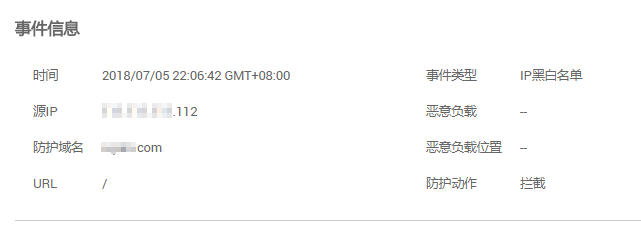

# 处理误报事件

当Web应用防火墙拦截或者记录的攻击事件为误报时，用户可通过Web应用防火墙对误报进行屏蔽。该任务指导用户通过Web应用防火墙处理误报事件、查看事件详情。

## 前提条件

-   已获取管理控制台的帐号和密码。
-   事件详情列表中包含误报攻击事件。

## 操作步骤

1.  登录管理控制台（https://console.huaweicloud.com/）。
2.  单击页面上方的“服务列表“，选择“安全  \>  Web应用防火墙“，在左侧导航树中选择“防护事件“，进入“防护事件“页面。
3.  选中“查阅“页签，在域名下拉列表中，选择待查看的防护域名的防护日志，如[图1](#fig194311743164914)所示。

    在事件列表的右上角，单击“通过ID查询“，可以通过事件ID来查询防护事件。

    **图 1**  选择指定域名  
    

4.  在事件列表中的操作列，单击“详情“，查看目标域名攻击事件详情，如[图2](#fig52030871144517)所示，参数说明如[表1](#table81191110181512)所示。

    **图 2**  查看事情详情  
    

    **表 1**  事件详情参数说明

    
    <table><thead align="left"><tr id="row2556894716324"><th class="cellrowborder" valign="top" width="23.31%" id="mcps1.2.3.1.1">
参数

    </th>
    <th class="cellrowborder" valign="top" width="76.69%" id="mcps1.2.3.1.2">
参数说明

    </th>
    </tr>
    </thead>
    <tbody><tr id="row4987116516324"><td class="cellrowborder" valign="top" width="23.31%" headers="mcps1.2.3.1.1 ">
时间

    </td>
    <td class="cellrowborder" valign="top" width="76.69%" headers="mcps1.2.3.1.2 ">
发生本次攻击的时间。

    </td>
    </tr>
    <tr id="row1667368145442"><td class="cellrowborder" valign="top" width="23.31%" headers="mcps1.2.3.1.1 ">
源IP

    </td>
    <td class="cellrowborder" valign="top" width="76.69%" headers="mcps1.2.3.1.2 ">
Web访问者的公网IP地址（攻击者IP地址）。

    </td>
    </tr>
    <tr id="row3841545216324"><td class="cellrowborder" valign="top" width="23.31%" headers="mcps1.2.3.1.1 ">
防护域名

    </td>
    <td class="cellrowborder" valign="top" width="76.69%" headers="mcps1.2.3.1.2 ">
发生攻击事件的域名。

    </td>
    </tr>
    <tr id="row4732058016324"><td class="cellrowborder" valign="top" width="23.31%" headers="mcps1.2.3.1.1 ">
URL

    </td>
    <td class="cellrowborder" valign="top" width="76.69%" headers="mcps1.2.3.1.2 ">
攻击的URL。

    </td>
    </tr>
    <tr id="row17997245174958"><td class="cellrowborder" valign="top" width="23.31%" headers="mcps1.2.3.1.1 ">
恶意负载

    </td>
    <td class="cellrowborder" valign="top" width="76.69%" headers="mcps1.2.3.1.2 ">
发生的恶意负载详情。

    </td>
    </tr>
    <tr id="row197801315102611"><td class="cellrowborder" valign="top" width="23.31%" headers="mcps1.2.3.1.1 ">
恶意负载位置

    </td>
    <td class="cellrowborder" valign="top" width="76.69%" headers="mcps1.2.3.1.2 ">
发生的恶意负载位置。

    </td>
    </tr>
    <tr id="row2118492316324"><td class="cellrowborder" valign="top" width="23.31%" headers="mcps1.2.3.1.1 ">
事件类型

    </td>
    <td class="cellrowborder" valign="top" width="76.69%" headers="mcps1.2.3.1.2 ">
发生攻击的类型。

    </td>
    </tr>
    <tr id="row48622009143216"><td class="cellrowborder" valign="top" width="23.31%" headers="mcps1.2.3.1.1 ">
防护动作

    </td>
    <td class="cellrowborder" valign="top" width="76.69%" headers="mcps1.2.3.1.2 ">
防护配置中设置的防护动作，包含：拦截、仅记录、人机验证和放行。

    </td>
    </tr>
    </tbody>
    </table>

5.  当攻击事件属于误报时，可单击该攻击事件所在行的“误报处理“添加误报屏蔽策略，如[图3](#fig16174064111318)所示。

    > **说明：**   
    >黑白名单、CC防护、精准防护等用户添加的规则无法执行误报屏蔽操作。若需要屏蔽，可将添加的防护规则删除。  

    **图 3**  误报处理  
    

    误报处理参数说明，如[表2](#table35022095114540)所示。

    **表 2**  误报处理参数说明

    
    <table><thead align="left"><tr id="row3795605114540"><th class="cellrowborder" valign="top" width="19.46%" id="mcps1.2.4.1.1">
参数

    </th>
    <th class="cellrowborder" valign="top" width="54.54%" id="mcps1.2.4.1.2">
参数说明

    </th>
    <th class="cellrowborder" valign="top" width="26%" id="mcps1.2.4.1.3">
取值样例

    </th>
    </tr>
    </thead>
    <tbody><tr id="row49117151114540"><td class="cellrowborder" valign="top" width="19.46%" headers="mcps1.2.4.1.1 ">
防护对象

    </td>
    <td class="cellrowborder" valign="top" width="54.54%" headers="mcps1.2.4.1.2 ">
发生攻击事件的域名，系统自动获取。

    </td>
    <td class="cellrowborder" valign="top" width="26%" headers="mcps1.2.4.1.3 ">
--

    </td>
    </tr>
    <tr id="row7791918114540"><td class="cellrowborder" valign="top" width="19.46%" headers="mcps1.2.4.1.1 ">
路径

    </td>
    <td class="cellrowborder" valign="top" width="54.54%" headers="mcps1.2.4.1.2 ">
误报事件的URL路径。

    </td>
    <td class="cellrowborder" valign="top" width="26%" headers="mcps1.2.4.1.3 ">
/domxss.html

    </td>
    </tr>
    <tr id="row6648026114540"><td class="cellrowborder" valign="top" width="19.46%" headers="mcps1.2.4.1.1 ">
规则ID

    </td>
    <td class="cellrowborder" valign="top" width="54.54%" headers="mcps1.2.4.1.2 ">
自动读取的内置规则的ID。

    </td>
    <td class="cellrowborder" valign="top" width="26%" headers="mcps1.2.4.1.3 ">
--

    </td>
    </tr>
    </tbody>
    </table>

6.  单击“确认添加“，处理误报，攻击事件详情列表中不再出现此误报。

    > **说明：**   
    >用户可进入“域名列表“页面，在对应防护域名的所在行的“防护策略“列中，单击目标域名的策略名称，在“误报屏蔽栏“中，单击“自定义误报屏蔽规则“，进入误报屏蔽列表，查看添加的误报屏蔽事件。  

