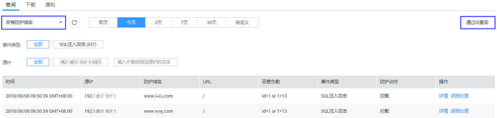
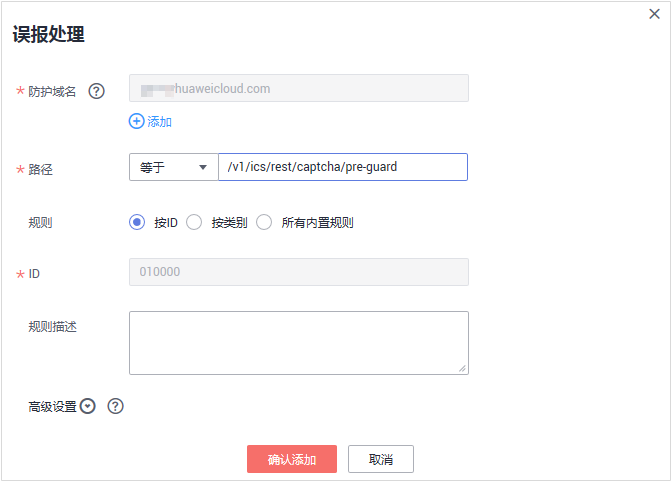

# 处理误报事件

当Web应用防火墙拦截或者记录的攻击事件为误报时，用户可通过Web应用防火墙对误报进行屏蔽。该任务指导用户通过Web应用防火墙处理误报事件、查看事件详情。

## 前提条件

-   已获取管理控制台的帐号和密码。
-   事件详情列表中包含误报攻击事件。

## 操作步骤

1.  登录管理控制台（https://console.huaweicloud.com/）。
2.  单击管理控制台左上角的，选择区域或项目。
3.  单击页面上方的“服务列表“，选择“安全  \>  Web应用防火墙“，在左侧导航树中选择“防护事件“，进入“防护事件“页面。
4.  选择“查阅“页签，在域名下拉列表中选择待查看的防护域名或“所有域名“，可查看“昨天“、“今天“、“3天““7天“、“30天“或者自定义时间范围内的防护日志，如[图1](#fig194311743164914)所示，参数说明如[表1](#table146358613417)和[表2](#table135241210519)所示。

    在事件列表的右上角，单击“通过ID查询“，可以通过事件ID来查询防护事件。

    **图 1**  选择指定域名  
    

    **表 1**  防护事件参数说明

    
    <table><thead align="left"><tr id="row863606163419"><th class="cellrowborder" valign="top" width="35.809999999999995%" id="mcps1.2.3.1.1">
参数名称

    </th>
    <th class="cellrowborder" valign="top" width="64.19%" id="mcps1.2.3.1.2">
参数说明

    </th>
    </tr>
    </thead>
    <tbody><tr id="row18636563347"><td class="cellrowborder" valign="top" width="35.809999999999995%" headers="mcps1.2.3.1.1 ">
事件类型

    </td>
    <td class="cellrowborder" valign="top" width="64.19%" headers="mcps1.2.3.1.2 ">
发生攻击的类型。

    
默认选择“全部”，查看所有攻击类型的日志信息，也可以根据需要，选择攻击类型查看攻击日志信息。

    </td>
    </tr>
    <tr id="row1563616616349"><td class="cellrowborder" valign="top" width="35.809999999999995%" headers="mcps1.2.3.1.1 ">
源IP

    </td>
    <td class="cellrowborder" valign="top" width="64.19%" headers="mcps1.2.3.1.2 ">
Web访问者的公网IP地址（攻击者IP地址）。

    
默认选择“全部”，查看所有的日志信息，也可以根据需要，选择或者自定义攻击者IP地址查看攻击日志信息。

    </td>
    </tr>
    </tbody>
    </table>

    **表 2**  日志列表参数说明

    
    <table><thead align="left"><tr id="row135266102011"><th class="cellrowborder" valign="top" width="50%" id="mcps1.2.3.1.1">
参数名称

    </th>
    <th class="cellrowborder" valign="top" width="50%" id="mcps1.2.3.1.2">
参数说明

    </th>
    </tr>
    </thead>
    <tbody><tr id="row152661018114"><td class="cellrowborder" valign="top" width="50%" headers="mcps1.2.3.1.1 ">
时间

    </td>
    <td class="cellrowborder" valign="top" width="50%" headers="mcps1.2.3.1.2 ">
发生本次攻击的时间。

    </td>
    </tr>
    <tr id="row352616101114"><td class="cellrowborder" valign="top" width="50%" headers="mcps1.2.3.1.1 ">
源IP

    </td>
    <td class="cellrowborder" valign="top" width="50%" headers="mcps1.2.3.1.2 ">
Web访问者的公网IP地址（攻击者IP地址）。

    </td>
    </tr>
    <tr id="row652611010115"><td class="cellrowborder" valign="top" width="50%" headers="mcps1.2.3.1.1 ">
防护域名

    </td>
    <td class="cellrowborder" valign="top" width="50%" headers="mcps1.2.3.1.2 ">
被攻击的防护域名。

    </td>
    </tr>
    <tr id="row10526810313"><td class="cellrowborder" valign="top" width="50%" headers="mcps1.2.3.1.1 ">
URL

    </td>
    <td class="cellrowborder" valign="top" width="50%" headers="mcps1.2.3.1.2 ">
攻击的防护域名的URL。

    </td>
    </tr>
    <tr id="row635713296113"><td class="cellrowborder" valign="top" width="50%" headers="mcps1.2.3.1.1 ">
恶意负载位置

    </td>
    <td class="cellrowborder" valign="top" width="50%" headers="mcps1.2.3.1.2 ">
发生攻击的恶意负载位置。

    </td>
    </tr>
    <tr id="row33596297111"><td class="cellrowborder" valign="top" width="50%" headers="mcps1.2.3.1.1 ">
事件类型

    </td>
    <td class="cellrowborder" valign="top" width="50%" headers="mcps1.2.3.1.2 ">
发生攻击的类型。

    </td>
    </tr>
    <tr id="row17359429116"><td class="cellrowborder" valign="top" width="50%" headers="mcps1.2.3.1.1 ">
防护动作

    </td>
    <td class="cellrowborder" valign="top" width="50%" headers="mcps1.2.3.1.2 ">
防护配置中设置的防护动作，包含：拦截、仅记录、人机验证和放行。

    </td>
    </tr>
    </tbody>
    </table>

    > **说明：**   
    >如果需要查看目标域名攻击事件详情，可在事件列表中的“操作“列，单击“详情“。  

5.  当攻击事件属于误报时，在该攻击事件所在行的“操作“列，可单击“误报处理“，添加误报屏蔽策略，如[图2](#fig16174064111318)所示，参数说明如[表3](#table35022095114540)所示。

    > **说明：**   
    >仅WAF预置的Web基础防护规则可添加误报进行屏蔽，用户自己添加的规则无法执行误报屏蔽操作，若需要屏蔽，可将添加的防护规则删除。  

    **图 2**  误报处理  
    

    **表 3**  误报处理参数说明

    
    <table><thead align="left"><tr id="row3795605114540"><th class="cellrowborder" valign="top" width="19.46%" id="mcps1.2.4.1.1">
参数

    </th>
    <th class="cellrowborder" valign="top" width="54.54%" id="mcps1.2.4.1.2">
参数说明

    </th>
    <th class="cellrowborder" valign="top" width="26%" id="mcps1.2.4.1.3">
取值样例

    </th>
    </tr>
    </thead>
    <tbody><tr id="row49117151114540"><td class="cellrowborder" valign="top" width="19.46%" headers="mcps1.2.4.1.1 ">
防护对象

    </td>
    <td class="cellrowborder" valign="top" width="54.54%" headers="mcps1.2.4.1.2 ">
发生攻击事件的域名，系统自动获取。

    </td>
    <td class="cellrowborder" valign="top" width="26%" headers="mcps1.2.4.1.3 ">
--

    </td>
    </tr>
    <tr id="row7791918114540"><td class="cellrowborder" valign="top" width="19.46%" headers="mcps1.2.4.1.1 ">
路径

    </td>
    <td class="cellrowborder" valign="top" width="54.54%" headers="mcps1.2.4.1.2 ">
误报事件的URL路径，不包含域名。

    <ul id="ul1515617591337"><li>前缀匹配：以*结尾代表以该路径为前缀。例如，需要防护的路径为“/admin/test.php”或 “/adminabc”，则路径可以填写为“/admin*”。</li><li>精准匹配：需要防护的路径需要与此处填写的路径完全相等。例如，需要防护的路径为“/admin”，该规则必须填写为“/admin”。</li></ul>
    
 说明： 
<ul id="ul20707155819344"><li>该路径不支持正则，仅支持前缀匹配和精准匹配的逻辑。</li><li>路径里不能含有连续的多条斜线的配置，如“///admin”，WAF引擎会将“///”转为“/”。</li></ul>
    

    </td>
    <td class="cellrowborder" valign="top" width="26%" headers="mcps1.2.4.1.3 ">
/admin*

    </td>
    </tr>
    <tr id="row6648026114540"><td class="cellrowborder" valign="top" width="19.46%" headers="mcps1.2.4.1.1 ">
规则ID

    </td>
    <td class="cellrowborder" valign="top" width="54.54%" headers="mcps1.2.4.1.2 ">
自动读取的内置规则的ID。

    </td>
    <td class="cellrowborder" valign="top" width="26%" headers="mcps1.2.4.1.3 ">
--

    </td>
    </tr>
    </tbody>
    </table>

6.  单击“确认添加“，处理误报，攻击事件详情列表中不再出现此误报。

    > **说明：**   
    >用户可进入“域名列表“页面，在对应防护域名的所在行的“防护策略“列中，单击“配置防护策略“，在“误报屏蔽“栏中，单击“自定义误报屏蔽规则“，进入误报屏蔽列表，查看添加的误报屏蔽事件。  

