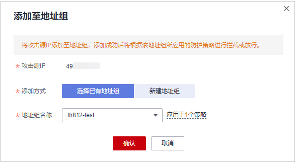

# 处理误报事件

对于“防护事件“页面中的攻击事件，如果排查后您确认该攻击事件为误报事件，即未发现该攻击事件相关的恶意链接、字符等，则您可以通过设置URL和规则ID的忽略（Web基础防护规则）、删除或关闭对应的防护规则（自定义防护规则）、将攻击源IP添加至黑白名单地址组或黑白名单策略中，屏蔽该攻击事件。将攻击事件处理为误报事件后，“防护事件“页面中将不再出现该攻击事件，您也不会收到该攻击事件的告警通知。

当WAF根据内置的Web基础防护规则和网站反爬虫的特征反爬虫，以及自定义防护规则（CC攻击防护规则、精准访问防护规则、黑白名单规则、地理位置访问控制规则等）检测到符合规则的恶意攻击时，会按照规则中的防护动作（仅记录、拦截等）在“防护事件“页面中记录检测到的攻击事件。

> **说明：** 
>如果您已开通企业项目，您需要在“企业项目“下拉列表中选择您所在的企业项目并确保已开通操作权限，才能处理该企业项目下的误报事件。

## 前提条件

事件详情列表中包含误报攻击事件。

## 约束条件

-   仅基于WAF内置的Web基础防护规则和网站反爬虫的特征反爬虫拦截或记录的攻击事情可以进行“误报处理”操作。
-   基于自定义规则（CC攻击防护规则、精准访问防护规则、黑白名单规则、地理位置访问控制规则等）拦截或记录的攻击事件，无法执行“误报处理“操作，如果您确认该攻击事件为误报，可在自定义规则页面，将该攻击事件对应的防护规则删除或关闭。
-   同一个攻击事件不能重复进行误报处理，即如果该攻击事件已进行了误报处理，则不能再对该攻击事件进行误报处理。
-   拦截事件处理为误报后，“防护事件“页面中将不再出现该事件，您也不会收到该类事件的告警通知。

## 使用场景

业务正常请求被WAF拦截。例如，您在华为云ECS服务器上部署了一个Web应用，将该Web应用对应的公网域名接入WAF并开启Web基础防护后，该域名的请求流量命中了Web基础防护规则被WAF误拦截，导致通过域名访问网站显示异常，但直接通过IP访问网站正常。

## 操作步骤

1.  [登录管理控制台](https://console.huaweicloud.com/?locale=zh-cn)。
2.  单击管理控制台左上角的，选择区域或项目。
3.  单击页面左上方的，选择“安全与合规  \>  Web应用防火墙 WAF“。
4.  在左侧导航树中，选择“防护事件“，进入“防护事件“页面。
5.  选择“查询“页签，在网站或实例下拉列表中选择待查看的防护网站，可查看“昨天“、“今天“、“3天“、“7天“、“30天“或者自定义时间范围内的防护日志。
6.  在“防护事件列表“中，根据实际情况对防护事件进行处理。
    -   确认事件为误报，在目标防护事件所在行的“操作“列，单击“更多  \>  误报处理“，添加误报处理策略。

        **图 1**  误报处理  
        

        **表 1**  参数说明

        
        <table><thead align="left"><tr id="waf_01_0016_row1423118585235"><th class="cellrowborder" valign="top" width="22.91229122912291%" id="mcps1.2.4.1.1">
参数

        </th>
        <th class="cellrowborder" valign="top" width="49.09490949094909%" id="mcps1.2.4.1.2">
参数说明

        </th>
        <th class="cellrowborder" valign="top" width="27.992799279927993%" id="mcps1.2.4.1.3">
取值样例

        </th>
        </tr>
        </thead>
        <tbody><tr id="waf_01_0016_row523119581238"><td class="cellrowborder" valign="top" width="22.91229122912291%" headers="mcps1.2.4.1.1 ">
防护方式

        </td>
        <td class="cellrowborder" valign="top" width="49.09490949094909%" headers="mcps1.2.4.1.2 "><ul id="waf_01_0016_ul1738010421244"><li>“全部域名”：默认防护当前策略下绑定的所有域名。</li><li>“指定域名”：选择策略绑定的防护域名或手动输入泛域名对应的单域名。</li></ul>
        </td>
        <td class="cellrowborder" valign="top" width="27.992799279927993%" headers="mcps1.2.4.1.3 ">
指定域名

        </td>
        </tr>
        <tr id="waf_01_0016_row523114586234"><td class="cellrowborder" valign="top" width="22.91229122912291%" headers="mcps1.2.4.1.1 ">
防护域名

        </td>
        <td class="cellrowborder" valign="top" width="49.09490949094909%" headers="mcps1.2.4.1.2 ">
“防护方式”选择“指定域名”时，需要配置此参数。

        
需要手动输入当前策略下绑定的需要防护的泛域名对应的单域名，且需要输入完整的域名。

        
单击“添加”，支持配置多个域名。

        </td>
        <td class="cellrowborder" valign="top" width="27.992799279927993%" headers="mcps1.2.4.1.3 ">
www.example.com

        </td>
        </tr>
        <tr id="waf_01_0016_row82316589236"><td class="cellrowborder" valign="top" width="22.91229122912291%" headers="mcps1.2.4.1.1 ">
条件列表

        </td>
        <td class="cellrowborder" valign="top" width="49.09490949094909%" headers="mcps1.2.4.1.2 ">
单击“添加”增加新的条件，一个防护规则至少包含一项条件，最多可添加30项条件，多个条件同时满足时，本条规则才生效。

        
条件设置参数说明如下：<ul id="waf_01_0016_ul61829843104748"><li>字段</li><li>子字段：当字段选择“Params”、“Cookie”或者“Header”时，请根据实际使用需求配置子字段。
 须知： 

子字段的长度不能超过2048字节，且只能由数字、字母、下划线和中划线组成。

        

        </li><li>逻辑：在“逻辑”下拉列表中选择需要的逻辑关系。</li><li>内容：输入或者选择条件匹配的内容。</li></ul>
        

        </td>
        <td class="cellrowborder" valign="top" width="27.992799279927993%" headers="mcps1.2.4.1.3 ">
“路径”包含“/product”

        </td>
        </tr>
        <tr id="waf_01_0016_row923743404110"><td class="cellrowborder" valign="top" width="22.91229122912291%" headers="mcps1.2.4.1.1 ">
不检测模块

        </td>
        <td class="cellrowborder" valign="top" width="49.09490949094909%" headers="mcps1.2.4.1.2 "><ul id="waf_01_0016_ul1685775011413"><li>“所有检测模块”：通过WAF配置的其他所有的规则都不会生效，WAF将放行该域名下的所有请求流量。</li><li>“Web基础防护模块”：选择此参数时，可根据选择的“不检测规则类型”，对某些规则ID或者事件类别进行忽略设置（例如，某URL不进行XSS的检查，可设置屏蔽规则，屏蔽XSS检查）。</li></ul>
        </td>
        <td class="cellrowborder" valign="top" width="27.992799279927993%" headers="mcps1.2.4.1.3 ">
Web基础防护模块

        </td>
        </tr>
        <tr id="waf_01_0016_row1623110581230"><td class="cellrowborder" valign="top" width="22.91229122912291%" headers="mcps1.2.4.1.1 ">
不检测规则类型

        </td>
        <td class="cellrowborder" valign="top" width="49.09490949094909%" headers="mcps1.2.4.1.2 ">
“不检测模块”选择“Web基础防护模块”时，您可以选择以下三种方式进行配置：

        <ul id="waf_01_0016_ul240411253712"><li>按ID：按攻击事件的ID进行配置。</li><li>按类别：按攻击事件类别进行配置，如：XSS、SQL注入等。一个类别会包含一个或者多个规则id。</li><li>所有内置规则：<a href="配置Web基础防护规则防御常见Web攻击.md">Web基础防护规则</a>里开启的所有防护规则。</li></ul>
        </td>
        <td class="cellrowborder" valign="top" width="27.992799279927993%" headers="mcps1.2.4.1.3 ">
按类别

        </td>
        </tr>
        <tr id="waf_01_0016_row2023105819230"><td class="cellrowborder" valign="top" width="22.91229122912291%" headers="mcps1.2.4.1.1 ">
不检测规则ID

        </td>
        <td class="cellrowborder" valign="top" width="49.09490949094909%" headers="mcps1.2.4.1.2 ">
当“不检测规则类型”选择“按ID”时，需要配置此参数。

        
“防护事件”列表中事件类型为非自定义规则的攻击事件所对应的规则编号。建议您直接在防护事件页面进行误报处理。

        </td>
        <td class="cellrowborder" valign="top" width="27.992799279927993%" headers="mcps1.2.4.1.3 ">
041046

        </td>
        </tr>
        <tr id="waf_01_0016_row8239175812416"><td class="cellrowborder" valign="top" width="22.91229122912291%" headers="mcps1.2.4.1.1 ">
不检测规则类别

        </td>
        <td class="cellrowborder" valign="top" width="49.09490949094909%" headers="mcps1.2.4.1.2 ">
当“不检测规则类型”选择“按类别”时，需要配置此参数。

        
在下拉框中选择事件类别。

        
WAF支持的防护事件类别有：XSS攻击、网站木马、其他类型攻击、SQL注入攻击、恶意爬虫、远程文件包含、本地文件包含、命令注入攻击。

        </td>
        <td class="cellrowborder" valign="top" width="27.992799279927993%" headers="mcps1.2.4.1.3 ">
SQL注入攻击

        </td>
        </tr>
        <tr id="waf_01_0016_row11239185832410"><td class="cellrowborder" valign="top" width="22.91229122912291%" headers="mcps1.2.4.1.1 ">
规则描述

        </td>
        <td class="cellrowborder" valign="top" width="49.09490949094909%" headers="mcps1.2.4.1.2 ">
可选参数，设置该规则的备注信息。

        </td>
        <td class="cellrowborder" valign="top" width="27.992799279927993%" headers="mcps1.2.4.1.3 ">
不拦截SQL注入攻击

        </td>
        </tr>
        <tr id="waf_01_0016_row16239195816246"><td class="cellrowborder" valign="top" width="22.91229122912291%" headers="mcps1.2.4.1.1 ">
高级设置

        </td>
        <td class="cellrowborder" valign="top" width="49.09490949094909%" headers="mcps1.2.4.1.2 ">
如果您只想忽略来源于某攻击事件下指定字段的攻击，可在“高级设置”里选择指定字段进行配置，配置完成后，WAF将不再拦截指定字段的攻击事件。

        
在左边第一个下拉列表中选择目标字段。支持的字段有：Params、Cookie、Header、Body、Multipart。<ul id="waf_01_0016_ul33023151373"><li>当选择“Params”、“Cookie”或者“Header”字段时，可以配置“全部”或根据需求配置子字段。</li><li>当选择“Body”或“Multipart”字段时，可以配置“全部”。</li><li>当选择“Cookie”字段时，“防护域名”可以为空。</li></ul>
        
 说明： 

当字段配置为“全部”时，配置完成后，WAF将不再拦截该字段的所有攻击事件。

        

        

        </td>
        <td class="cellrowborder" valign="top" width="27.992799279927993%" headers="mcps1.2.4.1.3 ">
Params

        
全部

        </td>
        </tr>
        </tbody>
        </table>

    -   将源IP添加到地址组。在目标防护事件所在行的“操作“列，单击“更多  \>  添加到地址组“，添加成功后将根据该地址组所应用的防护策略进行拦截或放行。

        “添加方式“可选择已有地址组或者新建地址组。

        **图 2**  添加至地址组  
        

    -   将源IP添加至对应防护域名下的黑白名单策略。在目标防护事件所在行的“操作“列，单击“更多  \>  添加至黑白名单“，添加成功后该策略将始终对添加的攻击源IP进行拦截或放行。

        **图 3**  添加至黑白名单  
        

        **表 2**  参数说明

        
        <table><thead align="left"><tr id="row1256655764010"><th class="cellrowborder" valign="top" width="32.300000000000004%" id="mcps1.2.3.1.1">
参数

        </th>
        <th class="cellrowborder" valign="top" width="67.7%" id="mcps1.2.3.1.2">
参数说明

        </th>
        </tr>
        </thead>
        <tbody><tr id="row456616575406"><td class="cellrowborder" valign="top" width="32.300000000000004%" headers="mcps1.2.3.1.1 ">
添加方式

        </td>
        <td class="cellrowborder" valign="top" width="67.7%" headers="mcps1.2.3.1.2 "><ul id="ul187266194216"><li>选择已有规则</li><li>新建规则</li></ul>
        </td>
        </tr>
        <tr id="row155678574407"><td class="cellrowborder" valign="top" width="32.300000000000004%" headers="mcps1.2.3.1.1 ">
规则名称

        </td>
        <td class="cellrowborder" valign="top" width="67.7%" headers="mcps1.2.3.1.2 "><ul id="ul558954844616"><li>添加方式选择“选择已有规则”时，在下拉框中选择规则名称 。</li><li>添加方式选择“新建规则”时，自定义黑白名单规则的名字。</li></ul>
        </td>
        </tr>
        <tr id="row1056745714405"><td class="cellrowborder" valign="top" width="32.300000000000004%" headers="mcps1.2.3.1.1 ">
IP/IP段或地址组

        </td>
        <td class="cellrowborder" valign="top" width="67.7%" headers="mcps1.2.3.1.2 ">
添加方式选择“新建规则”时，需要配置此参数。

        
支持添加黑白名单规则的方式，“IP/IP段”或“地址组”。

        </td>
        </tr>
        <tr id="row597493515515"><td class="cellrowborder" valign="top" width="32.300000000000004%" headers="mcps1.2.3.1.1 ">
地址组名称

        </td>
        <td class="cellrowborder" valign="top" width="67.7%" headers="mcps1.2.3.1.2 ">
“IP/IP段或地址组”选择“地址组”时，需要配置此参数。

        
在下拉列表框中选择已添加的地址组。您也可以单击“添加地址组”创建新的地址组，详细操作请参见<a href="添加黑白名单IP地址组.md">添加黑白名单IP地址组</a>。

        </td>
        </tr>
        <tr id="row7567357114015"><td class="cellrowborder" valign="top" width="32.300000000000004%" headers="mcps1.2.3.1.1 ">
防护动作

        </td>
        <td class="cellrowborder" valign="top" width="67.7%" headers="mcps1.2.3.1.2 "><ul id="ul14238171916485"><li>拦截：IP地址或IP地址段设置的是黑名单且需要拦截，则选择“拦截”。</li><li>放行：IP地址或IP地址段设置的是白名单，则选择“放行”。</li><li>仅记录：需要观察的IP地址或IP地址段，可选择“仅记录”。</li></ul>
        </td>
        </tr>
        <tr id="row19567155719403"><td class="cellrowborder" valign="top" width="32.300000000000004%" headers="mcps1.2.3.1.1 ">
攻击惩罚

        </td>
        <td class="cellrowborder" valign="top" width="67.7%" headers="mcps1.2.3.1.2 ">
当“防护动作”设置为“拦截”时，您可以设置攻击惩罚标准。设置攻击惩罚后，当访问者的IP、Cookie或Params恶意请求被拦截时，WAF将根据惩罚标准设置的拦截时长来封禁访问者。

        </td>
        </tr>
        <tr id="row1056712571408"><td class="cellrowborder" valign="top" width="32.300000000000004%" headers="mcps1.2.3.1.1 ">
规则描述

        </td>
        <td class="cellrowborder" valign="top" width="67.7%" headers="mcps1.2.3.1.2 ">
可选参数，设置该规则的备注信息。

        </td>
        </tr>
        </tbody>
        </table>

## 生效条件

设置误报处理后，1分钟左右生效，攻击事件详情列表中将不再出现此误报。您可以刷新浏览器缓存，重新访问设置了全局白名单（原误报屏蔽）规则的页面，验证是否配置成功。

## 相关操作

拦截事件处理为误报后，该误报事件对应的规则将添加到全局白名单（原误报屏蔽）规则列表中，您可以在“防护策略“界面的全局白名单（原误报屏蔽）页面查看、关闭、删除或修改该规则。有关配置全局白名单（原误报屏蔽）规则的详细操作，请参见[配置全局白名单（原误报屏蔽）规则对误报进行忽略](配置全局白名单（原误报屏蔽）规则对误报进行忽略.md)。

