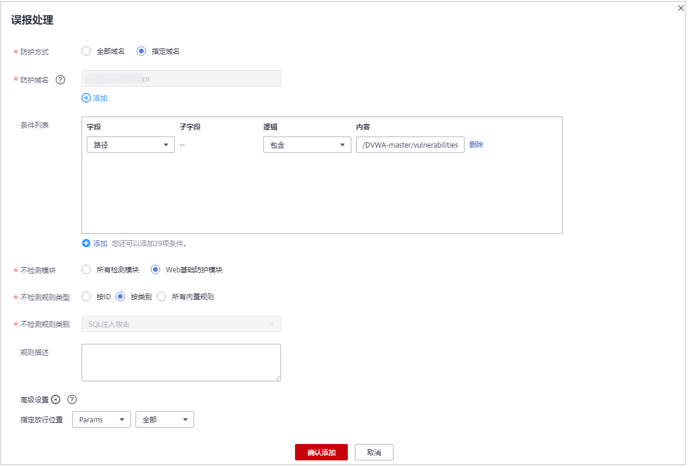

# 处理误报事件

仅WAF预置的Web基础防护规则可添加误报进行屏蔽，用户自己添加的规则无法执行误报屏蔽操作，若需要屏蔽，可将添加的防护规则删除。

当Web应用防火墙拦截或者记录的攻击事件为误报时，您可通过Web应用防火墙对误报进行屏蔽。通过设置URL和规则ID的忽略，以后该URL再次发生攻击时，设置的规则不再告警或者阻断。该章节指导用户通过Web应用防火墙处理误报事件、查看事件详情。

## 前提条件

-   已获取管理控制台的账号和密码。
-   事件详情列表中包含误报攻击事件。

## 操作步骤

1.  [登录管理控制台](https://console.huaweicloud.com/?locale=zh-cn)。
2.  进入防护事件页面入口，如[图1](#waf_01_0156_fig182151235121911)所示。

    **图 1**  防护事件页面入口  
    

3.  选择“查询“页签，在网站或实例下拉列表中选择待查看的防护网站或实例，可查看“昨天“、“今天“、“3天““7天“、“30天“或者自定义时间范围内的防护日志，如[图2](#fig194311743164914)所示，参数说明如[表1](#table146358613417)和[表2](#table135241210519)所示。

    **图 2**  查看防护事件  
    

    **表 1**  防护事件参数说明

    
    <table><thead align="left"><tr id="row863606163419"><th class="cellrowborder" valign="top" width="35.809999999999995%" id="mcps1.2.3.1.1">
参数名称

    </th>
    <th class="cellrowborder" valign="top" width="64.19%" id="mcps1.2.3.1.2">
参数说明

    </th>
    </tr>
    </thead>
    <tbody><tr id="row18636563347"><td class="cellrowborder" valign="top" width="35.809999999999995%" headers="mcps1.2.3.1.1 ">
事件类型

    </td>
    <td class="cellrowborder" valign="top" width="64.19%" headers="mcps1.2.3.1.2 ">
发生攻击的类型。

    
默认选择“全部”，查看所有攻击类型的日志信息，也可以根据需要，选择攻击类型查看攻击日志信息。

    </td>
    </tr>
    <tr id="row14240104218184"><td class="cellrowborder" valign="top" width="35.809999999999995%" headers="mcps1.2.3.1.1 ">
防护动作

    </td>
    <td class="cellrowborder" valign="top" width="64.19%" headers="mcps1.2.3.1.2 ">
防护配置中设置的防护动作，包含：拦截、仅记录、人机验证、放行和过滤。

    </td>
    </tr>
    <tr id="row1563616616349"><td class="cellrowborder" valign="top" width="35.809999999999995%" headers="mcps1.2.3.1.1 ">
源IP

    </td>
    <td class="cellrowborder" valign="top" width="64.19%" headers="mcps1.2.3.1.2 ">
Web访问者的公网IP地址（攻击者IP地址）。

    
默认选择“全部”，查看所有的日志信息，也可以根据需要，选择或者自定义攻击者IP地址查看攻击日志信息。

    </td>
    </tr>
    <tr id="row188821953151813"><td class="cellrowborder" valign="top" width="35.809999999999995%" headers="mcps1.2.3.1.1 ">
URL

    </td>
    <td class="cellrowborder" valign="top" width="64.19%" headers="mcps1.2.3.1.2 ">
攻击的防护域名的URL。

    </td>
    </tr>
    <tr id="row1698513261914"><td class="cellrowborder" valign="top" width="35.809999999999995%" headers="mcps1.2.3.1.1 ">
事件ID

    </td>
    <td class="cellrowborder" valign="top" width="64.19%" headers="mcps1.2.3.1.2 ">
标识该防护事件的ID。

    </td>
    </tr>
    </tbody>
    </table>

    **表 2**  日志列表参数说明

    
    <table><thead align="left"><tr id="row135266102011"><th class="cellrowborder" valign="top" width="50%" id="mcps1.2.3.1.1">
参数名称

    </th>
    <th class="cellrowborder" valign="top" width="50%" id="mcps1.2.3.1.2">
参数说明

    </th>
    </tr>
    </thead>
    <tbody><tr id="row152661018114"><td class="cellrowborder" valign="top" width="50%" headers="mcps1.2.3.1.1 ">
时间

    </td>
    <td class="cellrowborder" valign="top" width="50%" headers="mcps1.2.3.1.2 ">
发生本次攻击的时间。

    </td>
    </tr>
    <tr id="row352616101114"><td class="cellrowborder" valign="top" width="50%" headers="mcps1.2.3.1.1 ">
源IP

    </td>
    <td class="cellrowborder" valign="top" width="50%" headers="mcps1.2.3.1.2 ">
Web访问者的公网IP地址（攻击者IP地址）。

    </td>
    </tr>
    <tr id="row652611010115"><td class="cellrowborder" valign="top" width="50%" headers="mcps1.2.3.1.1 ">
防护域名

    </td>
    <td class="cellrowborder" valign="top" width="50%" headers="mcps1.2.3.1.2 ">
被攻击的防护域名。

    </td>
    </tr>
    <tr id="row10526810313"><td class="cellrowborder" valign="top" width="50%" headers="mcps1.2.3.1.1 ">
URL

    </td>
    <td class="cellrowborder" valign="top" width="50%" headers="mcps1.2.3.1.2 ">
攻击的防护域名的URL。

    </td>
    </tr>
    <tr id="row635713296113"><td class="cellrowborder" valign="top" width="50%" headers="mcps1.2.3.1.1 ">
恶意负载

    </td>
    <td class="cellrowborder" valign="top" width="50%" headers="mcps1.2.3.1.2 ">
发生攻击的恶意负载位置。

    </td>
    </tr>
    <tr id="row33596297111"><td class="cellrowborder" valign="top" width="50%" headers="mcps1.2.3.1.1 ">
事件类型

    </td>
    <td class="cellrowborder" valign="top" width="50%" headers="mcps1.2.3.1.2 ">
发生攻击的类型。

    </td>
    </tr>
    <tr id="row17359429116"><td class="cellrowborder" valign="top" width="50%" headers="mcps1.2.3.1.1 ">
防护动作

    </td>
    <td class="cellrowborder" valign="top" width="50%" headers="mcps1.2.3.1.2 ">
防护配置中设置的防护动作，包含：拦截、仅记录、人机验证、放行和过滤。

    </td>
    </tr>
    </tbody>
    </table>

    > **说明：**   
    >如果需要查看目标域名攻击事件详情，可在事件列表中的“操作“列，单击“详情“。  

4.  当攻击事件属于误报时，在该攻击事件所在行的“操作“列，单击“误报处理“，添加误报屏蔽策略，如[图3](#fig16174064111318)所示，参数说明如[表3](#table1326514293541)所示。

    > **说明：**   
    >仅WAF预置的Web基础防护规则可添加误报进行屏蔽，用户自己添加的规则无法执行误报屏蔽操作，若需要屏蔽，可将添加的防护规则删除。  

    **图 3**  误报处理  
    

    **表 3**  误报处理参数说明

    
    <table><thead align="left"><tr id="row1226682975418"><th class="cellrowborder" valign="top" width="17.22172217221722%" id="mcps1.2.4.1.1">
参数

    </th>
    <th class="cellrowborder" valign="top" width="56.265626562656266%" id="mcps1.2.4.1.2">
参数说明

    </th>
    <th class="cellrowborder" valign="top" width="26.512651265126514%" id="mcps1.2.4.1.3">
取值样例

    </th>
    </tr>
    </thead>
    <tbody><tr id="row162661429185419"><td class="cellrowborder" valign="top" width="17.22172217221722%" headers="mcps1.2.4.1.1 ">
防护域名

    </td>
    <td class="cellrowborder" valign="top" width="56.265626562656266%" headers="mcps1.2.4.1.2 ">
发生攻击事件的域名，系统自动获取。

    </td>
    <td class="cellrowborder" valign="top" width="26.512651265126514%" headers="mcps1.2.4.1.3 ">
--

    </td>
    </tr>
    <tr id="row1266112975410"><td class="cellrowborder" valign="top" width="17.22172217221722%" headers="mcps1.2.4.1.1 ">
路径

    </td>
    <td class="cellrowborder" valign="top" width="56.265626562656266%" headers="mcps1.2.4.1.2 ">
误报事件的URL路径，不包含域名。默认为攻击事件的来源路径。

    <ul id="ul1187017515530"><li>前缀匹配：选择“前缀为”，代表以输入的路径为前缀。例如，需要防护的路径为“/admin/test.php”或 “/adminabc”，则路径可以填写为“/admin”。</li><li>精准匹配：选择“等于”，需要防护的路径需要与此处填写的路径完全相等。例如，需要防护的路径为“/admin/test.php”，该规则必须填写为“/admin/test.php”。</li></ul>
    
 说明： 
<ul id="ul982719519561"><li>该路径不支持正则，仅支持前缀匹配和精准匹配的逻辑。</li><li>路径里不能含有连续的多条斜线的配置，如“///admin”，访问时，引擎会将“///”转为“/”。</li></ul>
    

    </td>
    <td class="cellrowborder" valign="top" width="26.512651265126514%" headers="mcps1.2.4.1.3 ">
--

    </td>
    </tr>
    <tr id="row107243367577"><td class="cellrowborder" valign="top" width="17.22172217221722%" headers="mcps1.2.4.1.1 ">
规则

    </td>
    <td class="cellrowborder" valign="top" width="56.265626562656266%" headers="mcps1.2.4.1.2 ">
您可以选择以下三种方式进行配置：

    <ul id="ul52161845421"><li>按ID：按攻击事件的ID进行配置。</li><li>按类别：按攻击事件类别进行配置。</li><li>所有内置规则：<a href="配置Web基础防护规则.md">Web基础防护规则</a>里开启的所有防护规则。</li></ul>
    </td>
    <td class="cellrowborder" valign="top" width="26.512651265126514%" headers="mcps1.2.4.1.3 ">
按类别

    </td>
    </tr>
    <tr id="row11683316572"><td class="cellrowborder" valign="top" width="17.22172217221722%" headers="mcps1.2.4.1.1 ">
ID

    </td>
    <td class="cellrowborder" valign="top" width="56.265626562656266%" headers="mcps1.2.4.1.2 ">
当“规则”选择“按ID”时，需要配置此参数。

    
自动读取的内置规则的ID。

    </td>
    <td class="cellrowborder" valign="top" width="26.512651265126514%" headers="mcps1.2.4.1.3 ">
060015

    </td>
    </tr>
    <tr id="row12930143018571"><td class="cellrowborder" valign="top" width="17.22172217221722%" headers="mcps1.2.4.1.1 ">
类别

    </td>
    <td class="cellrowborder" valign="top" width="56.265626562656266%" headers="mcps1.2.4.1.2 ">
当“规则”选择“按类别”时，需要配置此参数。

    
自动获取的攻击事件类别。

    </td>
    <td class="cellrowborder" valign="top" width="26.512651265126514%" headers="mcps1.2.4.1.3 ">
远程文件包含

    </td>
    </tr>
    <tr id="row112667298541"><td class="cellrowborder" valign="top" width="17.22172217221722%" headers="mcps1.2.4.1.1 ">
规则描述

    </td>
    <td class="cellrowborder" valign="top" width="56.265626562656266%" headers="mcps1.2.4.1.2 ">
可选参数，设置该规则的备注信息。

    </td>
    <td class="cellrowborder" valign="top" width="26.512651265126514%" headers="mcps1.2.4.1.3 ">
不拦截SQL注入攻击

    </td>
    </tr>
    <tr id="row182661329175418"><td class="cellrowborder" valign="top" width="17.22172217221722%" headers="mcps1.2.4.1.1 ">
高级设置

    </td>
    <td class="cellrowborder" valign="top" width="56.265626562656266%" headers="mcps1.2.4.1.2 ">
如果您只想忽略来源于某攻击事件下指定字段的攻击，可在“高级设置”里选择指定字段进行配置，配置完成后，WAF将不再拦截指定字段的攻击事件。

    
在左边第一个下拉列表中选择目标字段。支持的字段有：Params、Cookie、Header、Body、Multipart。<ul id="ul174282283277"><li>当选择“Params”、“Cookie”或者“Header”字段时，根据需求配置子字段。</li><li>当选择“Cookie”字段时，“防护域名”和“路径”可以为空。</li></ul>
    

    </td>
    <td class="cellrowborder" valign="top" width="26.512651265126514%" headers="mcps1.2.4.1.3 ">
Params

    
全部

    </td>
    </tr>
    </tbody>
    </table>

5.  单击“确认添加“，处理误报，攻击事件详情列表中不再出现此误报。

    > **说明：**   
    >-   用户可进入“域名列表“页面，在对应防护域名的所在行的“防护策略“列中，单击“配置防护策略“，在“误报屏蔽“栏中，单击“自定义误报屏蔽规则“，进入误报屏蔽列表，查看添加的误报屏蔽事件。  
    >-   设置误报屏蔽后，1分钟左右生效。您可以刷新浏览器缓存，重新访问设置了误报屏蔽的页面，验证是否配置成功。  

