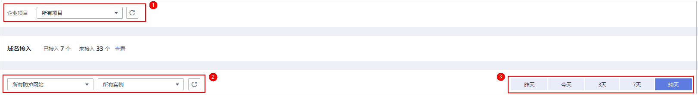
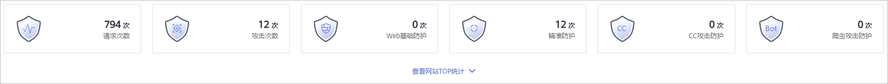
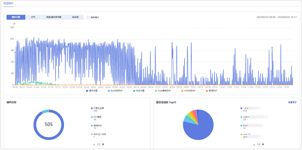

# 安全总览

在“安全总览“页面，您可以查看昨天、今天、3天、7天或者30天内所有防护网站或所有实例以及指定防护网站或实例的防护日志。包括请求与各攻击类型统计次数，QPS、带宽、响应码信息，以及事件分布、受攻击域名 Top10、攻击源IP Top10、受攻击URL Top10、攻击来源区域 Top10和业务异常监控 Top10等防护数据。

安全总览页面统计数据每隔2分钟刷新一次。

> **说明：** 
>如果您已开通企业项目，您可以在“企业项目“下拉列表中选择您所在的企业项目，查看该企业项目的安全总览信息。

## 前提条件

-   已添加了防护域名并已完成了域名接入。
-   WAF防护已开启。
-   已为防护域名添加了一个或者多个防护规则。

## 规格限制

在“安全总览“界面，最多可以查看30天的防护数据。

## QPS计算方式

不同时间段的QPS计算方式不同，QPS在各时间段的取值说明如[表1](#table397244618286)所示。

**表 1**  QPS取值说明

<table><thead align="left"><tr id="row597374642813"><th class="cellrowborder" valign="top" width="23.29%" id="mcps1.2.4.1.1">
时间段

</th>
<th class="cellrowborder" valign="top" width="41.449999999999996%" id="mcps1.2.4.1.2">
QPS平均取值说明

</th>
<th class="cellrowborder" valign="top" width="35.260000000000005%" id="mcps1.2.4.1.3">
QPS峰值取值说明

</th>
</tr>
</thead>
<tbody><tr id="row129735464286"><td class="cellrowborder" valign="top" width="23.29%" headers="mcps1.2.4.1.1 ">
“昨天”、“今天”

</td>
<td class="cellrowborder" valign="top" width="41.449999999999996%" headers="mcps1.2.4.1.2 ">
间隔1分钟，取1分钟内的平均值

</td>
<td class="cellrowborder" valign="top" width="35.260000000000005%" headers="mcps1.2.4.1.3 ">
间隔1分钟，取1分钟内的最大值

</td>
</tr>
<tr id="row129731465286"><td class="cellrowborder" valign="top" width="23.29%" headers="mcps1.2.4.1.1 ">
“3天”

</td>
<td class="cellrowborder" valign="top" width="41.449999999999996%" headers="mcps1.2.4.1.2 ">
间隔5分钟，取5分钟内的平均值

</td>
<td class="cellrowborder" valign="top" width="35.260000000000005%" headers="mcps1.2.4.1.3 ">
间隔5分钟，取5分钟内的最大值

</td>
</tr>
<tr id="row3373193273111"><td class="cellrowborder" valign="top" width="23.29%" headers="mcps1.2.4.1.1 ">
“7天”

</td>
<td class="cellrowborder" valign="top" width="41.449999999999996%" headers="mcps1.2.4.1.2 ">
间隔10分钟，取每5分钟内平均值的最大值

</td>
<td class="cellrowborder" valign="top" width="35.260000000000005%" headers="mcps1.2.4.1.3 ">
间隔10分钟，取10分钟内最大值

</td>
</tr>
<tr id="row93115013324"><td class="cellrowborder" valign="top" width="23.29%" headers="mcps1.2.4.1.1 ">
“30天”

</td>
<td class="cellrowborder" valign="top" width="41.449999999999996%" headers="mcps1.2.4.1.2 ">
间隔1小时，取每5分钟内平均值的最大值

</td>
<td class="cellrowborder" valign="top" width="35.260000000000005%" headers="mcps1.2.4.1.3 ">
间隔1小时，取1小时内最大值

</td>
</tr>
</tbody>
</table>

> **说明：** 
>QPS（Queries Per Second）即每秒钟的请求量，例如一个HTTP GET请求就是一个Query。请求次数是间隔时间内请求的总量。

## 操作步骤

1.  [登录管理控制台](https://console.huaweicloud.com/?locale=zh-cn)。
2.  单击管理控制台左上角的，选择区域或项目。
3.  单击页面左上方的，选择“安全与合规  \>  Web应用防火墙 WAF“，进入“安全总览“页面。
4.  在页面上方，选择“企业项目“，设置要查询的网站、实例以及查询时间。

    -   默认统计的是该账号所有项目下添加到WAF的所有网站的相关数据。
    -   “域名接入“：统计的是选择的企业项目下，添加到WAF的防护网站的接入信息。单击“查看“跳转到“网站设置“界面，可以查看防护域名详细信息。
    -   查询时间：可选择昨天、今天、3天、7天、30天。

    **图 1**  查询条件设置  
    

5.  查看统计的总的请求次数、攻击次数以及各类型攻击的页面总数。

    -   “请求次数“中统计的次数为网站的PV（Page Views）值，即用户每次访问网站，在某个时间内被访问的页面总数。
    -   “攻击次数“中统计的次数为网站被各类型攻击的总次数。
    -   各攻击类型统计的次数为用户每次访问网站，在某个时间内被该类型攻击的页面总数。
    -   单击“查看网站TOP统计“，可查看请求次数、攻击次数、Web基础防护、精准防护、CC攻击防护、爬虫攻击防护排名TOP 10的数据。

    **图 2**  防护统计数据  
    

6.  “安全统计“模块数据展示。

    “按天统计“：勾选后，显示的是间隔一天统计一次的数据；不勾选，统计的数据周期根据选择的时间段而定，具体如下：

    -   “昨天“、“今天“：间隔两分钟统计一次数据。
    -   “3天“：间隔5分钟统计一次数据。
    -   “7天“：间隔10分钟统计一次数据。
    -   “30天“：间隔1小时统计一次数据。

    **图 3**  安全统计  
    

    **表 2**  安全统计参数说明

    
    <table><thead align="left"><tr id="row1192514982914"><th class="cellrowborder" valign="top" width="28.01%" id="mcps1.2.3.1.1">
参数

    </th>
    <th class="cellrowborder" valign="top" width="71.99%" id="mcps1.2.3.1.2">
说明

    </th>
    </tr>
    </thead>
    <tbody><tr id="row692529122916"><td class="cellrowborder" valign="top" width="28.01%" headers="mcps1.2.3.1.1 ">
请求次数

    </td>
    <td class="cellrowborder" valign="top" width="71.99%" headers="mcps1.2.3.1.2 ">
统计的是域名被访问的总请求量、攻击总量以及被各类攻击类型攻击的页面总数。

    </td>
    </tr>
    <tr id="row10926297292"><td class="cellrowborder" valign="top" width="28.01%" headers="mcps1.2.3.1.1 ">
QPS

    </td>
    <td class="cellrowborder" valign="top" width="71.99%" headers="mcps1.2.3.1.2 ">
域名平均每秒钟的请求量。QPS的取值说明参考<a href="#section1588682602717">QPS计算方式</a>。

    
QPS（Queries Per Second）即每秒钟的请求量，例如一个HTTP GET请求就是一个Query。

    </td>
    </tr>
    <tr id="row119261992916"><td class="cellrowborder" valign="top" width="28.01%" headers="mcps1.2.3.1.1 ">
发送/接收字节数

    </td>
    <td class="cellrowborder" valign="top" width="71.99%" headers="mcps1.2.3.1.2 ">
域名访问的占用带宽。

    
发送、接收字节数是通过request_length，upstream_bytes_received按时间进行累加统计，与EIP上监控的网络带宽值存在差异。此外，造成两者差异的原因，还可能跟网页压缩、连接复用、TCP重传等因素相关。

    
 须知： 

目前仅以下区域支持查看带宽统计信息：

    <ul id="ul3926199152919"><li>华北-北京一</li><li>华北-北京四</li><li>华东-上海一</li><li>华南-广州</li><li>华东-上海二</li><li>中国-香港</li><li>亚太-曼谷</li></ul>
    

    </td>
    </tr>
    <tr id="row5926391292"><td class="cellrowborder" valign="top" width="28.01%" headers="mcps1.2.3.1.1 ">
响应码

    </td>
    <td class="cellrowborder" valign="top" width="71.99%" headers="mcps1.2.3.1.2 ">
可以查看“WAF返回客户端”和“源站返回给WAF”对应响应码以及响应次数。

    
响应码的数量是按照图表下方响应码的顺序（从左至右）累加进行显示，对应响应码的数量是为两条线的差值（如果某个响应码值为0，会与前一个的响应码显示的线重合）。

    </td>
    </tr>
    <tr id="row898710466506"><td class="cellrowborder" valign="top" width="28.01%" headers="mcps1.2.3.1.1 ">
事件分布

    </td>
    <td class="cellrowborder" valign="top" width="71.99%" headers="mcps1.2.3.1.2 ">
查看攻击事件类型。

    
单击“事件分布”中的任意一个区域，可查看指定域名被攻击的类型、攻击的次数、以及攻击占比。

    </td>
    </tr>
    <tr id="row124101555165018"><td class="cellrowborder" valign="top" width="28.01%" headers="mcps1.2.3.1.1 ">
受攻击域名 Top10

    </td>
    <td class="cellrowborder" valign="top" width="71.99%" headers="mcps1.2.3.1.2 ">
受攻击统计次数Top 10的域名以及各域名受攻击的次数。

    
单击“查看更多”，可以跳转到“防护事件”页面，查看更多防护数据。

    </td>
    </tr>
    <tr id="row194116550500"><td class="cellrowborder" valign="top" width="28.01%" headers="mcps1.2.3.1.1 ">
攻击源IP Top10

    </td>
    <td class="cellrowborder" valign="top" width="71.99%" headers="mcps1.2.3.1.2 ">
攻击次数Top 10的攻击源IP以及各源IP发起的攻击次数。

    
单击“查看更多”，可以跳转到“防护事件”页面，查看更多防护数据。

    </td>
    </tr>
    <tr id="row105012484523"><td class="cellrowborder" valign="top" width="28.01%" headers="mcps1.2.3.1.1 ">
受攻击URL Top10

    </td>
    <td class="cellrowborder" valign="top" width="71.99%" headers="mcps1.2.3.1.2 ">
受攻击统计次数Top 10的URL以及各URL受攻击的次数。

    
单击“查看更多”，可以跳转到“防护事件”页面，查看更多防护数据。

    </td>
    </tr>
    <tr id="row195020489520"><td class="cellrowborder" valign="top" width="28.01%" headers="mcps1.2.3.1.1 ">
攻击来源区域 Top10

    </td>
    <td class="cellrowborder" valign="top" width="71.99%" headers="mcps1.2.3.1.2 ">
攻击次数Top 10的地区以及来源各地区发起的攻击次数。

    </td>
    </tr>
    <tr id="row15054817522"><td class="cellrowborder" valign="top" width="28.01%" headers="mcps1.2.3.1.1 ">
业务异常监控 Top10

    </td>
    <td class="cellrowborder" valign="top" width="71.99%" headers="mcps1.2.3.1.2 ">
业务异常的Top 10防护网站。可以查看业务异常为“404”、“500”、“502”的防护网站。

    
单击“业务异常排查”，参照操作指导排查相应业务异常以及其他业务异常。

    </td>
    </tr>
    </tbody>
    </table>

