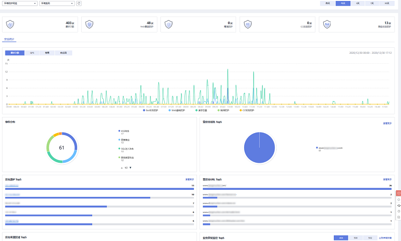

# 安全总览

在“安全总览“页面，您可以查看昨天、今天、3天、7天或者30天内所有防护网站或所有实例以及指定防护网站或实例的防护日志。包括请求与各攻击类型统计次数，QPS、带宽、响应码信息，以及事件分布、受攻击域名 Top10、攻击源IP Top10、受攻击URL Top10、攻击来源区域 Top10和业务异常监控 Top10等防护数据。

安全总览页面统计数据每隔2分钟刷新一次。

> **说明：** 
>如果您已开通企业项目，您可以在“企业项目“下拉列表中选择您所在的企业项目，查看该企业项目的安全总览信息。

## 前提条件

-   已添加了防护域名并已完成了域名接入。
-   WAF防护已开启。
-   已为防护域名添加了一个或者多个防护规则。

## 规格限制

在“安全总览“界面，最多可以查看30天的防护数据。

## 操作步骤

1.  [登录管理控制台](https://console.huaweicloud.com/?locale=zh-cn)。
2.  单击管理控制台左上角的，选择区域或项目。
3.  单击页面左上方的，选择“安全  \>  Web应用防火墙 WAF“，进入“安全总览“页面。
4.  在网站下拉列表中，选择要查看的网站，以及选择查看的历史时间段（昨天、今天、3天、7天、30天），可以查看统计的请求次数和各类型的攻击次数，以及详细的防护信息，如[图1](#fig11493115019718)所示，详细信息说明如[表1](#table6493750771)所示。

    -   各攻击类型统计的次数为用户每次访问网站，在某个时间内被该类型攻击的页面总数。
    -   “请求次数“中统计的次数为网站的PV（Page Views）值，即用户每次访问网站，在某个时间内被访问的页面总数。

    **图 1**  查看防护日志  
    

    **表 1**  防护日志参数说明

    
    <table><thead align="left"><tr id="row144931550072"><th class="cellrowborder" valign="top" width="25.81258125812581%" id="mcps1.2.4.1.1">
参数

    </th>
    <th class="cellrowborder" valign="top" width="38.033803380338036%" id="mcps1.2.4.1.2">
说明

    </th>
    <th class="cellrowborder" valign="top" width="36.153615361536154%" id="mcps1.2.4.1.3">
界面说明

    </th>
    </tr>
    </thead>
    <tbody><tr id="row3927172953019"><td class="cellrowborder" valign="top" width="25.81258125812581%" headers="mcps1.2.4.1.1 ">
域名接入

    </td>
    <td class="cellrowborder" valign="top" width="38.033803380338036%" headers="mcps1.2.4.1.2 ">
防护域名整体接入信息。

    </td>
    <td class="cellrowborder" valign="top" width="36.153615361536154%" headers="mcps1.2.4.1.3 ">
单击“查看”跳转到“网站设置”界面，可以查看防护域名详细信息。

    </td>
    </tr>
    <tr id="row204941850875"><td class="cellrowborder" valign="top" width="25.81258125812581%" headers="mcps1.2.4.1.1 ">
请求次数

    </td>
    <td class="cellrowborder" valign="top" width="38.033803380338036%" headers="mcps1.2.4.1.2 ">
域名访问的总次数。

    </td>
    <td class="cellrowborder" valign="top" width="36.153615361536154%" headers="mcps1.2.4.1.3 ">
-

    </td>
    </tr>
    <tr id="row144947501679"><td class="cellrowborder" valign="top" width="25.81258125812581%" headers="mcps1.2.4.1.1 ">
QPS

    </td>
    <td class="cellrowborder" valign="top" width="38.033803380338036%" headers="mcps1.2.4.1.2 ">
域名平均每秒钟的请求量。

    
QPS（Queries Per Second）即每秒钟的请求量，例如一个HTTP GET请求就是一个Query。

    </td>
    <td class="cellrowborder" valign="top" width="36.153615361536154%" headers="mcps1.2.4.1.3 ">
-

    </td>
    </tr>
    <tr id="row1197294484620"><td class="cellrowborder" valign="top" width="25.81258125812581%" headers="mcps1.2.4.1.1 ">
带宽

    </td>
    <td class="cellrowborder" valign="top" width="38.033803380338036%" headers="mcps1.2.4.1.2 ">
域名访问的占用带宽。

    </td>
    <td class="cellrowborder" valign="top" width="36.153615361536154%" headers="mcps1.2.4.1.3 ">
-

    </td>
    </tr>
    <tr id="row11494125018713"><td class="cellrowborder" valign="top" width="25.81258125812581%" headers="mcps1.2.4.1.1 ">
响应码

    </td>
    <td class="cellrowborder" valign="top" width="38.033803380338036%" headers="mcps1.2.4.1.2 ">
可以查看“WAF返回客户端”和“源站返回给WAF”对应响应码以及响应次数。

    </td>
    <td class="cellrowborder" valign="top" width="36.153615361536154%" headers="mcps1.2.4.1.3 ">
-

    </td>
    </tr>
    <tr id="row7889152313473"><td class="cellrowborder" valign="top" width="25.81258125812581%" headers="mcps1.2.4.1.1 ">
事件分布

    </td>
    <td class="cellrowborder" valign="top" width="38.033803380338036%" headers="mcps1.2.4.1.2 ">
查看攻击事件类型。

    </td>
    <td class="cellrowborder" valign="top" width="36.153615361536154%" headers="mcps1.2.4.1.3 ">
单击“事件分布”中的任一个区域，可查看指定域名被攻击的类型、攻击的次数、以及攻击占比。

    </td>
    </tr>
    <tr id="row1793135314713"><td class="cellrowborder" valign="top" width="25.81258125812581%" headers="mcps1.2.4.1.1 ">
受攻击域名 Top10

    </td>
    <td class="cellrowborder" valign="top" width="38.033803380338036%" headers="mcps1.2.4.1.2 ">
受攻击统计次数Top 10的域名以及各域名受攻击的次数。

    </td>
    <td class="cellrowborder" valign="top" width="36.153615361536154%" headers="mcps1.2.4.1.3 ">
在“受攻击域名 Top10”区域框右上角，单击“查看更多”，可以跳转到“防护事件”页面，查看更多防护数据。

    </td>
    </tr>
    <tr id="row19407205924720"><td class="cellrowborder" valign="top" width="25.81258125812581%" headers="mcps1.2.4.1.1 ">
攻击源IP Top10

    </td>
    <td class="cellrowborder" valign="top" width="38.033803380338036%" headers="mcps1.2.4.1.2 ">
攻击次数Top 10的攻击源IP以及各源IP发起的攻击次数。

    </td>
    <td class="cellrowborder" valign="top" width="36.153615361536154%" headers="mcps1.2.4.1.3 ">
在“攻击源IP Top10”区域框右上角，单击“查看更多”，可以跳转到“防护事件”页面，查看更多防护数据。

    </td>
    </tr>
    <tr id="row772141254811"><td class="cellrowborder" valign="top" width="25.81258125812581%" headers="mcps1.2.4.1.1 ">
受攻击URL Top10

    </td>
    <td class="cellrowborder" valign="top" width="38.033803380338036%" headers="mcps1.2.4.1.2 ">
受攻击统计次数Top 10的URL以及各URL受攻击的次数。

    </td>
    <td class="cellrowborder" valign="top" width="36.153615361536154%" headers="mcps1.2.4.1.3 ">
在“受攻击URL Top10”区域框右上角，单击“查看更多”，可以跳转到“防护事件”页面，查看更多防护数据。

    </td>
    </tr>
    <tr id="row43446259480"><td class="cellrowborder" valign="top" width="25.81258125812581%" headers="mcps1.2.4.1.1 ">
攻击来源区域 Top10

    </td>
    <td class="cellrowborder" valign="top" width="38.033803380338036%" headers="mcps1.2.4.1.2 ">
攻击次数Top 10的地区以及来源各地区发起的攻击次数。

    </td>
    <td class="cellrowborder" valign="top" width="36.153615361536154%" headers="mcps1.2.4.1.3 ">
-

    </td>
    </tr>
    <tr id="row115285318502"><td class="cellrowborder" valign="top" width="25.81258125812581%" headers="mcps1.2.4.1.1 ">
业务异常监控 Top10

    </td>
    <td class="cellrowborder" valign="top" width="38.033803380338036%" headers="mcps1.2.4.1.2 ">
业务异常的Top 10防护网站。可以查看业务异常为“404”、“500”、“502”的防护网站。

    </td>
    <td class="cellrowborder" valign="top" width="36.153615361536154%" headers="mcps1.2.4.1.3 ">
在“业务异常监控 Top10”区域框右上角，单击“业务异常排查”，参照操作指导排查相应业务异常以及其他业务异常。

    </td>
    </tr>
    </tbody>
    </table>

