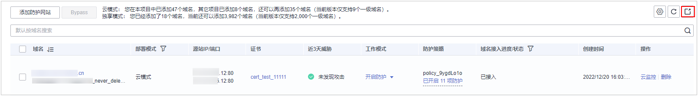

# 导出网站设置列表

在Web应用防火墙的网站设置页面，可以导出该账号下添加到WAF的所有网站设置信息。

## 前提条件

已成功添加防护网站。

## 操作步骤

1.  [登录管理控制台](https://console.huaweicloud.com/?locale=zh-cn)。
2.  单击管理控制台左上角的，选择区域或项目。
3.  单击页面左上方的，选择“安全与合规  \>  Web应用防火墙 WAF“。
4.  在左侧导航树中，选择“网站设置“，进入“网站设置“页面。
5.  在网站列表的右上角，单击，网站信息列表将导出到本地。

    **图 1**  网站列表  
    

