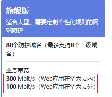

# 带宽扩展包说明

通过包年包月模式购买Web应用防火墙（WAF）时，专业版、企业版和旗舰版存在一定量的业务带宽限制。您可以购买带宽扩展包以满足更大的业务带宽需求。

## 什么是业务带宽限制

WAF的业务带宽是指所有该WAF防护的域名、站点中正常业务流量的大小，单位为Mbit/s。一个带宽扩展包包含20Mbit/s/50Mbit/s（华为云外/华为云内）或者1,000QPS（Query Per Second，即每秒钟的请求量，例如一个HTTP GET请求就是一个Query）。

> **说明：**   
>WAF中的实际业务带宽由WAF单独计算，与其他华为云产品（如CDN、ELB、ECS等）的带宽或者流量限制没有任何关联。  

通过包年包月模式购买WAF时，专业版、企业版和旗舰版都存在一定量的业务带宽限制，且在华为云内的源站服务器（如ECS、ELB实例等）可享有更高的业务带宽。例如，在WAF旗舰版套餐中，对于华为云内的源站的业务带宽限制为300Mbit/s，而对于华为云外的服务器（如IDC机房等）的业务带宽限制则为100Mbit/s，如[图1](#zh-cn_topic_0169204299_fig134541713116)所示。

**图 1**  业务带宽  

## 如何选择带宽扩展包

购买Web应用防火墙时，您需要提前考虑您准备通过WAF配置防护的所有站点的日常入方向和出方向总流量的峰值，确保您选购的WAF套餐所对应的业务带宽限制大于入、出方向总流量峰值中较大的值。

> **说明：**   
>一般情况下，出方向的流量会比较大。  

您可以参考云服务器（ECS）管理控制台中的流量统计，或者通过您站点服务器上的其它监控工具来评估您的实际业务流量大小。

> **说明：**   
>此处的流量指的是正常的业务流量。例如，您需要将所有站点对外访问的流量都接入WAF进行防护，在正常访问（未遭受攻击）时，WAF将这些正常访问流量回源到源站ECS实例；而当站点遭受攻击（CC攻击或DDoS攻击）时，WAF将异常流量拦截、过滤后，将正常流量回源到源站ECS实例。因此，您在云服务器（ECS）管理控制台中查看您源站ECS实例的入方向及出方向的流量就是正常的业务流量。如果存在多个源站ECS实例，则需要统计所有源站ECS实例流量的总和。例如：假设您需要通过WAF配置防护六个站点，每个站点的出方向的正常业务流量峰值都不超过50Mbit/s，流量总和不超过300Mbit/s。这种情况下，您只需选择购买Web应用防火墙旗舰版套餐即可。  

## 超过业务带宽限制会有什么影响

如果您的正常业务流量超过您已购买的WAF版本的业务带宽限制，您在WAF中配置的全部业务的流量转发将可能受到影响。

超出业务带宽限制后，可能出现限流、随机丢包等现象，导致您的正常业务在一定时间内不可用、卡顿、延迟等。

如果出现这种情况，您需要升级WAF版本或者扩展业务带宽，避免正常业务流量超出业务带宽限制所产生的影响。

## 带宽扩展包

如果您通过WAF防护的网站的业务流量较大，您可以额外购买更多的带宽扩展包防止超过WAF版本的业务带宽限制。

例如，您当前的业务流量需求为70Mbit/s（华为云外的源站服务器），您已经购买了WAF企业版套餐（带宽限制为50Mbit/s），这种情况下您需要额外购买20Mbit/s的带宽扩展包，确保您的业务访问正常。您可以通过[升级版本和规格](升级版本和规格.md)来增加带宽扩展配置，满足更大的业务带宽需求。

