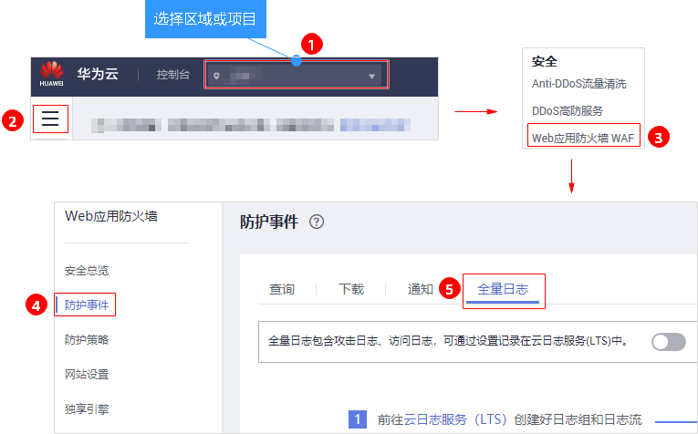
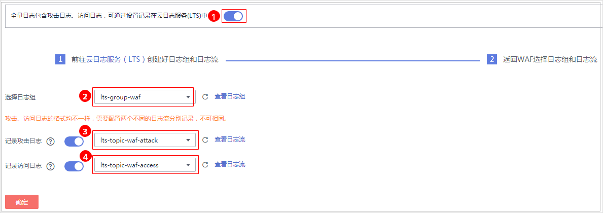
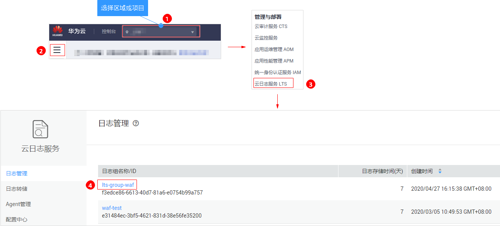
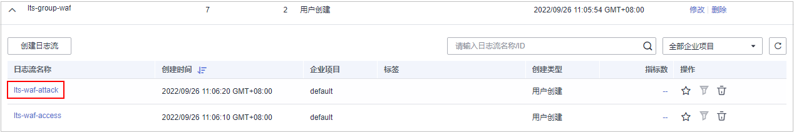
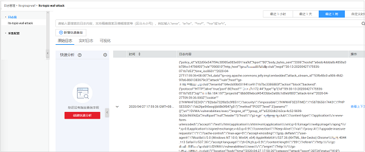
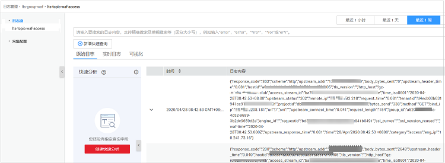

# 开启全量日志

启用WAF全量日志功能后，您可以将攻击日志、访问日志记录到华为云的云日志服务（Log Tank Service，简称LTS）中，通过LTS记录的WAF日志数据，快速高效地进行实时决策分析、设备运维管理以及业务趋势分析。

LTS对于采集的日志数据，通过海量日志数据的分析与处理，可以为您提供一个实时、高效、安全的日志处理能力。LTS默认存储日志的时间为7天，存储时间可以在1～30天之间进行设置，超出存储时间的日志数据将会被自动删除，对于需要长期存储的日志数据（日志持久化），LTS提供转储功能，可以将日志转储至对象存储服务（OBS）或者数据接入服务（DIS）中长期保存。

> **须知：**   
>-   在WAF管理控制台，您可以查看最近30天的防护日志、下载5天内的所有防护域名的防护日志数据。  
>-   LTS按流量单独计费。有关LTS的计费详情，请参见[LTS价格详情](https://www.huaweicloud.com/pricing.html#/lts)。  

## 前提条件

已成功添加防护域名。

## 将防护日志配置到LTS

1.  [登录管理控制台](https://console.huaweicloud.com/?locale=zh-cn)。
2.  进入全量日志配置入口，如[图1](#fig1030319478517)所示。

    **图 1**  全量日志入口  
    

3.  开启全量日志，并选择日志组和日志流，如[图2](#fig928951613101)所示，相关参数说明如[表1](#table11535733111515)所示。

    **图 2**  配置全量日志  
    

    **表 1**  全量日志配置参数

    
    <table><thead align="left"><tr id="row353613334158"><th class="cellrowborder" valign="top" width="26.12261226122612%" id="mcps1.2.4.1.1">
参数

    </th>
    <th class="cellrowborder" valign="top" width="40.54405440544054%" id="mcps1.2.4.1.2">
参数说明

    </th>
    <th class="cellrowborder" valign="top" width="33.33333333333333%" id="mcps1.2.4.1.3">
取值样例

    </th>
    </tr>
    </thead>
    <tbody><tr id="row15536143321520"><td class="cellrowborder" valign="top" width="26.12261226122612%" headers="mcps1.2.4.1.1 ">
选择日志组

    </td>
    <td class="cellrowborder" valign="top" width="40.54405440544054%" headers="mcps1.2.4.1.2 ">
选择已创建的日志组，或者单击“查看日志组”，跳转到LTS管理控制台创建新的日志组。

    </td>
    <td class="cellrowborder" valign="top" width="33.33333333333333%" headers="mcps1.2.4.1.3 ">
lts-group-waf

    </td>
    </tr>
    <tr id="row15536133111516"><td class="cellrowborder" valign="top" width="26.12261226122612%" headers="mcps1.2.4.1.1 ">
记录攻击日志

    </td>
    <td class="cellrowborder" valign="top" width="40.54405440544054%" headers="mcps1.2.4.1.2 ">
选择已创建的日志流，或者单击“查看日志流”，跳转到LTS管理控制台创建新的日志流。

    
攻击日志记录每一个攻击告警信息，包括攻击事件类型、防护动作、攻击源IP等信息。

    </td>
    <td class="cellrowborder" valign="top" width="33.33333333333333%" headers="mcps1.2.4.1.3 ">
lts-topic-waf-attack

    </td>
    </tr>
    <tr id="row5536143301512"><td class="cellrowborder" valign="top" width="26.12261226122612%" headers="mcps1.2.4.1.1 ">
记录访问日志

    </td>
    <td class="cellrowborder" valign="top" width="40.54405440544054%" headers="mcps1.2.4.1.2 ">
选择已创建的日志流，或者单击“查看日志流”，跳转到LTS管理控制台创建新的日志流。

    
访问日志记录每一个HTTP访问的关键信息，包括访问时间、访问客户端IP、访问资源URL等信息。

    </td>
    <td class="cellrowborder" valign="top" width="33.33333333333333%" headers="mcps1.2.4.1.3 ">
lts-topic-waf-access

    </td>
    </tr>
    </tbody>
    </table>

4.  单击“确定“，全量日志配置成功。

    您可以在LTS管理控制台查看WAF的防护日志。

## 在LTS上查看WAF防护日志

当您将WAF防护日志配置记录到LTS上后，请参考以下操作步骤，在LTS管理控制台查看、分析记录的WAF日志数据。

1.  [登录管理控制台](https://console.huaweicloud.com/?locale=zh-cn)。
2.  进入日志流入口，如[图3](#fig11902193715135)所示。

    **图 3**  日志流入口  
    

3.  查看WAF防护日志。
    -   查看攻击日志
        1.  在日志流列表，单击配置的攻击日志流“lts-topic-waf-attack“，如[图4](#fig472533374310)所示。

            **图 4**  单击攻击日志流名称  
            

        2.  查看攻击日志，日志示例如[图5](#fig3630258133613)所示。

            **图 5**  查看攻击日志  
            

    -   查看访问日志
        1.  在日志流列表，单击配置的访问日志流“lts-topic-waf-access“，如[图6](#fig1079183718507)所示。

            **图 6**  单击访问日志流名称  
            

        2.  查看访问日志，日志示例如[图7](#fig3826175165212)所示。

            **图 7**  查看访问日志  
            

## WAF日志字段说明

<table><thead align="left"><tr id="row56294135315"><th class="cellrowborder" valign="top" width="20.95209520952095%" id="mcps1.1.4.1.1">
字段

</th>
<th class="cellrowborder" valign="top" width="26.612661266126615%" id="mcps1.1.4.1.2">
字段说明

</th>
<th class="cellrowborder" valign="top" width="52.43524352435244%" id="mcps1.1.4.1.3">
描述

</th>
</tr>
</thead>
<tbody><tr id="row76310417530"><td class="cellrowborder" valign="top" width="20.95209520952095%" headers="mcps1.1.4.1.1 ">
time

</td>
<td class="cellrowborder" valign="top" width="26.612661266126615%" headers="mcps1.1.4.1.2 ">
接收访问请求的时间

</td>
<td class="cellrowborder" valign="top" width="52.43524352435244%" headers="mcps1.1.4.1.3 ">
日志内容记录的GMT时间。

</td>
</tr>
<tr id="row7634419533"><td class="cellrowborder" valign="top" width="20.95209520952095%" headers="mcps1.1.4.1.1 ">
requestid

</td>
<td class="cellrowborder" valign="top" width="26.612661266126615%" headers="mcps1.1.4.1.2 ">
访问请求的标识

</td>
<td class="cellrowborder" valign="top" width="52.43524352435244%" headers="mcps1.1.4.1.3 ">
访问请求的唯一ID标识。

</td>
</tr>
<tr id="row1663345531"><td class="cellrowborder" valign="top" width="20.95209520952095%" headers="mcps1.1.4.1.1 ">
eng_ip

</td>
<td class="cellrowborder" valign="top" width="26.612661266126615%" headers="mcps1.1.4.1.2 ">
WAF引擎管理面的IP

</td>
<td class="cellrowborder" valign="top" width="52.43524352435244%" headers="mcps1.1.4.1.3 ">
-

</td>
</tr>
<tr id="row864174165320"><td class="cellrowborder" valign="top" width="20.95209520952095%" headers="mcps1.1.4.1.1 ">
hostid

</td>
<td class="cellrowborder" valign="top" width="26.612661266126615%" headers="mcps1.1.4.1.2 ">
访问请求的域名标识

</td>
<td class="cellrowborder" valign="top" width="52.43524352435244%" headers="mcps1.1.4.1.3 ">
与“http_host”一一对应。

</td>
</tr>
<tr id="row2641748530"><td class="cellrowborder" valign="top" width="20.95209520952095%" headers="mcps1.1.4.1.1 ">
tenantid

</td>
<td class="cellrowborder" valign="top" width="26.612661266126615%" headers="mcps1.1.4.1.2 ">
租户ID

</td>
<td class="cellrowborder" valign="top" width="52.43524352435244%" headers="mcps1.1.4.1.3 ">
一个华为云账号对应一个租户ID。

</td>
</tr>
<tr id="row16420411532"><td class="cellrowborder" valign="top" width="20.95209520952095%" headers="mcps1.1.4.1.1 ">
projectid

</td>
<td class="cellrowborder" valign="top" width="26.612661266126615%" headers="mcps1.1.4.1.2 ">
项目ID

</td>
<td class="cellrowborder" valign="top" width="52.43524352435244%" headers="mcps1.1.4.1.3 ">
用户在对应区域下的项目ID。

</td>
</tr>
<tr id="row1964846530"><td class="cellrowborder" valign="top" width="20.95209520952095%" headers="mcps1.1.4.1.1 ">
remote_ip

</td>
<td class="cellrowborder" valign="top" width="26.612661266126615%" headers="mcps1.1.4.1.2 ">
客户端IP

</td>
<td class="cellrowborder" valign="top" width="52.43524352435244%" headers="mcps1.1.4.1.3 ">
访问请求的客户端IP。

</td>
</tr>
<tr id="row17117104965416"><td class="cellrowborder" valign="top" width="20.95209520952095%" headers="mcps1.1.4.1.1 ">
scheme

</td>
<td class="cellrowborder" valign="top" width="26.612661266126615%" headers="mcps1.1.4.1.2 ">
访问请求协议

</td>
<td class="cellrowborder" valign="top" width="52.43524352435244%" headers="mcps1.1.4.1.3 ">
访问请求行中的请求所使用的协议有：

<ul id="ul2069169165815"><li>http</li><li>https</li></ul>
</td>
</tr>
<tr id="row10663141315588"><td class="cellrowborder" valign="top" width="20.95209520952095%" headers="mcps1.1.4.1.1 ">
response_code

</td>
<td class="cellrowborder" valign="top" width="26.612661266126615%" headers="mcps1.1.4.1.2 ">
访问请求返回状态码

</td>
<td class="cellrowborder" valign="top" width="52.43524352435244%" headers="mcps1.1.4.1.3 ">
源站返回给WAF的响应状态。

</td>
</tr>
<tr id="row1672674410714"><td class="cellrowborder" valign="top" width="20.95209520952095%" headers="mcps1.1.4.1.1 ">
method

</td>
<td class="cellrowborder" valign="top" width="26.612661266126615%" headers="mcps1.1.4.1.2 ">
访问请求方法

</td>
<td class="cellrowborder" valign="top" width="52.43524352435244%" headers="mcps1.1.4.1.3 ">
访问请求行中的请求类型。通常为“GET”或“POST”。

</td>
</tr>
<tr id="row159341243151114"><td class="cellrowborder" valign="top" width="20.95209520952095%" headers="mcps1.1.4.1.1 ">
http_host

</td>
<td class="cellrowborder" valign="top" width="26.612661266126615%" headers="mcps1.1.4.1.2 ">
访问请求地址

</td>
<td class="cellrowborder" valign="top" width="52.43524352435244%" headers="mcps1.1.4.1.3 ">
在浏览器的地址栏中输入的地址，域名或IP地址。

</td>
</tr>
<tr id="row488755861913"><td class="cellrowborder" valign="top" width="20.95209520952095%" headers="mcps1.1.4.1.1 ">
url

</td>
<td class="cellrowborder" valign="top" width="26.612661266126615%" headers="mcps1.1.4.1.2 ">
访问请求URL

</td>
<td class="cellrowborder" valign="top" width="52.43524352435244%" headers="mcps1.1.4.1.3 ">
URL链接中的路径（不包含域名）。

</td>
</tr>
<tr id="row515718254241"><td class="cellrowborder" valign="top" width="20.95209520952095%" headers="mcps1.1.4.1.1 ">
request_length

</td>
<td class="cellrowborder" valign="top" width="26.612661266126615%" headers="mcps1.1.4.1.2 ">
访问请求的长度

</td>
<td class="cellrowborder" valign="top" width="52.43524352435244%" headers="mcps1.1.4.1.3 ">
包括访问请求地址、HTTP请求头和请求体的字节数。

</td>
</tr>
<tr id="row94911052122613"><td class="cellrowborder" valign="top" width="20.95209520952095%" headers="mcps1.1.4.1.1 ">
bytes_send

</td>
<td class="cellrowborder" valign="top" width="26.612661266126615%" headers="mcps1.1.4.1.2 ">
响应字节数

</td>
<td class="cellrowborder" valign="top" width="52.43524352435244%" headers="mcps1.1.4.1.3 ">
WAF返回给客户端的响应字节数。

</td>
</tr>
<tr id="row11721811113014"><td class="cellrowborder" valign="top" width="20.95209520952095%" headers="mcps1.1.4.1.1 ">
body_bytes_send

</td>
<td class="cellrowborder" valign="top" width="26.612661266126615%" headers="mcps1.1.4.1.2 ">
body体响应字节数

</td>
<td class="cellrowborder" valign="top" width="52.43524352435244%" headers="mcps1.1.4.1.3 ">
WAF返回给客户端body体的响应字节数。

</td>
</tr>
<tr id="row14643174243418"><td class="cellrowborder" valign="top" width="20.95209520952095%" headers="mcps1.1.4.1.1 ">
upstream_addr

</td>
<td class="cellrowborder" valign="top" width="26.612661266126615%" headers="mcps1.1.4.1.2 ">
源站响应IP

</td>
<td class="cellrowborder" valign="top" width="52.43524352435244%" headers="mcps1.1.4.1.3 ">
访问请求所对应的源站IP。例如，WAF回源到ECS，则返回源站ECS的IP。

</td>
</tr>
<tr id="row7613529173611"><td class="cellrowborder" valign="top" width="20.95209520952095%" headers="mcps1.1.4.1.1 ">
request_time

</td>
<td class="cellrowborder" valign="top" width="26.612661266126615%" headers="mcps1.1.4.1.2 ">
访问请求时长

</td>
<td class="cellrowborder" valign="top" width="52.43524352435244%" headers="mcps1.1.4.1.3 ">
访问请求的总时长。

</td>
</tr>
<tr id="row6202141821017"><td class="cellrowborder" valign="top" width="20.95209520952095%" headers="mcps1.1.4.1.1 ">
upstream_response_time

</td>
<td class="cellrowborder" valign="top" width="26.612661266126615%" headers="mcps1.1.4.1.2 ">
源站响应时间

</td>
<td class="cellrowborder" valign="top" width="52.43524352435244%" headers="mcps1.1.4.1.3 ">
源站响应WAF请求的时间。

</td>
</tr>
<tr id="row460882541217"><td class="cellrowborder" valign="top" width="20.95209520952095%" headers="mcps1.1.4.1.1 ">
upstream_status

</td>
<td class="cellrowborder" valign="top" width="26.612661266126615%" headers="mcps1.1.4.1.2 ">
源站响应状态码

</td>
<td class="cellrowborder" valign="top" width="52.43524352435244%" headers="mcps1.1.4.1.3 ">
源站返回给WAF的响应状态。

</td>
</tr>
<tr id="row181315538139"><td class="cellrowborder" valign="top" width="20.95209520952095%" headers="mcps1.1.4.1.1 ">
upstream_connect_time

</td>
<td class="cellrowborder" valign="top" width="26.612661266126615%" headers="mcps1.1.4.1.2 ">
源站建立连接的时间

</td>
<td class="cellrowborder" valign="top" width="52.43524352435244%" headers="mcps1.1.4.1.3 ">
源站与后端服务建立连接的时间。如果后端服务使用了加密协议，该参数包括握手的时间。

</td>
</tr>
<tr id="row1478010298141"><td class="cellrowborder" valign="top" width="20.95209520952095%" headers="mcps1.1.4.1.1 ">
upstream_header_time

</td>
<td class="cellrowborder" valign="top" width="26.612661266126615%" headers="mcps1.1.4.1.2 ">
源站接受响应头的时间

</td>
<td class="cellrowborder" valign="top" width="52.43524352435244%" headers="mcps1.1.4.1.3 ">
源站接受后端服务响应头的时间。

</td>
</tr>
<tr id="row1866925901820"><td class="cellrowborder" valign="top" width="20.95209520952095%" headers="mcps1.1.4.1.1 ">
bind_ip

</td>
<td class="cellrowborder" valign="top" width="26.612661266126615%" headers="mcps1.1.4.1.2 ">
WAF引擎回源IP

</td>
<td class="cellrowborder" valign="top" width="52.43524352435244%" headers="mcps1.1.4.1.3 ">
WAF引擎所使用的回源IP。

</td>
</tr>
<tr id="row127655101212"><td class="cellrowborder" valign="top" width="20.95209520952095%" headers="mcps1.1.4.1.1 ">
group_id

</td>
<td class="cellrowborder" valign="top" width="26.612661266126615%" headers="mcps1.1.4.1.2 ">
日志组ID

</td>
<td class="cellrowborder" valign="top" width="52.43524352435244%" headers="mcps1.1.4.1.3 ">
WAF对接华为云的云日志服务日志组ID。

</td>
</tr>
<tr id="row285175322318"><td class="cellrowborder" valign="top" width="20.95209520952095%" headers="mcps1.1.4.1.1 ">
access_stream_id

</td>
<td class="cellrowborder" valign="top" width="26.612661266126615%" headers="mcps1.1.4.1.2 ">
日志流ID

</td>
<td class="cellrowborder" valign="top" width="52.43524352435244%" headers="mcps1.1.4.1.3 ">
WAF对接华为云的云日志服务日志流ID。

</td>
</tr>
<tr id="row64283733420"><td class="cellrowborder" valign="top" width="20.95209520952095%" headers="mcps1.1.4.1.1 ">
engine_id

</td>
<td class="cellrowborder" valign="top" width="26.612661266126615%" headers="mcps1.1.4.1.2 ">
WAF独享引擎标识

</td>
<td class="cellrowborder" valign="top" width="52.43524352435244%" headers="mcps1.1.4.1.3 ">
独享模式下WAF引擎的唯一标识，共享模式下，该字段为空。

</td>
</tr>
<tr id="row37001597250"><td class="cellrowborder" valign="top" width="20.95209520952095%" headers="mcps1.1.4.1.1 ">
tls_version

</td>
<td class="cellrowborder" valign="top" width="26.612661266126615%" headers="mcps1.1.4.1.2 ">
访问请求TLS协议版本

</td>
<td class="cellrowborder" valign="top" width="52.43524352435244%" headers="mcps1.1.4.1.3 ">
访问请求所使用的TLS协议版本。

</td>
</tr>
</tbody>
</table>

