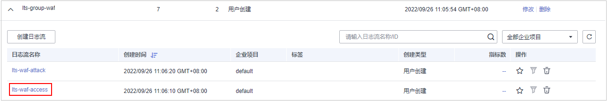

# 开启全量日志

启用WAF全量日志功能后，您可以将攻击日志、访问日志记录到华为云的云日志服务（Log Tank Service，简称LTS）中，通过LTS记录的WAF日志数据，快速高效地进行实时决策分析、设备运维管理以及业务趋势分析。

> **说明：** 
>如果您已开通企业项目，您需要在“企业项目“下拉列表中选择您所在的企业项目并确保已开通操作权限，才能开启该企业项目的全量日志。

LTS对于采集的日志数据，通过海量日志数据的分析与处理，可以为您提供一个实时、高效、安全的日志处理能力。LTS默认存储日志的时间为7天，存储时间可以在1～30天之间进行设置，超出存储时间的日志数据将会被自动删除，对于需要长期存储的日志数据（日志持久化），LTS提供转储功能，可以将日志转储至对象存储服务（OBS）或者数据接入服务（DIS）中长期保存。

> **须知：** 
>-   在WAF管理控制台，您可以查看最近30天的防护日志、下载5天内的所有防护域名的防护日志数据。
>-   LTS按流量单独计费。有关LTS的计费详情，请参见[LTS价格详情](https://www.huaweicloud.com/pricing.html#/lts)。
>-   如果您已开通企业项目，您可以在“企业项目“下拉列表中选择您所在的企业项目，开启该企业项目的全量日志。

## 前提条件

-   已购买WAF。
-   已添加防护网站。

## 约束条件

支持全量日志功能的区域为：华北-北京一、华北-北京四、华东-上海一、华南-广州、华东-上海二、中国-香港、亚太-曼谷、俄罗斯-莫斯科

## 系统影响

开启全量日志功能是将WAF日志记录到LTS，不影响WAF性能。

## 将防护日志配置到LTS

1.  [登录管理控制台](https://console.huaweicloud.com/?locale=zh-cn)。
2.  进入防护事件页面入口，如[图1](#waf_01_0156_fig182151235121911)所示。

    **图 1**  防护事件页面入口  
    

3.  选择“全量日志“页签，开启全量日志，并选择日志组和日志流，如[图2](#fig928951613101)所示，相关参数说明如[表1](#table11535733111515)所示。

    **图 2**  配置全量日志  
    

    **表 1**  全量日志配置参数

    
    <table><thead align="left"><tr id="row353613334158"><th class="cellrowborder" valign="top" width="26.12261226122612%" id="mcps1.2.4.1.1">
参数

    </th>
    <th class="cellrowborder" valign="top" width="40.54405440544054%" id="mcps1.2.4.1.2">
参数说明

    </th>
    <th class="cellrowborder" valign="top" width="33.33333333333333%" id="mcps1.2.4.1.3">
取值样例

    </th>
    </tr>
    </thead>
    <tbody><tr id="row15536143321520"><td class="cellrowborder" valign="top" width="26.12261226122612%" headers="mcps1.2.4.1.1 ">
选择日志组

    </td>
    <td class="cellrowborder" valign="top" width="40.54405440544054%" headers="mcps1.2.4.1.2 ">
选择已创建的日志组，或者单击“查看日志组”，跳转到LTS管理控制台创建新的日志组。

    </td>
    <td class="cellrowborder" valign="top" width="33.33333333333333%" headers="mcps1.2.4.1.3 ">
lts-group-waf

    </td>
    </tr>
    <tr id="row15536133111516"><td class="cellrowborder" valign="top" width="26.12261226122612%" headers="mcps1.2.4.1.1 ">
记录攻击日志

    </td>
    <td class="cellrowborder" valign="top" width="40.54405440544054%" headers="mcps1.2.4.1.2 ">
选择已创建的日志流，或者单击“查看日志流”，跳转到LTS管理控制台创建新的日志流。

    
攻击日志记录每一个攻击告警信息，包括攻击事件类型、防护动作、攻击源IP等信息。

    </td>
    <td class="cellrowborder" valign="top" width="33.33333333333333%" headers="mcps1.2.4.1.3 ">
lts-topic-waf-attack

    </td>
    </tr>
    <tr id="row5536143301512"><td class="cellrowborder" valign="top" width="26.12261226122612%" headers="mcps1.2.4.1.1 ">
记录访问日志

    </td>
    <td class="cellrowborder" valign="top" width="40.54405440544054%" headers="mcps1.2.4.1.2 ">
选择已创建的日志流，或者单击“查看日志流”，跳转到LTS管理控制台创建新的日志流。

    
访问日志记录每一个HTTP访问的关键信息，包括访问时间、访问客户端IP、访问资源URL等信息。

    </td>
    <td class="cellrowborder" valign="top" width="33.33333333333333%" headers="mcps1.2.4.1.3 ">
lts-topic-waf-access

    </td>
    </tr>
    </tbody>
    </table>

4.  单击“确定“，全量日志配置成功。

    您可以在LTS管理控制台查看WAF的防护日志。

## 在LTS上查看WAF防护日志

当您将WAF防护日志配置记录到LTS上后，请参考以下操作步骤，在LTS管理控制台查看、分析记录的WAF日志数据。

1.  [登录管理控制台](https://console.huaweicloud.com/?locale=zh-cn)。
2.  进入日志流入口，如[图3](#fig11902193715135)所示。

    **图 3**  日志流入口  
    

3.  查看WAF防护日志。
    -   查看攻击日志
        1.  在日志流列表，单击配置的攻击日志流“lts-topic-waf-attack“，如[图4](#fig472533374310)所示。

            **图 4**  单击攻击日志流名称  
            

        2.  查看攻击日志，日志示例如[图5](#fig3630258133613)所示。

            **图 5**  查看攻击日志  
            

    -   查看访问日志
        1.  在日志流列表，单击配置的访问日志流“lts-topic-waf-access“，如[图6](#fig1079183718507)所示。

            **图 6**  单击访问日志流名称  
            

        2.  查看访问日志，日志示例如[图7](#fig3826175165212)所示。

            **图 7**  查看访问日志  
            

## WAF访问日志access\_log字段说明

<table><thead align="left"><tr id="row56294135315"><th class="cellrowborder" valign="top" width="17.69%" id="mcps1.1.5.1.1">
字段

</th>
<th class="cellrowborder" valign="top" width="11.35%" id="mcps1.1.5.1.2">
类型

</th>
<th class="cellrowborder" valign="top" width="22.41%" id="mcps1.1.5.1.3">
字段说明

</th>
<th class="cellrowborder" valign="top" width="48.55%" id="mcps1.1.5.1.4">
描述

</th>
</tr>
</thead>
<tbody><tr id="row274819469365"><td class="cellrowborder" valign="top" width="17.69%" headers="mcps1.1.5.1.1 ">
requestid

</td>
<td class="cellrowborder" valign="top" width="11.35%" headers="mcps1.1.5.1.2 ">
string

</td>
<td class="cellrowborder" valign="top" width="22.41%" headers="mcps1.1.5.1.3 ">
随机ID标识

</td>
<td class="cellrowborder" valign="top" width="48.55%" headers="mcps1.1.5.1.4 ">
与攻击日志的“req_id” 字段末尾8个字符一致。

</td>
</tr>
<tr id="row662411313404"><td class="cellrowborder" valign="top" width="17.69%" headers="mcps1.1.5.1.1 ">
time

</td>
<td class="cellrowborder" valign="top" width="11.35%" headers="mcps1.1.5.1.2 ">
string

</td>
<td class="cellrowborder" valign="top" width="22.41%" headers="mcps1.1.5.1.3 ">
访问请求的时间

</td>
<td class="cellrowborder" valign="top" width="48.55%" headers="mcps1.1.5.1.4 ">
日志内容记录的GMT时间。

</td>
</tr>
<tr id="row76310417530"><td class="cellrowborder" valign="top" width="17.69%" headers="mcps1.1.5.1.1 ">
eng_ip

</td>
<td class="cellrowborder" valign="top" width="11.35%" headers="mcps1.1.5.1.2 ">
string

</td>
<td class="cellrowborder" valign="top" width="22.41%" headers="mcps1.1.5.1.3 ">
WAF引擎IP

</td>
<td class="cellrowborder" valign="top" width="48.55%" headers="mcps1.1.5.1.4 ">
-

</td>
</tr>
<tr id="row7634419533"><td class="cellrowborder" valign="top" width="17.69%" headers="mcps1.1.5.1.1 ">
hostid

</td>
<td class="cellrowborder" valign="top" width="11.35%" headers="mcps1.1.5.1.2 ">
string

</td>
<td class="cellrowborder" valign="top" width="22.41%" headers="mcps1.1.5.1.3 ">
访问请求的域名标识

</td>
<td class="cellrowborder" valign="top" width="48.55%" headers="mcps1.1.5.1.4 ">
防护域名ID(upstream_id)。

</td>
</tr>
<tr id="row1663345531"><td class="cellrowborder" valign="top" width="17.69%" headers="mcps1.1.5.1.1 ">
tenantid

</td>
<td class="cellrowborder" valign="top" width="11.35%" headers="mcps1.1.5.1.2 ">
string

</td>
<td class="cellrowborder" valign="top" width="22.41%" headers="mcps1.1.5.1.3 ">
防护域名的租户ID

</td>
<td class="cellrowborder" valign="top" width="48.55%" headers="mcps1.1.5.1.4 ">
一个华为云帐号对应一个租户ID。

</td>
</tr>
<tr id="row864174165320"><td class="cellrowborder" valign="top" width="17.69%" headers="mcps1.1.5.1.1 ">
projectid

</td>
<td class="cellrowborder" valign="top" width="11.35%" headers="mcps1.1.5.1.2 ">
string

</td>
<td class="cellrowborder" valign="top" width="22.41%" headers="mcps1.1.5.1.3 ">
防护域名的项目ID

</td>
<td class="cellrowborder" valign="top" width="48.55%" headers="mcps1.1.5.1.4 ">
用户在对应区域下的项目ID。

</td>
</tr>
<tr id="row2641748530"><td class="cellrowborder" valign="top" width="17.69%" headers="mcps1.1.5.1.1 ">
remote_ip

</td>
<td class="cellrowborder" valign="top" width="11.35%" headers="mcps1.1.5.1.2 ">
string

</td>
<td class="cellrowborder" valign="top" width="22.41%" headers="mcps1.1.5.1.3 ">
请求的客户端IP

</td>
<td class="cellrowborder" valign="top" width="48.55%" headers="mcps1.1.5.1.4 ">
请求的客户端IP。

 须知： 

如果在WAF前部署了7层代理，本字段表示最靠近WAF的代理节点的IP地址。此时，真实访问者IP参考“x-forwarded-for”，“x_real_ip”字段。

</td>
</tr>
<tr id="row7247192181514"><td class="cellrowborder" valign="top" width="17.69%" headers="mcps1.1.5.1.1 ">
x-forwarded-for

</td>
<td class="cellrowborder" valign="top" width="11.35%" headers="mcps1.1.5.1.2 ">
string

</td>
<td class="cellrowborder" valign="top" width="22.41%" headers="mcps1.1.5.1.3 ">
当WAF前部署代理时，代理节点IP链

</td>
<td class="cellrowborder" valign="top" width="48.55%" headers="mcps1.1.5.1.4 ">
代理节点IP链，为1个或多个IP组成的字符串。

最左边为最原始客户端的IP地址，代理服务器每成功收到一个请求，就将请求来源IP地址添加到右边。

</td>
</tr>
<tr id="row14771145741417"><td class="cellrowborder" valign="top" width="17.69%" headers="mcps1.1.5.1.1 ">
x_real_ip

</td>
<td class="cellrowborder" valign="top" width="11.35%" headers="mcps1.1.5.1.2 ">
string

</td>
<td class="cellrowborder" valign="top" width="22.41%" headers="mcps1.1.5.1.3 ">
当WAF前部署代理时，真实的客户端IP

</td>
<td class="cellrowborder" valign="top" width="48.55%" headers="mcps1.1.5.1.4 ">
代理节点识别到的真实客户端IP。

</td>
</tr>
<tr id="row8748104311914"><td class="cellrowborder" valign="top" width="17.69%" headers="mcps1.1.5.1.1 ">
cdn_src_ip

</td>
<td class="cellrowborder" valign="top" width="11.35%" headers="mcps1.1.5.1.2 ">
string

</td>
<td class="cellrowborder" valign="top" width="22.41%" headers="mcps1.1.5.1.3 ">
当WAF前部署CDN时CDN识别到的客户端IP

</td>
<td class="cellrowborder" valign="top" width="48.55%" headers="mcps1.1.5.1.4 ">
当WAF前部署CDN时，此字段记录的为CDN节点识别到的真实客户端IP。

 须知： 

部分CDN厂商可能使用其他字段，WAF仅记录最常见的字段。

</td>
</tr>
<tr id="row121521681471"><td class="cellrowborder" valign="top" width="17.69%" headers="mcps1.1.5.1.1 ">
scheme

</td>
<td class="cellrowborder" valign="top" width="11.35%" headers="mcps1.1.5.1.2 ">
string

</td>
<td class="cellrowborder" valign="top" width="22.41%" headers="mcps1.1.5.1.3 ">
请求协议类型

</td>
<td class="cellrowborder" valign="top" width="48.55%" headers="mcps1.1.5.1.4 ">
请求所使用的协议有：

<ul id="ul9969527125420"><li>http</li><li>https</li></ul>
</td>
</tr>
<tr id="row17117104965416"><td class="cellrowborder" valign="top" width="17.69%" headers="mcps1.1.5.1.1 ">
response_code

</td>
<td class="cellrowborder" valign="top" width="11.35%" headers="mcps1.1.5.1.2 ">
string

</td>
<td class="cellrowborder" valign="top" width="22.41%" headers="mcps1.1.5.1.3 ">
请求响应码

</td>
<td class="cellrowborder" valign="top" width="48.55%" headers="mcps1.1.5.1.4 ">
源站返回给WAF的响应状态码。

</td>
</tr>
<tr id="row10663141315588"><td class="cellrowborder" valign="top" width="17.69%" headers="mcps1.1.5.1.1 ">
method

</td>
<td class="cellrowborder" valign="top" width="11.35%" headers="mcps1.1.5.1.2 ">
string

</td>
<td class="cellrowborder" valign="top" width="22.41%" headers="mcps1.1.5.1.3 ">
请求方法

</td>
<td class="cellrowborder" valign="top" width="48.55%" headers="mcps1.1.5.1.4 ">
请求行中的请求类型。通常为“GET”或“POST”。

</td>
</tr>
<tr id="row1672674410714"><td class="cellrowborder" valign="top" width="17.69%" headers="mcps1.1.5.1.1 ">
http_host

</td>
<td class="cellrowborder" valign="top" width="11.35%" headers="mcps1.1.5.1.2 ">
string

</td>
<td class="cellrowborder" valign="top" width="22.41%" headers="mcps1.1.5.1.3 ">
请求的服务器域名

</td>
<td class="cellrowborder" valign="top" width="48.55%" headers="mcps1.1.5.1.4 ">
浏览器的地址栏中输入的地址，域名或IP地址。

</td>
</tr>
<tr id="row159341243151114"><td class="cellrowborder" valign="top" width="17.69%" headers="mcps1.1.5.1.1 ">
url

</td>
<td class="cellrowborder" valign="top" width="11.35%" headers="mcps1.1.5.1.2 ">
string

</td>
<td class="cellrowborder" valign="top" width="22.41%" headers="mcps1.1.5.1.3 ">
请求URL

</td>
<td class="cellrowborder" valign="top" width="48.55%" headers="mcps1.1.5.1.4 ">
URL链接中的路径（不包含域名）。

</td>
</tr>
<tr id="row488755861913"><td class="cellrowborder" valign="top" width="17.69%" headers="mcps1.1.5.1.1 ">
request_length

</td>
<td class="cellrowborder" valign="top" width="11.35%" headers="mcps1.1.5.1.2 ">
string

</td>
<td class="cellrowborder" valign="top" width="22.41%" headers="mcps1.1.5.1.3 ">
请求的长度

</td>
<td class="cellrowborder" valign="top" width="48.55%" headers="mcps1.1.5.1.4 ">
包括请求地址、HTTP请求头和请求体的字节数。

</td>
</tr>
<tr id="row515718254241"><td class="cellrowborder" valign="top" width="17.69%" headers="mcps1.1.5.1.1 ">
bytes_send

</td>
<td class="cellrowborder" valign="top" width="11.35%" headers="mcps1.1.5.1.2 ">
string

</td>
<td class="cellrowborder" valign="top" width="22.41%" headers="mcps1.1.5.1.3 ">
发送给客户端的总字节数

</td>
<td class="cellrowborder" valign="top" width="48.55%" headers="mcps1.1.5.1.4 ">
WAF返回给客户端的总字节数。

</td>
</tr>
<tr id="row94911052122613"><td class="cellrowborder" valign="top" width="17.69%" headers="mcps1.1.5.1.1 ">
body_bytes_sent

</td>
<td class="cellrowborder" valign="top" width="11.35%" headers="mcps1.1.5.1.2 ">
string

</td>
<td class="cellrowborder" valign="top" width="22.41%" headers="mcps1.1.5.1.3 ">
发送给客户端的响应体字节数

</td>
<td class="cellrowborder" valign="top" width="48.55%" headers="mcps1.1.5.1.4 ">
WAF返回给客户端的响应体字节数

</td>
</tr>
<tr id="row11721811113014"><td class="cellrowborder" valign="top" width="17.69%" headers="mcps1.1.5.1.1 ">
upstream_addr

</td>
<td class="cellrowborder" valign="top" width="11.35%" headers="mcps1.1.5.1.2 ">
string

</td>
<td class="cellrowborder" valign="top" width="22.41%" headers="mcps1.1.5.1.3 ">
选择的后端服务器地址

</td>
<td class="cellrowborder" valign="top" width="48.55%" headers="mcps1.1.5.1.4 ">
请求所对应的源站IP。例如，WAF回源到ECS，则返回源站ECS的IP。

</td>
</tr>
<tr id="row14643174243418"><td class="cellrowborder" valign="top" width="17.69%" headers="mcps1.1.5.1.1 ">
request_time

</td>
<td class="cellrowborder" valign="top" width="11.35%" headers="mcps1.1.5.1.2 ">
string

</td>
<td class="cellrowborder" valign="top" width="22.41%" headers="mcps1.1.5.1.3 ">
请求处理时间

</td>
<td class="cellrowborder" valign="top" width="48.55%" headers="mcps1.1.5.1.4 ">
从读取客户端的第一个字节开始计时。

</td>
</tr>
<tr id="row7613529173611"><td class="cellrowborder" valign="top" width="17.69%" headers="mcps1.1.5.1.1 ">
upstream_response_time

</td>
<td class="cellrowborder" valign="top" width="11.35%" headers="mcps1.1.5.1.2 ">
string

</td>
<td class="cellrowborder" valign="top" width="22.41%" headers="mcps1.1.5.1.3 ">
后端服务器响应时间

</td>
<td class="cellrowborder" valign="top" width="48.55%" headers="mcps1.1.5.1.4 ">
后端服务器响应WAF请求的时间。

</td>
</tr>
<tr id="row6202141821017"><td class="cellrowborder" valign="top" width="17.69%" headers="mcps1.1.5.1.1 ">
upstream_status

</td>
<td class="cellrowborder" valign="top" width="11.35%" headers="mcps1.1.5.1.2 ">
string

</td>
<td class="cellrowborder" valign="top" width="22.41%" headers="mcps1.1.5.1.3 ">
后端服务器的响应码

</td>
<td class="cellrowborder" valign="top" width="48.55%" headers="mcps1.1.5.1.4 ">
后端服务器返回给WAF的响应状态码。

</td>
</tr>
<tr id="row460882541217"><td class="cellrowborder" valign="top" width="17.69%" headers="mcps1.1.5.1.1 ">
upstream_connect_time

</td>
<td class="cellrowborder" valign="top" width="11.35%" headers="mcps1.1.5.1.2 ">
string

</td>
<td class="cellrowborder" valign="top" width="22.41%" headers="mcps1.1.5.1.3 ">
后端服务器连接用时

</td>
<td class="cellrowborder" valign="top" width="48.55%" headers="mcps1.1.5.1.4 ">
源站与后端服务建立连接的时间。如果后端服务使用了加密协议，该参数包括握手的时间。

</td>
</tr>
<tr id="row181315538139"><td class="cellrowborder" valign="top" width="17.69%" headers="mcps1.1.5.1.1 ">
upstream_header_time

</td>
<td class="cellrowborder" valign="top" width="11.35%" headers="mcps1.1.5.1.2 ">
string

</td>
<td class="cellrowborder" valign="top" width="22.41%" headers="mcps1.1.5.1.3 ">
后端服务器接收到第一个响应头字节的用时

</td>
<td class="cellrowborder" valign="top" width="48.55%" headers="mcps1.1.5.1.4 ">
-

</td>
</tr>
<tr id="row1478010298141"><td class="cellrowborder" valign="top" width="17.69%" headers="mcps1.1.5.1.1 ">
bind_ip

</td>
<td class="cellrowborder" valign="top" width="11.35%" headers="mcps1.1.5.1.2 ">
string

</td>
<td class="cellrowborder" valign="top" width="22.41%" headers="mcps1.1.5.1.3 ">
WAF引擎回源IP

</td>
<td class="cellrowborder" valign="top" width="48.55%" headers="mcps1.1.5.1.4 ">
WAF引擎所使用的回源IP。

</td>
</tr>
<tr id="row1866925901820"><td class="cellrowborder" valign="top" width="17.69%" headers="mcps1.1.5.1.1 ">
group_id

</td>
<td class="cellrowborder" valign="top" width="11.35%" headers="mcps1.1.5.1.2 ">
string

</td>
<td class="cellrowborder" valign="top" width="22.41%" headers="mcps1.1.5.1.3 ">
对接LTS服务的日志组ID

</td>
<td class="cellrowborder" valign="top" width="48.55%" headers="mcps1.1.5.1.4 ">
WAF对接华为云的云日志服务日志组ID。

</td>
</tr>
<tr id="row127655101212"><td class="cellrowborder" valign="top" width="17.69%" headers="mcps1.1.5.1.1 ">
access_stream_id

</td>
<td class="cellrowborder" valign="top" width="11.35%" headers="mcps1.1.5.1.2 ">
string

</td>
<td class="cellrowborder" valign="top" width="22.41%" headers="mcps1.1.5.1.3 ">
日志流ID

</td>
<td class="cellrowborder" valign="top" width="48.55%" headers="mcps1.1.5.1.4 ">
与“group_id”相关，是日志组下用户的access_stream的ID。

</td>
</tr>
<tr id="row285175322318"><td class="cellrowborder" valign="top" width="17.69%" headers="mcps1.1.5.1.1 ">
engine_id

</td>
<td class="cellrowborder" valign="top" width="11.35%" headers="mcps1.1.5.1.2 ">
string

</td>
<td class="cellrowborder" valign="top" width="22.41%" headers="mcps1.1.5.1.3 ">
WAF引擎标识

</td>
<td class="cellrowborder" valign="top" width="48.55%" headers="mcps1.1.5.1.4 ">
WAF引擎的唯一标识。

</td>
</tr>
<tr id="row64283733420"><td class="cellrowborder" valign="top" width="17.69%" headers="mcps1.1.5.1.1 ">
time_iso8601

</td>
<td class="cellrowborder" valign="top" width="11.35%" headers="mcps1.1.5.1.2 ">
string

</td>
<td class="cellrowborder" valign="top" width="22.41%" headers="mcps1.1.5.1.3 ">
日志的ISO 8601格式时间

</td>
<td class="cellrowborder" valign="top" width="48.55%" headers="mcps1.1.5.1.4 ">
-

</td>
</tr>
<tr id="row868983611116"><td class="cellrowborder" valign="top" width="17.69%" headers="mcps1.1.5.1.1 ">
sni

</td>
<td class="cellrowborder" valign="top" width="11.35%" headers="mcps1.1.5.1.2 ">
string

</td>
<td class="cellrowborder" valign="top" width="22.41%" headers="mcps1.1.5.1.3 ">
通过SNI请求的域名

</td>
<td class="cellrowborder" valign="top" width="48.55%" headers="mcps1.1.5.1.4 ">
-

</td>
</tr>
<tr id="row16671173361217"><td class="cellrowborder" valign="top" width="17.69%" headers="mcps1.1.5.1.1 ">
tls_version

</td>
<td class="cellrowborder" valign="top" width="11.35%" headers="mcps1.1.5.1.2 ">
string

</td>
<td class="cellrowborder" valign="top" width="22.41%" headers="mcps1.1.5.1.3 ">
建立SSL连接的协议版本

</td>
<td class="cellrowborder" valign="top" width="48.55%" headers="mcps1.1.5.1.4 ">
请求所使用的TLS协议版本。

</td>
</tr>
<tr id="row37001597250"><td class="cellrowborder" valign="top" width="17.69%" headers="mcps1.1.5.1.1 ">
ssl_curves

</td>
<td class="cellrowborder" valign="top" width="11.35%" headers="mcps1.1.5.1.2 ">
string

</td>
<td class="cellrowborder" valign="top" width="22.41%" headers="mcps1.1.5.1.3 ">
客户端支持的曲线列表

</td>
<td class="cellrowborder" valign="top" width="48.55%" headers="mcps1.1.5.1.4 ">
-

</td>
</tr>
<tr id="row127981596137"><td class="cellrowborder" valign="top" width="17.69%" headers="mcps1.1.5.1.1 ">
ssl_session_reused

</td>
<td class="cellrowborder" valign="top" width="11.35%" headers="mcps1.1.5.1.2 ">
string

</td>
<td class="cellrowborder" valign="top" width="22.41%" headers="mcps1.1.5.1.3 ">
SSL会话是否被重用。

</td>
<td class="cellrowborder" valign="top" width="48.55%" headers="mcps1.1.5.1.4 ">
表示SSL会话是否被重用。

r：是

.：否

</td>
</tr>
<tr id="row16990161401612"><td class="cellrowborder" valign="top" width="17.69%" headers="mcps1.1.5.1.1 ">
process_time

</td>
<td class="cellrowborder" valign="top" width="11.35%" headers="mcps1.1.5.1.2 ">
string

</td>
<td class="cellrowborder" valign="top" width="22.41%" headers="mcps1.1.5.1.3 ">
引擎的检测用时

</td>
<td class="cellrowborder" valign="top" width="48.55%" headers="mcps1.1.5.1.4 ">
-

</td>
</tr>
</tbody>
</table>

## WAF请求日志request\_log字段说明

<table><thead align="left"><tr id="row176011246193510"><th class="cellrowborder" valign="top" width="17.69%" id="mcps1.1.5.1.1">
字段

</th>
<th class="cellrowborder" valign="top" width="11.35%" id="mcps1.1.5.1.2">
类型

</th>
<th class="cellrowborder" valign="top" width="22.470000000000002%" id="mcps1.1.5.1.3">
字段说明

</th>
<th class="cellrowborder" valign="top" width="48.49%" id="mcps1.1.5.1.4">
描述

</th>
</tr>
</thead>
<tbody><tr id="row760244617354"><td class="cellrowborder" valign="top" width="17.69%" headers="mcps1.1.5.1.1 ">
scheme

</td>
<td class="cellrowborder" valign="top" width="11.35%" headers="mcps1.1.5.1.2 ">
string

</td>
<td class="cellrowborder" valign="top" width="22.470000000000002%" headers="mcps1.1.5.1.3 ">
请求协议类型

</td>
<td class="cellrowborder" valign="top" width="48.49%" headers="mcps1.1.5.1.4 ">
请求所使用的协议有：

<ul id="ul988614224201"><li>http</li><li>https</li></ul>
</td>
</tr>
<tr id="row166021646173516"><td class="cellrowborder" valign="top" width="17.69%" headers="mcps1.1.5.1.1 ">
hport

</td>
<td class="cellrowborder" valign="top" width="11.35%" headers="mcps1.1.5.1.2 ">
string

</td>
<td class="cellrowborder" valign="top" width="22.470000000000002%" headers="mcps1.1.5.1.3 ">
引擎监听端口

</td>
<td class="cellrowborder" valign="top" width="48.49%" headers="mcps1.1.5.1.4 ">
-

</td>
</tr>
<tr id="row106031046163517"><td class="cellrowborder" valign="top" width="17.69%" headers="mcps1.1.5.1.1 ">
body_bytes_sent

</td>
<td class="cellrowborder" valign="top" width="11.35%" headers="mcps1.1.5.1.2 ">
string

</td>
<td class="cellrowborder" valign="top" width="22.470000000000002%" headers="mcps1.1.5.1.3 ">
发送给客户端的响应体字节数

</td>
<td class="cellrowborder" valign="top" width="48.49%" headers="mcps1.1.5.1.4 ">
-

</td>
</tr>
<tr id="row1860317469350"><td class="cellrowborder" valign="top" width="17.69%" headers="mcps1.1.5.1.1 ">
hostid

</td>
<td class="cellrowborder" valign="top" width="11.35%" headers="mcps1.1.5.1.2 ">
string

</td>
<td class="cellrowborder" valign="top" width="22.470000000000002%" headers="mcps1.1.5.1.3 ">
防护域名ID（upstream_id）

</td>
<td class="cellrowborder" valign="top" width="48.49%" headers="mcps1.1.5.1.4 ">
-

</td>
</tr>
<tr id="row4604546143511"><td class="cellrowborder" valign="top" width="17.69%" headers="mcps1.1.5.1.1 ">
time_iso8601

</td>
<td class="cellrowborder" valign="top" width="11.35%" headers="mcps1.1.5.1.2 ">
string

</td>
<td class="cellrowborder" valign="top" width="22.470000000000002%" headers="mcps1.1.5.1.3 ">
日志的ISO 8601格式时间

</td>
<td class="cellrowborder" valign="top" width="48.49%" headers="mcps1.1.5.1.4 ">
-

</td>
</tr>
<tr id="row1760518467355"><td class="cellrowborder" valign="top" width="17.69%" headers="mcps1.1.5.1.1 ">
host

</td>
<td class="cellrowborder" valign="top" width="11.35%" headers="mcps1.1.5.1.2 ">
string

</td>
<td class="cellrowborder" valign="top" width="22.470000000000002%" headers="mcps1.1.5.1.3 ">
请求的服务器域名

</td>
<td class="cellrowborder" valign="top" width="48.49%" headers="mcps1.1.5.1.4 ">
-

</td>
</tr>
<tr id="row1860554663516"><td class="cellrowborder" valign="top" width="17.69%" headers="mcps1.1.5.1.1 ">
tenantid

</td>
<td class="cellrowborder" valign="top" width="11.35%" headers="mcps1.1.5.1.2 ">
string

</td>
<td class="cellrowborder" valign="top" width="22.470000000000002%" headers="mcps1.1.5.1.3 ">
防护域名的租户ID

</td>
<td class="cellrowborder" valign="top" width="48.49%" headers="mcps1.1.5.1.4 ">
-

</td>
</tr>
<tr id="row6605104613517"><td class="cellrowborder" valign="top" width="17.69%" headers="mcps1.1.5.1.1 ">
inet_ip

</td>
<td class="cellrowborder" valign="top" width="11.35%" headers="mcps1.1.5.1.2 ">
string

</td>
<td class="cellrowborder" valign="top" width="22.470000000000002%" headers="mcps1.1.5.1.3 ">
引擎IP

</td>
<td class="cellrowborder" valign="top" width="48.49%" headers="mcps1.1.5.1.4 ">
-

</td>
</tr>
<tr id="row1360617464352"><td class="cellrowborder" valign="top" width="17.69%" headers="mcps1.1.5.1.1 ">
backend.protocol

</td>
<td class="cellrowborder" valign="top" width="11.35%" headers="mcps1.1.5.1.2 ">
string

</td>
<td class="cellrowborder" valign="top" width="22.470000000000002%" headers="mcps1.1.5.1.3 ">
当前后端协议

</td>
<td class="cellrowborder" valign="top" width="48.49%" headers="mcps1.1.5.1.4 ">
-

</td>
</tr>
<tr id="row1760611465359"><td class="cellrowborder" valign="top" width="17.69%" headers="mcps1.1.5.1.1 ">
backend.alive

</td>
<td class="cellrowborder" valign="top" width="11.35%" headers="mcps1.1.5.1.2 ">
string

</td>
<td class="cellrowborder" valign="top" width="22.470000000000002%" headers="mcps1.1.5.1.3 ">
当前后端状态

</td>
<td class="cellrowborder" valign="top" width="48.49%" headers="mcps1.1.5.1.4 ">
-

</td>
</tr>
<tr id="row1060614613516"><td class="cellrowborder" valign="top" width="17.69%" headers="mcps1.1.5.1.1 ">
backend.port

</td>
<td class="cellrowborder" valign="top" width="11.35%" headers="mcps1.1.5.1.2 ">
string

</td>
<td class="cellrowborder" valign="top" width="22.470000000000002%" headers="mcps1.1.5.1.3 ">
当前后端端口

</td>
<td class="cellrowborder" valign="top" width="48.49%" headers="mcps1.1.5.1.4 ">
-

</td>
</tr>
<tr id="row06094461350"><td class="cellrowborder" valign="top" width="17.69%" headers="mcps1.1.5.1.1 ">
backend.host

</td>
<td class="cellrowborder" valign="top" width="11.35%" headers="mcps1.1.5.1.2 ">
string

</td>
<td class="cellrowborder" valign="top" width="22.470000000000002%" headers="mcps1.1.5.1.3 ">
当前后端Host值

</td>
<td class="cellrowborder" valign="top" width="48.49%" headers="mcps1.1.5.1.4 ">
-

</td>
</tr>
<tr id="row5609194617357"><td class="cellrowborder" valign="top" width="17.69%" headers="mcps1.1.5.1.1 ">
backend.type

</td>
<td class="cellrowborder" valign="top" width="11.35%" headers="mcps1.1.5.1.2 ">
string

</td>
<td class="cellrowborder" valign="top" width="22.470000000000002%" headers="mcps1.1.5.1.3 ">
当前后端Host类型

</td>
<td class="cellrowborder" valign="top" width="48.49%" headers="mcps1.1.5.1.4 ">
后端Host类型，包括域名或IP。

</td>
</tr>
<tr id="row2609124616358"><td class="cellrowborder" valign="top" width="17.69%" headers="mcps1.1.5.1.1 ">
id

</td>
<td class="cellrowborder" valign="top" width="11.35%" headers="mcps1.1.5.1.2 ">
string

</td>
<td class="cellrowborder" valign="top" width="22.470000000000002%" headers="mcps1.1.5.1.3 ">
请求ID标识

</td>
<td class="cellrowborder" valign="top" width="48.49%" headers="mcps1.1.5.1.4 ">
末尾8个字符与访问日志的“requestid”前8个字符一致。

</td>
</tr>
<tr id="row11610144616354"><td class="cellrowborder" valign="top" width="17.69%" headers="mcps1.1.5.1.1 ">
sip

</td>
<td class="cellrowborder" valign="top" width="11.35%" headers="mcps1.1.5.1.2 ">
string

</td>
<td class="cellrowborder" valign="top" width="22.470000000000002%" headers="mcps1.1.5.1.3 ">
请求的客户端IP

</td>
<td class="cellrowborder" valign="top" width="48.49%" headers="mcps1.1.5.1.4 ">
-

</td>
</tr>
<tr id="row17610546183510"><td class="cellrowborder" valign="top" width="17.69%" headers="mcps1.1.5.1.1 ">
sport

</td>
<td class="cellrowborder" valign="top" width="11.35%" headers="mcps1.1.5.1.2 ">
string

</td>
<td class="cellrowborder" valign="top" width="22.470000000000002%" headers="mcps1.1.5.1.3 ">
请求的客户端端口

</td>
<td class="cellrowborder" valign="top" width="48.49%" headers="mcps1.1.5.1.4 ">
-

</td>
</tr>
<tr id="row15611194693512"><td class="cellrowborder" valign="top" width="17.69%" headers="mcps1.1.5.1.1 ">
projectid

</td>
<td class="cellrowborder" valign="top" width="11.35%" headers="mcps1.1.5.1.2 ">
string

</td>
<td class="cellrowborder" valign="top" width="22.470000000000002%" headers="mcps1.1.5.1.3 ">
防护域名的项目ID

</td>
<td class="cellrowborder" valign="top" width="48.49%" headers="mcps1.1.5.1.4 ">
-

</td>
</tr>
<tr id="row11611174663517"><td class="cellrowborder" valign="top" width="17.69%" headers="mcps1.1.5.1.1 ">
cookie

</td>
<td class="cellrowborder" valign="top" width="11.35%" headers="mcps1.1.5.1.2 ">
string

</td>
<td class="cellrowborder" valign="top" width="22.470000000000002%" headers="mcps1.1.5.1.3 ">
Cookie内容

</td>
<td class="cellrowborder" valign="top" width="48.49%" headers="mcps1.1.5.1.4 ">
-

</td>
</tr>
<tr id="row11611124618359"><td class="cellrowborder" valign="top" width="17.69%" headers="mcps1.1.5.1.1 ">
method

</td>
<td class="cellrowborder" valign="top" width="11.35%" headers="mcps1.1.5.1.2 ">
string

</td>
<td class="cellrowborder" valign="top" width="22.470000000000002%" headers="mcps1.1.5.1.3 ">
请求方法

</td>
<td class="cellrowborder" valign="top" width="48.49%" headers="mcps1.1.5.1.4 ">
-

</td>
</tr>
<tr id="row1061216464355"><td class="cellrowborder" valign="top" width="17.69%" headers="mcps1.1.5.1.1 ">
uri

</td>
<td class="cellrowborder" valign="top" width="11.35%" headers="mcps1.1.5.1.2 ">
string

</td>
<td class="cellrowborder" valign="top" width="22.470000000000002%" headers="mcps1.1.5.1.3 ">
请求URI

</td>
<td class="cellrowborder" valign="top" width="48.49%" headers="mcps1.1.5.1.4 ">
-

</td>
</tr>
<tr id="row9612104610358"><td class="cellrowborder" valign="top" width="17.69%" headers="mcps1.1.5.1.1 ">
request_stream_id

</td>
<td class="cellrowborder" valign="top" width="11.35%" headers="mcps1.1.5.1.2 ">
string

</td>
<td class="cellrowborder" valign="top" width="22.470000000000002%" headers="mcps1.1.5.1.3 ">
日志流ID

</td>
<td class="cellrowborder" valign="top" width="48.49%" headers="mcps1.1.5.1.4 ">
与“group_id”相关，是日志组下用户的request_stream的ID。

</td>
</tr>
<tr id="row7612154623517"><td class="cellrowborder" valign="top" width="17.69%" headers="mcps1.1.5.1.1 ">
group_id

</td>
<td class="cellrowborder" valign="top" width="11.35%" headers="mcps1.1.5.1.2 ">
string

</td>
<td class="cellrowborder" valign="top" width="22.470000000000002%" headers="mcps1.1.5.1.3 ">
日志组ID

</td>
<td class="cellrowborder" valign="top" width="48.49%" headers="mcps1.1.5.1.4 ">
对接LTS服务的日志组ID。

</td>
</tr>
<tr id="row10612346193512"><td class="cellrowborder" valign="top" width="17.69%" headers="mcps1.1.5.1.1 ">
engine_id

</td>
<td class="cellrowborder" valign="top" width="11.35%" headers="mcps1.1.5.1.2 ">
string

</td>
<td class="cellrowborder" valign="top" width="22.470000000000002%" headers="mcps1.1.5.1.3 ">
引擎的唯一标识

</td>
<td class="cellrowborder" valign="top" width="48.49%" headers="mcps1.1.5.1.4 ">
-

</td>
</tr>
<tr id="row16613114603514"><td class="cellrowborder" valign="top" width="17.69%" headers="mcps1.1.5.1.1 ">
header

</td>
<td class="cellrowborder" valign="top" width="11.35%" headers="mcps1.1.5.1.2 ">
string

</td>
<td class="cellrowborder" valign="top" width="22.470000000000002%" headers="mcps1.1.5.1.3 ">
Header头内容

</td>
<td class="cellrowborder" valign="top" width="48.49%" headers="mcps1.1.5.1.4 ">
-

</td>
</tr>
<tr id="row8613946143513"><td class="cellrowborder" valign="top" width="17.69%" headers="mcps1.1.5.1.1 ">
time

</td>
<td class="cellrowborder" valign="top" width="11.35%" headers="mcps1.1.5.1.2 ">
string

</td>
<td class="cellrowborder" valign="top" width="22.470000000000002%" headers="mcps1.1.5.1.3 ">
日志时间

</td>
<td class="cellrowborder" valign="top" width="48.49%" headers="mcps1.1.5.1.4 ">
-

</td>
</tr>
<tr id="row1361654617359"><td class="cellrowborder" valign="top" width="17.69%" headers="mcps1.1.5.1.1 ">
category

</td>
<td class="cellrowborder" valign="top" width="11.35%" headers="mcps1.1.5.1.2 ">
string

</td>
<td class="cellrowborder" valign="top" width="22.470000000000002%" headers="mcps1.1.5.1.3 ">
日志分类

</td>
<td class="cellrowborder" valign="top" width="48.49%" headers="mcps1.1.5.1.4 ">
值为“request”。

</td>
</tr>
<tr id="row126161446193510"><td class="cellrowborder" valign="top" width="17.69%" headers="mcps1.1.5.1.1 ">
status

</td>
<td class="cellrowborder" valign="top" width="11.35%" headers="mcps1.1.5.1.2 ">
string

</td>
<td class="cellrowborder" valign="top" width="22.470000000000002%" headers="mcps1.1.5.1.3 ">
请求响应码

</td>
<td class="cellrowborder" valign="top" width="48.49%" headers="mcps1.1.5.1.4 ">
-

</td>
</tr>
</tbody>
</table>

## WAF攻击日志attack\_log字段说明

<table><thead align="left"><tr id="row107001750151916"><th class="cellrowborder" valign="top" width="17.669999999999998%" id="mcps1.1.5.1.1">
字段

</th>
<th class="cellrowborder" valign="top" width="11.37%" id="mcps1.1.5.1.2">
类型

</th>
<th class="cellrowborder" valign="top" width="22.470000000000002%" id="mcps1.1.5.1.3">
字段说明

</th>
<th class="cellrowborder" valign="top" width="48.49%" id="mcps1.1.5.1.4">
描述

</th>
</tr>
</thead>
<tbody><tr id="row1584433733918"><td class="cellrowborder" valign="top" width="17.669999999999998%" headers="mcps1.1.5.1.1 ">
category

</td>
<td class="cellrowborder" valign="top" width="11.37%" headers="mcps1.1.5.1.2 ">
string

</td>
<td class="cellrowborder" valign="top" width="22.470000000000002%" headers="mcps1.1.5.1.3 ">
日志分类

</td>
<td class="cellrowborder" valign="top" width="48.49%" headers="mcps1.1.5.1.4 ">
值为“attack”。

</td>
</tr>
<tr id="row163131920174012"><td class="cellrowborder" valign="top" width="17.669999999999998%" headers="mcps1.1.5.1.1 ">
time

</td>
<td class="cellrowborder" valign="top" width="11.37%" headers="mcps1.1.5.1.2 ">
string

</td>
<td class="cellrowborder" valign="top" width="22.470000000000002%" headers="mcps1.1.5.1.3 ">
日志时间

</td>
<td class="cellrowborder" valign="top" width="48.49%" headers="mcps1.1.5.1.4 ">
-

</td>
</tr>
<tr id="row85181743174017"><td class="cellrowborder" valign="top" width="17.669999999999998%" headers="mcps1.1.5.1.1 ">
time_iso8601

</td>
<td class="cellrowborder" valign="top" width="11.37%" headers="mcps1.1.5.1.2 ">
string

</td>
<td class="cellrowborder" valign="top" width="22.470000000000002%" headers="mcps1.1.5.1.3 ">
日志的ISO 8601格式时间

</td>
<td class="cellrowborder" valign="top" width="48.49%" headers="mcps1.1.5.1.4 ">
-

</td>
</tr>
<tr id="row387943119412"><td class="cellrowborder" valign="top" width="17.669999999999998%" headers="mcps1.1.5.1.1 ">
policy_id

</td>
<td class="cellrowborder" valign="top" width="11.37%" headers="mcps1.1.5.1.2 ">
string

</td>
<td class="cellrowborder" valign="top" width="22.470000000000002%" headers="mcps1.1.5.1.3 ">
防护策略ID

</td>
<td class="cellrowborder" valign="top" width="48.49%" headers="mcps1.1.5.1.4 ">
-

</td>
</tr>
<tr id="row1840191111424"><td class="cellrowborder" valign="top" width="17.669999999999998%" headers="mcps1.1.5.1.1 ">
level

</td>
<td class="cellrowborder" valign="top" width="11.37%" headers="mcps1.1.5.1.2 ">
string

</td>
<td class="cellrowborder" valign="top" width="22.470000000000002%" headers="mcps1.1.5.1.3 ">
防护策略层级

</td>
<td class="cellrowborder" valign="top" width="48.49%" headers="mcps1.1.5.1.4 ">
表示Web基础防护策略级别。

<ul id="ul06621721154416"><li>1：宽松</li><li>2：中等</li><li>3：严格</li></ul>
</td>
</tr>
<tr id="row1271225010199"><td class="cellrowborder" valign="top" width="17.669999999999998%" headers="mcps1.1.5.1.1 ">
attack

</td>
<td class="cellrowborder" valign="top" width="11.37%" headers="mcps1.1.5.1.2 ">
string

</td>
<td class="cellrowborder" valign="top" width="22.470000000000002%" headers="mcps1.1.5.1.3 ">
发生攻击的类型

</td>
<td class="cellrowborder" valign="top" width="48.49%" headers="mcps1.1.5.1.4 ">
发生攻击的类型，仅在攻击日志中出现。

<ul id="ul6713115013191"><li>default：默认</li><li>sqli：SQL注入攻击</li><li>xss：跨站脚本攻击</li><li>webshell：WebShell攻击</li><li>robot：恶意爬虫</li><li>cmdi：命令注入攻击</li><li>rfi：远程文件包含</li><li>lfi： 本地文件包含</li><li>illegal：非法请求</li><li>vuln：漏洞攻击</li><li>cc：命中CC防护规则</li><li>custom_custom：命中精准防护规则</li><li>custom_whiteip：命中IP黑白名单规则</li><li>custom_geoip：命中地理位置控制规则</li><li>antitamper： 命中网页防篡改规则</li><li>anticrawler：命中JS挑战反爬虫规则</li><li>leakage：命中敏感信息泄露规则</li><li>followed_action：攻击惩罚</li></ul>
</td>
</tr>
<tr id="row36621331175212"><td class="cellrowborder" valign="top" width="17.669999999999998%" headers="mcps1.1.5.1.1 ">
action

</td>
<td class="cellrowborder" valign="top" width="11.37%" headers="mcps1.1.5.1.2 ">
string

</td>
<td class="cellrowborder" valign="top" width="22.470000000000002%" headers="mcps1.1.5.1.3 ">
防护动作

</td>
<td class="cellrowborder" valign="top" width="48.49%" headers="mcps1.1.5.1.4 ">
WAF防护攻击动作。

<ul id="ul620664355312"><li>block：拦截</li><li>log：仅记录</li><li>captcha：人机验证</li></ul>
</td>
</tr>
<tr id="row324191613563"><td class="cellrowborder" valign="top" width="17.669999999999998%" headers="mcps1.1.5.1.1 ">
sub_type

</td>
<td class="cellrowborder" valign="top" width="11.37%" headers="mcps1.1.5.1.2 ">
string

</td>
<td class="cellrowborder" valign="top" width="22.470000000000002%" headers="mcps1.1.5.1.3 ">
爬虫的子类型

</td>
<td class="cellrowborder" valign="top" width="48.49%" headers="mcps1.1.5.1.4 ">
当attack为robot时，该字段不为空。

<ul id="ul7228173735712"><li>script_tool：脚本工具</li><li>search_engine：搜索引擎</li><li>scaner：扫描工具</li><li>uncategorized：其他爬虫</li></ul>
</td>
</tr>
<tr id="row1371895021914"><td class="cellrowborder" valign="top" width="17.669999999999998%" headers="mcps1.1.5.1.1 ">
rule

</td>
<td class="cellrowborder" valign="top" width="11.37%" headers="mcps1.1.5.1.2 ">
string

</td>
<td class="cellrowborder" valign="top" width="22.470000000000002%" headers="mcps1.1.5.1.3 ">
触发的规则ID或者自定义的策略类型描述

</td>
<td class="cellrowborder" valign="top" width="48.49%" headers="mcps1.1.5.1.4 ">
-

</td>
</tr>
<tr id="row724313905918"><td class="cellrowborder" valign="top" width="17.669999999999998%" headers="mcps1.1.5.1.1 ">
location

</td>
<td class="cellrowborder" valign="top" width="11.37%" headers="mcps1.1.5.1.2 ">
string

</td>
<td class="cellrowborder" valign="top" width="22.470000000000002%" headers="mcps1.1.5.1.3 ">
触发恶意负载的位置

</td>
<td class="cellrowborder" valign="top" width="48.49%" headers="mcps1.1.5.1.4 ">
-

</td>
</tr>
<tr id="row1536614245112"><td class="cellrowborder" valign="top" width="17.669999999999998%" headers="mcps1.1.5.1.1 ">
hit_data

</td>
<td class="cellrowborder" valign="top" width="11.37%" headers="mcps1.1.5.1.2 ">
string

</td>
<td class="cellrowborder" valign="top" width="22.470000000000002%" headers="mcps1.1.5.1.3 ">
触发恶意负载的字符串

</td>
<td class="cellrowborder" valign="top" width="48.49%" headers="mcps1.1.5.1.4 ">
-

</td>
</tr>
<tr id="row1797385895918"><td class="cellrowborder" valign="top" width="17.669999999999998%" headers="mcps1.1.5.1.1 ">
resp_headers

</td>
<td class="cellrowborder" valign="top" width="11.37%" headers="mcps1.1.5.1.2 ">
string

</td>
<td class="cellrowborder" valign="top" width="22.470000000000002%" headers="mcps1.1.5.1.3 ">
响应头

</td>
<td class="cellrowborder" valign="top" width="48.49%" headers="mcps1.1.5.1.4 ">
-

</td>
</tr>
<tr id="row14993522300"><td class="cellrowborder" valign="top" width="17.669999999999998%" headers="mcps1.1.5.1.1 ">
resp_body

</td>
<td class="cellrowborder" valign="top" width="11.37%" headers="mcps1.1.5.1.2 ">
string

</td>
<td class="cellrowborder" valign="top" width="22.470000000000002%" headers="mcps1.1.5.1.3 ">
响应体

</td>
<td class="cellrowborder" valign="top" width="48.49%" headers="mcps1.1.5.1.4 ">
-

</td>
</tr>
<tr id="row129111758918"><td class="cellrowborder" valign="top" width="17.669999999999998%" headers="mcps1.1.5.1.1 ">
backend

</td>
<td class="cellrowborder" valign="top" width="11.37%" headers="mcps1.1.5.1.2 ">
string

</td>
<td class="cellrowborder" valign="top" width="22.470000000000002%" headers="mcps1.1.5.1.3 ">
请求转发的后端服务器地址

</td>
<td class="cellrowborder" valign="top" width="48.49%" headers="mcps1.1.5.1.4 ">
-

</td>
</tr>
<tr id="row134112531339"><td class="cellrowborder" valign="top" width="17.669999999999998%" headers="mcps1.1.5.1.1 ">
status

</td>
<td class="cellrowborder" valign="top" width="11.37%" headers="mcps1.1.5.1.2 ">
string

</td>
<td class="cellrowborder" valign="top" width="22.470000000000002%" headers="mcps1.1.5.1.3 ">
请求的响应状态码

</td>
<td class="cellrowborder" valign="top" width="48.49%" headers="mcps1.1.5.1.4 ">
-

</td>
</tr>
<tr id="row597311253415"><td class="cellrowborder" valign="top" width="17.669999999999998%" headers="mcps1.1.5.1.1 ">
reqid

</td>
<td class="cellrowborder" valign="top" width="11.37%" headers="mcps1.1.5.1.2 ">
string

</td>
<td class="cellrowborder" valign="top" width="22.470000000000002%" headers="mcps1.1.5.1.3 ">
随机ID标识

</td>
<td class="cellrowborder" valign="top" width="48.49%" headers="mcps1.1.5.1.4 ">
-

</td>
</tr>
<tr id="row7744132366"><td class="cellrowborder" valign="top" width="17.669999999999998%" headers="mcps1.1.5.1.1 ">
id

</td>
<td class="cellrowborder" valign="top" width="11.37%" headers="mcps1.1.5.1.2 ">
string

</td>
<td class="cellrowborder" valign="top" width="22.470000000000002%" headers="mcps1.1.5.1.3 ">
攻击ID

</td>
<td class="cellrowborder" valign="top" width="48.49%" headers="mcps1.1.5.1.4 ">
攻击的ID标识。

</td>
</tr>
<tr id="row77401218717"><td class="cellrowborder" valign="top" width="17.669999999999998%" headers="mcps1.1.5.1.1 ">
method

</td>
<td class="cellrowborder" valign="top" width="11.37%" headers="mcps1.1.5.1.2 ">
string

</td>
<td class="cellrowborder" valign="top" width="22.470000000000002%" headers="mcps1.1.5.1.3 ">
请求方法

</td>
<td class="cellrowborder" valign="top" width="48.49%" headers="mcps1.1.5.1.4 ">
-

</td>
</tr>
<tr id="row199785512714"><td class="cellrowborder" valign="top" width="17.669999999999998%" headers="mcps1.1.5.1.1 ">
sip

</td>
<td class="cellrowborder" valign="top" width="11.37%" headers="mcps1.1.5.1.2 ">
string

</td>
<td class="cellrowborder" valign="top" width="22.470000000000002%" headers="mcps1.1.5.1.3 ">
客户端请求IP

</td>
<td class="cellrowborder" valign="top" width="48.49%" headers="mcps1.1.5.1.4 ">
-

</td>
</tr>
<tr id="row28916260911"><td class="cellrowborder" valign="top" width="17.669999999999998%" headers="mcps1.1.5.1.1 ">
sport

</td>
<td class="cellrowborder" valign="top" width="11.37%" headers="mcps1.1.5.1.2 ">
string

</td>
<td class="cellrowborder" valign="top" width="22.470000000000002%" headers="mcps1.1.5.1.3 ">
客户端请求端口

</td>
<td class="cellrowborder" valign="top" width="48.49%" headers="mcps1.1.5.1.4 ">
-

</td>
</tr>
<tr id="row107212054293"><td class="cellrowborder" valign="top" width="17.669999999999998%" headers="mcps1.1.5.1.1 ">
host

</td>
<td class="cellrowborder" valign="top" width="11.37%" headers="mcps1.1.5.1.2 ">
string

</td>
<td class="cellrowborder" valign="top" width="22.470000000000002%" headers="mcps1.1.5.1.3 ">
请求的服务器域名

</td>
<td class="cellrowborder" valign="top" width="48.49%" headers="mcps1.1.5.1.4 ">
-

</td>
</tr>
<tr id="row085073912109"><td class="cellrowborder" valign="top" width="17.669999999999998%" headers="mcps1.1.5.1.1 ">
http_host

</td>
<td class="cellrowborder" valign="top" width="11.37%" headers="mcps1.1.5.1.2 ">
string

</td>
<td class="cellrowborder" valign="top" width="22.470000000000002%" headers="mcps1.1.5.1.3 ">
请求的服务器域名

</td>
<td class="cellrowborder" valign="top" width="48.49%" headers="mcps1.1.5.1.4 ">
-

</td>
</tr>
<tr id="row0110131718114"><td class="cellrowborder" valign="top" width="17.669999999999998%" headers="mcps1.1.5.1.1 ">
hport

</td>
<td class="cellrowborder" valign="top" width="11.37%" headers="mcps1.1.5.1.2 ">
string

</td>
<td class="cellrowborder" valign="top" width="22.470000000000002%" headers="mcps1.1.5.1.3 ">
请求的服务器端口

</td>
<td class="cellrowborder" valign="top" width="48.49%" headers="mcps1.1.5.1.4 ">
-

</td>
</tr>
<tr id="row4512105251118"><td class="cellrowborder" valign="top" width="17.669999999999998%" headers="mcps1.1.5.1.1 ">
uri

</td>
<td class="cellrowborder" valign="top" width="11.37%" headers="mcps1.1.5.1.2 ">
string

</td>
<td class="cellrowborder" valign="top" width="22.470000000000002%" headers="mcps1.1.5.1.3 ">
请求URL

</td>
<td class="cellrowborder" valign="top" width="48.49%" headers="mcps1.1.5.1.4 ">
不包括域名。

</td>
</tr>
<tr id="row19631559101114"><td class="cellrowborder" valign="top" width="17.669999999999998%" headers="mcps1.1.5.1.1 ">
header

</td>
<td class="cellrowborder" valign="top" width="11.37%" headers="mcps1.1.5.1.2 ">
json string，decode后为json table

</td>
<td class="cellrowborder" valign="top" width="22.470000000000002%" headers="mcps1.1.5.1.3 ">
请求header信息

</td>
<td class="cellrowborder" valign="top" width="48.49%" headers="mcps1.1.5.1.4 ">
-

</td>
</tr>
<tr id="row12381856121112"><td class="cellrowborder" valign="top" width="17.669999999999998%" headers="mcps1.1.5.1.1 ">
mutipart

</td>
<td class="cellrowborder" valign="top" width="11.37%" headers="mcps1.1.5.1.2 ">
json string，decode后为json table

</td>
<td class="cellrowborder" valign="top" width="22.470000000000002%" headers="mcps1.1.5.1.3 ">
请求multipart header

</td>
<td class="cellrowborder" valign="top" width="48.49%" headers="mcps1.1.5.1.4 ">
用于文件上传。

</td>
</tr>
<tr id="row16745892166"><td class="cellrowborder" valign="top" width="17.669999999999998%" headers="mcps1.1.5.1.1 ">
cookie

</td>
<td class="cellrowborder" valign="top" width="11.37%" headers="mcps1.1.5.1.2 ">
json string，decode后为json table

</td>
<td class="cellrowborder" valign="top" width="22.470000000000002%" headers="mcps1.1.5.1.3 ">
请求Cookie信息

</td>
<td class="cellrowborder" valign="top" width="48.49%" headers="mcps1.1.5.1.4 ">
-

</td>
</tr>
<tr id="row86967112178"><td class="cellrowborder" valign="top" width="17.669999999999998%" headers="mcps1.1.5.1.1 ">
params

</td>
<td class="cellrowborder" valign="top" width="11.37%" headers="mcps1.1.5.1.2 ">
json string，decode后为json table

</td>
<td class="cellrowborder" valign="top" width="22.470000000000002%" headers="mcps1.1.5.1.3 ">
请求URI后的参数信息

</td>
<td class="cellrowborder" valign="top" width="48.49%" headers="mcps1.1.5.1.4 ">
-

</td>
</tr>
<tr id="row1476144771718"><td class="cellrowborder" valign="top" width="17.669999999999998%" headers="mcps1.1.5.1.1 ">
body_bytes_sent

</td>
<td class="cellrowborder" valign="top" width="11.37%" headers="mcps1.1.5.1.2 ">
string

</td>
<td class="cellrowborder" valign="top" width="22.470000000000002%" headers="mcps1.1.5.1.3 ">
发送给客户端的响应体字节数

</td>
<td class="cellrowborder" valign="top" width="48.49%" headers="mcps1.1.5.1.4 ">
WAF发送给客户端的响应体字节数。

</td>
</tr>
<tr id="row1215514012184"><td class="cellrowborder" valign="top" width="17.669999999999998%" headers="mcps1.1.5.1.1 ">
upstream_response_time

</td>
<td class="cellrowborder" valign="top" width="11.37%" headers="mcps1.1.5.1.2 ">
string

</td>
<td class="cellrowborder" valign="top" width="22.470000000000002%" headers="mcps1.1.5.1.3 ">
后端服务器响应时间

</td>
<td class="cellrowborder" valign="top" width="48.49%" headers="mcps1.1.5.1.4 ">
-

</td>
</tr>
<tr id="row57001257171915"><td class="cellrowborder" valign="top" width="17.669999999999998%" headers="mcps1.1.5.1.1 ">
process_time

</td>
<td class="cellrowborder" valign="top" width="11.37%" headers="mcps1.1.5.1.2 ">
string

</td>
<td class="cellrowborder" valign="top" width="22.470000000000002%" headers="mcps1.1.5.1.3 ">
引擎的检测用时

</td>
<td class="cellrowborder" valign="top" width="48.49%" headers="mcps1.1.5.1.4 ">
-

</td>
</tr>
<tr id="row17778637142019"><td class="cellrowborder" valign="top" width="17.669999999999998%" headers="mcps1.1.5.1.1 ">
engine_id

</td>
<td class="cellrowborder" valign="top" width="11.37%" headers="mcps1.1.5.1.2 ">
string

</td>
<td class="cellrowborder" valign="top" width="22.470000000000002%" headers="mcps1.1.5.1.3 ">
引擎的唯一标识

</td>
<td class="cellrowborder" valign="top" width="48.49%" headers="mcps1.1.5.1.4 ">
-

</td>
</tr>
<tr id="row13511111472111"><td class="cellrowborder" valign="top" width="17.669999999999998%" headers="mcps1.1.5.1.1 ">
group_id

</td>
<td class="cellrowborder" valign="top" width="11.37%" headers="mcps1.1.5.1.2 ">
string

</td>
<td class="cellrowborder" valign="top" width="22.470000000000002%" headers="mcps1.1.5.1.3 ">
日志组ID

</td>
<td class="cellrowborder" valign="top" width="48.49%" headers="mcps1.1.5.1.4 ">
对接LTS服务的日志组ID。

</td>
</tr>
<tr id="row7987201882214"><td class="cellrowborder" valign="top" width="17.669999999999998%" headers="mcps1.1.5.1.1 ">
attack_stream_id

</td>
<td class="cellrowborder" valign="top" width="11.37%" headers="mcps1.1.5.1.2 ">
string

</td>
<td class="cellrowborder" valign="top" width="22.470000000000002%" headers="mcps1.1.5.1.3 ">
日志流ID

</td>
<td class="cellrowborder" valign="top" width="48.49%" headers="mcps1.1.5.1.4 ">
与“group_id”相关，是日志组下用户的 access_stream的ID。

</td>
</tr>
<tr id="row178831346102315"><td class="cellrowborder" valign="top" width="17.669999999999998%" headers="mcps1.1.5.1.1 ">
hostid

</td>
<td class="cellrowborder" valign="top" width="11.37%" headers="mcps1.1.5.1.2 ">
string

</td>
<td class="cellrowborder" valign="top" width="22.470000000000002%" headers="mcps1.1.5.1.3 ">
防护域名ID（upstream_id）

</td>
<td class="cellrowborder" valign="top" width="48.49%" headers="mcps1.1.5.1.4 ">
-

</td>
</tr>
<tr id="row194215559234"><td class="cellrowborder" valign="top" width="17.669999999999998%" headers="mcps1.1.5.1.1 ">
tenantid

</td>
<td class="cellrowborder" valign="top" width="11.37%" headers="mcps1.1.5.1.2 ">
string

</td>
<td class="cellrowborder" valign="top" width="22.470000000000002%" headers="mcps1.1.5.1.3 ">
防护域名的租户ID

</td>
<td class="cellrowborder" valign="top" width="48.49%" headers="mcps1.1.5.1.4 ">
-

</td>
</tr>
<tr id="row18879155242317"><td class="cellrowborder" valign="top" width="17.669999999999998%" headers="mcps1.1.5.1.1 ">
projectid

</td>
<td class="cellrowborder" valign="top" width="11.37%" headers="mcps1.1.5.1.2 ">
string

</td>
<td class="cellrowborder" valign="top" width="22.470000000000002%" headers="mcps1.1.5.1.3 ">
防护域名的项目ID

</td>
<td class="cellrowborder" valign="top" width="48.49%" headers="mcps1.1.5.1.4 ">
-

</td>
</tr>
</tbody>
</table>

