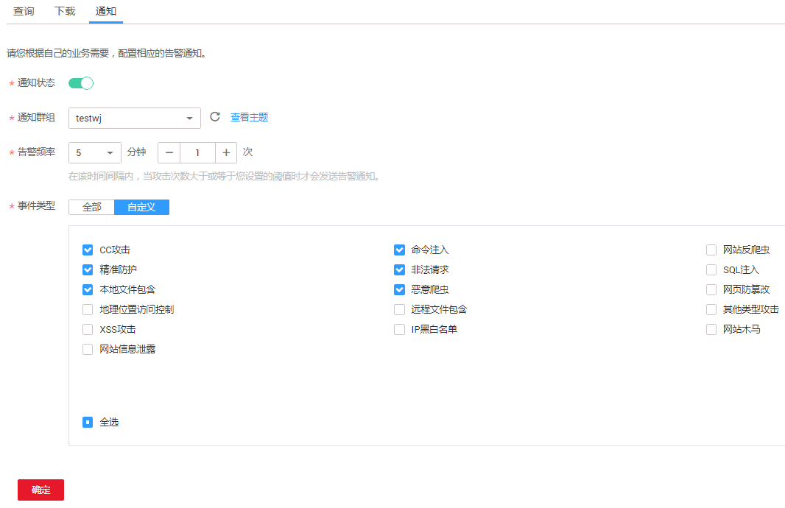

# 开启告警通知

该任务指导用户通过Web应用防火墙服务对攻击日志进行通知设置。Web应用防火墙可将仅记录和拦截的攻击日志通过用户设置的邮箱或者手机号发送给用户。

## 前提条件

-   已获取管理控制台的帐号和密码。
-   已开通消息通知服务。

## 操作步骤

1.  登录管理控制台（https://console.huaweicloud.com/）。
2.  单击管理控制台左上角的，选择区域或项目。
3.  单击页面上方的“服务列表“，选择“安全  \>  Web应用防火墙“，在左侧导航树中选择“防护事件“，进入“防护事件“页面。
4.  选择“通知“页签，配置告警通知，如[图1](#fig40676821112218)所示，根据[表1](#table4725363915334)配置参数。

    **图 1**  告警通知设置  
    

    **表 1**  通知设置参数说明

    
    <table><thead align="left"><tr id="row4914351215334"><th class="cellrowborder" valign="top" width="34.97%" id="mcps1.2.3.1.1">
参数

    </th>
    <th class="cellrowborder" valign="top" width="65.03%" id="mcps1.2.3.1.2">
参数说明

    </th>
    </tr>
    </thead>
    <tbody><tr id="row5386527415334"><td class="cellrowborder" valign="top" width="34.97%" headers="mcps1.2.3.1.1 ">
通知状态

    </td>
    <td class="cellrowborder" valign="top" width="65.03%" headers="mcps1.2.3.1.2 ">
是否开启通知。

    <ul id="ul131371286465"><li>表示开启。</li><li>：关闭状态。</li></ul>
    </td>
    </tr>
    <tr id="row6597002315334"><td class="cellrowborder" valign="top" width="34.97%" headers="mcps1.2.3.1.1 ">
通知群组

    </td>
    <td class="cellrowborder" valign="top" width="65.03%" headers="mcps1.2.3.1.2 ">
单击下拉列表选择已创建的群组，或者单击“查看主题”创建新的群组。

    
更多信息，请参见《消息通知服务用户指南》。

    </td>
    </tr>
    <tr id="row2091915305414"><td class="cellrowborder" valign="top" width="34.97%" headers="mcps1.2.3.1.1 ">
告警频率

    </td>
    <td class="cellrowborder" valign="top" width="65.03%" headers="mcps1.2.3.1.2 ">
设置告警频率。

    
 说明： 

在设置时间间隔内，当攻击次数大于或等于您设置的阈值时才会发送告警通知。

    

    </td>
    </tr>
    <tr id="row7449192820129"><td class="cellrowborder" valign="top" width="34.97%" headers="mcps1.2.3.1.1 ">
事件类型

    </td>
    <td class="cellrowborder" valign="top" width="65.03%" headers="mcps1.2.3.1.2 ">
设置告警的事件类型，系统默认选择“全部”，用户也可以单击“自定义”，勾选需要告警的事件类型。

    </td>
    </tr>
    </tbody>
    </table>

5.  配置完成后，单击“确定“，告警通知设置成功。

