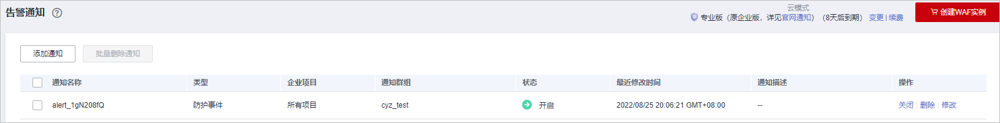
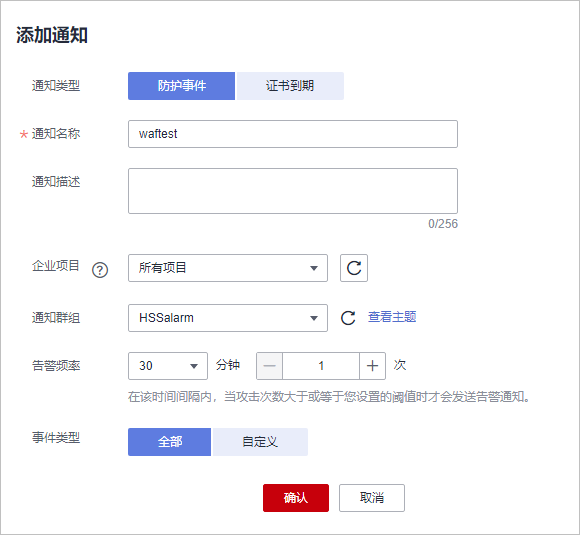

# 开启告警通知

通过对攻击日志进行通知设置，WAF可将仅记录和拦截的攻击日志通过用户设置的接收通知方式（例如邮件或短信）发送给用户。

同时，您也可以配置证书到期通知，证书即将到期时，WAF将通过用户设置的接收通知方式（例如邮件或短信）通知用户。

> **说明：** 
>-   消息通知服务为付费服务，价格详情请参见[SMN价格详情](https://www.huaweicloud.com/pricing.html?tab=detail#/smn)。
>-   在设置告警通知前，建议您先在“消息通知服务“中创建“消息主题“，详细操作请参见[如何发布主题消息](https://support.huaweicloud.com/qs-smn/smn_ug_0004.html)。
>-   如果您已开通企业项目，您需要在“企业项目“下拉列表中选择您所在的企业项目并确保已开通操作权限，才能开启该企业项目的告警通知。

## 前提条件

已开通消息通知服务。

## 约束条件

入门版不支持配置告警通知。

在设置时间间隔内，当攻击次数大于或等于您设置的阈值时才会发送告警通知。

## 操作步骤

1.  [登录管理控制台](https://console.huaweicloud.com/?locale=zh-cn)。
2.  单击管理控制台左上角的，选择区域或项目。
3.  单击页面左上方的，选择“安全与合规  \>  Web应用防火墙 WAF“。
4.  在左侧导航树中，选择“系统管理  \>  告警通知“，进入“告警通知“页面。

    **图 1**  告警通知  
    

5.  单击“添加通知“，配置告警通知参数，参数说明如[表1](#table24414341847)。

    **图 2**  添加通知  
    

    **表 1**  通知设置参数说明

    
    <table><thead align="left"><tr id="row2044117343417"><th class="cellrowborder" valign="top" width="34.92%" id="mcps1.2.3.1.1">
参数

    </th>
    <th class="cellrowborder" valign="top" width="65.08%" id="mcps1.2.3.1.2">
参数说明

    </th>
    </tr>
    </thead>
    <tbody><tr id="row94411734549"><td class="cellrowborder" valign="top" width="34.92%" headers="mcps1.2.3.1.1 ">
通知类型

    </td>
    <td class="cellrowborder" valign="top" width="65.08%" headers="mcps1.2.3.1.2 ">
选择告警通知的类型：

    <ul id="ul112119186159"><li>防护事件：WAF可将仅记录和拦截的攻击日志通过用户设置的接收通知方式（例如邮件或短信）发送给用户。</li><li>证书到期：证书即将到期时，WAF将通过用户设置的接收通知方式（例如邮件或短信）通知用户。</li></ul>
    </td>
    </tr>
    <tr id="row1168595114157"><td class="cellrowborder" valign="top" width="34.92%" headers="mcps1.2.3.1.1 ">
通知名称

    </td>
    <td class="cellrowborder" valign="top" width="65.08%" headers="mcps1.2.3.1.2 ">
自定义该条告警的名称 。

    </td>
    </tr>
    <tr id="row12602450131611"><td class="cellrowborder" valign="top" width="34.92%" headers="mcps1.2.3.1.1 ">
通知描述

    </td>
    <td class="cellrowborder" valign="top" width="65.08%" headers="mcps1.2.3.1.2 ">
可选参数，备注该条告警的用途。

    </td>
    </tr>
    <tr id="row240014451720"><td class="cellrowborder" valign="top" width="34.92%" headers="mcps1.2.3.1.1 ">
企业项目

    </td>
    <td class="cellrowborder" valign="top" width="65.08%" headers="mcps1.2.3.1.2 ">
在下拉框中选择企业项目，该通知在选择的企业项目下生效。

    </td>
    </tr>
    <tr id="row174428341443"><td class="cellrowborder" valign="top" width="34.92%" headers="mcps1.2.3.1.1 ">
通知群组

    </td>
    <td class="cellrowborder" valign="top" width="65.08%" headers="mcps1.2.3.1.2 ">
单击下拉列表选择已创建的主题或者单击“查看主题”创建新的主题，用于配置接收告警通知的终端。

    
单击“查看主题”创建新主题的操作步骤如下：<ol id="ol944215341349"><li>参见<a href="https://support.huaweicloud.com/usermanual-smn/zh-cn_topic_0043961401.html" target="_blank" rel="noopener noreferrer">创建主题</a>创建一个主题。</li><li>配置接收告警通知的手机号码、邮件地址、函数、平台应用的终端、DMS或HTTP(S)终端，即为创建的主题添加一个或多个订阅，具体操作请参见<a href="https://support.huaweicloud.com/usermanual-smn/smn_ug_0008.html" target="_blank" rel="noopener noreferrer">添加订阅</a>。</li><li>确认订阅。添加订阅后，完成订阅确认。</li></ol>
    

    
更多关于主题和订阅的信息，请参见《消息通知服务用户指南》。

    </td>
    </tr>
    <tr id="row124431334346"><td class="cellrowborder" valign="top" width="34.92%" headers="mcps1.2.3.1.1 ">
告警频率

    </td>
    <td class="cellrowborder" valign="top" width="65.08%" headers="mcps1.2.3.1.2 ">
“通知类型”选择“防护事件”时，需要设置告警频率。

    
 说明： 

在设置时间间隔内，当攻击次数大于或等于您设置的阈值时才会发送告警通知。

    

    </td>
    </tr>
    <tr id="row164431349414"><td class="cellrowborder" valign="top" width="34.92%" headers="mcps1.2.3.1.1 ">
事件类型

    </td>
    <td class="cellrowborder" valign="top" width="65.08%" headers="mcps1.2.3.1.2 ">
“通知类型”选择“防护事件”时，需要配置此参数。

    
设置告警的事件类型，系统默认选择“全部”，用户也可以单击“自定义”，勾选需要告警的事件类型。

    </td>
    </tr>
    <tr id="row175031137172116"><td class="cellrowborder" valign="top" width="34.92%" headers="mcps1.2.3.1.1 ">
到期提前通知

    </td>
    <td class="cellrowborder" valign="top" width="65.08%" headers="mcps1.2.3.1.2 ">
“通知类型”选择“证书到期”时，需要配置此参数。

    
在下拉框中选择证书到期提前通知的时间，可选择“1周”、“1个月”、“2个月”。

    
例如：选择“1周”，那么证书到期前1周时，WAF将以短信或邮件的方式通知您更换证书。

    </td>
    </tr>
    <tr id="row158142041172113"><td class="cellrowborder" valign="top" width="34.92%" headers="mcps1.2.3.1.1 ">
提前通知频率

    </td>
    <td class="cellrowborder" valign="top" width="65.08%" headers="mcps1.2.3.1.2 ">
“通知类型”选择“证书到期”时，需要配置此参数。

    
在下拉框中选择证书到期提前通知的频率，可配置为“每周”或“每天”。

    </td>
    </tr>
    </tbody>
    </table>

6.  配置完成后，单击“确认“，告警通知设置成功。
    -   如果需要关闭该告警通知，在目标告警所在行的的“操作“列，单击“关闭“。
    -   如果需要删除该告警通知，在目标告警所在行的的“操作“列，单击“删除“。
    -   如果需要修改该告警通知，在目标告警所在行的的“操作“列，单击“修改“。

## 告警通知邮件示例

如果您开启告警通知并成功设置以邮件方式接收告警通知，WAF会将记录和拦截的攻击日志发送给您，接收的告警通知邮件示例如[图3](#fig106335561016)所示。

**图 3**  告警通知邮件示例  

