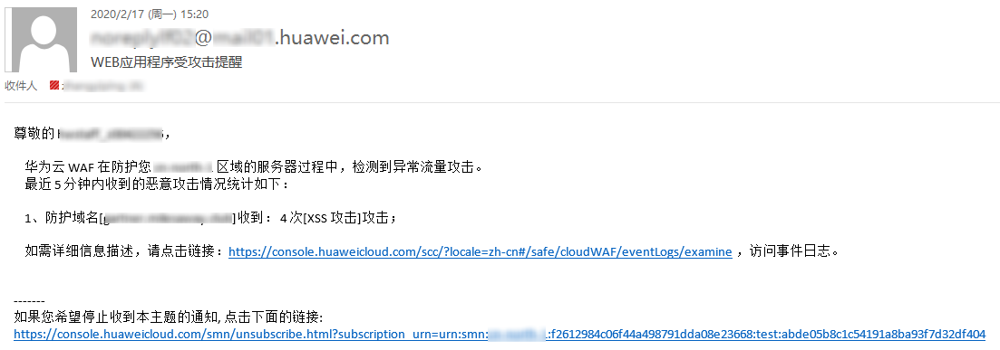

# 开启告警通知

该章节指导您通过Web应用防火墙服务对攻击日志进行通知设置。Web应用防火墙可将仅记录和拦截的攻击日志通过用户设置的接收通知方式发送给用户。

> **说明：** 
>-   消息通知服务为付费服务，价格详情请参见[SMN价格详情](https://www.huaweicloud.com/pricing.html?tab=detail#/smn)。
>-   在设置告警通知前，建议您先以管理员身份在“消息通知服务“中创建“消息主题“，详细操作请参见[如何发布主题消息](https://support.huaweicloud.com/qs-smn/smn_ug_0004.html)。

## 前提条件

-   已获取管理控制台的账号和密码。
-   已开通消息通知服务。

## 操作步骤

1.  [登录管理控制台](https://console.huaweicloud.com/?locale=zh-cn)。
2.  进入防护事件页面入口，如[图1](#waf_01_0156_fig182151235121911)所示。

    **图 1**  防护事件页面入口  
    

3.  选择“通知“页签，配置告警通知参数，如[图2](#fig194411151204911)所示，参数说明如[表1](#table15446251114920)所示。

    **图 2**  设置告警通知  
    

    **表 1**  通知设置参数说明

    
    <table><thead align="left"><tr id="row18441155104913"><th class="cellrowborder" valign="top" width="34.97%" id="mcps1.2.3.1.1">
参数

    </th>
    <th class="cellrowborder" valign="top" width="65.03%" id="mcps1.2.3.1.2">
参数说明

    </th>
    </tr>
    </thead>
    <tbody><tr id="row144411951154919"><td class="cellrowborder" valign="top" width="34.97%" headers="mcps1.2.3.1.1 ">
通知状态

    </td>
    <td class="cellrowborder" valign="top" width="65.03%" headers="mcps1.2.3.1.2 ">
是否开启通知。

    <ul id="ul24411551164911"><li>：开启状态。</li><li>：关闭状态。</li></ul>
    </td>
    </tr>
    <tr id="row13443115144918"><td class="cellrowborder" valign="top" width="34.97%" headers="mcps1.2.3.1.1 ">
通知群组

    </td>
    <td class="cellrowborder" valign="top" width="65.03%" headers="mcps1.2.3.1.2 ">
单击下拉列表选择已创建的主题或者单击“查看主题”创建新的主题，用于配置接收告警通知的终端。

    
单击“查看主题”创建新主题的操作步骤如下：<ol id="ol3442135116491"><li>参见<a href="https://support.huaweicloud.com/usermanual-smn/zh-cn_topic_0043961401.html" target="_blank" rel="noopener noreferrer">创建主题</a>创建一个主题。</li><li>配置接收告警通知的手机号码、邮件地址、函数、平台应用的终端、DMS或HTTP(S)终端，即为创建的主题添加一个或多个订阅，具体操作请参见<a href="https://support.huaweicloud.com/usermanual-smn/smn_ug_0008.html" target="_blank" rel="noopener noreferrer">添加订阅</a>。</li><li>确认订阅。添加订阅后，完成订阅确认。</li></ol>
    

    
更多关于主题和订阅的信息，请参见《消息通知服务用户指南》。

    </td>
    </tr>
    <tr id="row644625115492"><td class="cellrowborder" valign="top" width="34.97%" headers="mcps1.2.3.1.1 ">
告警频率

    </td>
    <td class="cellrowborder" valign="top" width="65.03%" headers="mcps1.2.3.1.2 ">
设置告警频率。

    
 说明： 

在设置时间间隔内，当攻击次数大于或等于您设置的阈值时才会发送告警通知。

    

    </td>
    </tr>
    <tr id="row1844612511491"><td class="cellrowborder" valign="top" width="34.97%" headers="mcps1.2.3.1.1 ">
事件类型

    </td>
    <td class="cellrowborder" valign="top" width="65.03%" headers="mcps1.2.3.1.2 ">
设置告警的事件类型，系统默认选择“全部”，用户也可以单击“自定义”，勾选需要告警的事件类型。

    </td>
    </tr>
    </tbody>
    </table>

4.  配置完成后，单击“确定“，告警通知设置成功。

## 告警通知邮件示例

如果您开启告警通知并成功设置以邮件方式接收告警通知，WAF会将记录和拦截的攻击日志发送给您，接收的告警通知邮件示例如[图3](#fig106335561016)所示。

**图 3**  告警通知邮件示例  

