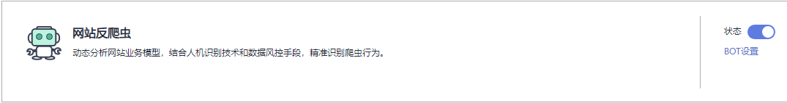

# 开启网站反爬虫

您可以通过Web应用防火墙服务开启网站反爬虫。

> **须知：** 
>仅企业版、旗舰版和独享版支持该规则。

## 操作须知

开启网站反爬虫后，如果不能查看拦截记录，请参见[开启网站反爬虫后，为什么有些请求被WAF拦截但查不到拦截记录？](https://support.huaweicloud.com/waf_faq/waf_01_0254.html)。

## 前提条件

已添加防护网站。

## 操作步骤

1.  [登录管理控制台](https://console.huaweicloud.com/?locale=zh-cn)。
2.  进入防护策略配置入口，如[图1](#waf_01_0008_fig089771664710)所示。

    **图 1**  防护策略配置入口  
    

3.  “网站反爬虫“的“状态“默认为关闭状态，如[图2](#fig177217811514)所示。

    **图 2**  网站反爬虫配置框  
    

    > **须知：** 
    >如果当前业务接入CDN等类型的服务时，同时开启了“网站反爬虫“防护，则可能造成访问异常，此情况取决于CDN等服务的加速配置。

4.  单击，在弹出的“警告“提示框中，单击“确定“，开启网站反爬虫。

