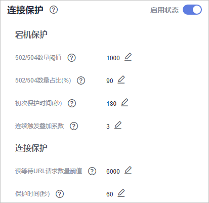

# 开启连接保护

网站接入WAF防护之后，若您访问网站时出现大量的502 Bad Gateway，504 Gateway Timeout错误或者等待处理的请求，为了保护源站的安全，可使用WAF的宕机保护和连接保护功能。当502/504请求数量或读等待URL请求数量以及占比阈值达到您设置的值时，将触发WAF熔断功能开关，实现宕机保护和读等待URL请求保护。

## 前提条件

-   已添加防护网站。
-   已将独享引擎版本升级到最新版本，具体的操作请参见[升级独享引擎实例](管理独享引擎.md#section14776618151819)。

## 约束条件

-   防护网站的部署模式为“独享模式“。
-   开启“连接保护“前，必须将[将独享引擎实例版本升级到最新版本](管理独享引擎.md#section14776618151819)，否则开启后可能会对业务产生影响。
-   网站连接保护功能开放的区域，请参考[功能总览](https://support.huaweicloud.com/function-waf/index.html#)。

## 操作步骤

1.  [登录管理控制台](https://console.huaweicloud.com/?locale=zh-cn)。
2.  单击管理控制台左上角的，选择区域或项目。
3.  单击页面左上方的，选择“安全与合规  \>  Web应用防火墙 WAF“。
4.  在左侧导航树中，选择“网站设置“，进入“网站设置“页面。
5.  在目标网站所在行的“域名“列中，单击目标网站，进入网站基本信息页面。
6.  在“连接保护“所在行，单击“启用状态“图标，开启连接保护。

    **图 1**  连接保护  
    

7.  根据业务需要，在各参数所在行，单击，配置“宕机保护“和“连接保护“参数值，并单击保存设置，参数说明如[表1](#table172097131662)所示。

    **表 1**  连接保护参数说明

    
    <table><thead align="left"><tr id="row921013131669"><th class="cellrowborder" colspan="2" valign="top" id="mcps1.2.5.1.1">
参数

    </th>
    <th class="cellrowborder" valign="top" id="mcps1.2.5.1.2">
参数说明

    </th>
    <th class="cellrowborder" valign="top" id="mcps1.2.5.1.3">
示例

    </th>
    </tr>
    </thead>
    <tbody><tr id="row13211101317615"><td class="cellrowborder" rowspan="4" valign="top" width="15.240000000000004%" headers="mcps1.2.5.1.1 ">
宕机保护

    </td>
    <td class="cellrowborder" valign="top" width="26.630000000000003%" headers="mcps1.2.5.1.1 ">
502/504数量阈值

    </td>
    <td class="cellrowborder" valign="top" width="37.440000000000005%" headers="mcps1.2.5.1.2 ">
每30s累加的502/504数量阈值

    </td>
    <td class="cellrowborder" valign="top" width="20.69%" headers="mcps1.2.5.1.3 ">
1000

    </td>
    </tr>
    <tr id="row1421116136619"><td class="cellrowborder" valign="top" headers="mcps1.2.5.1.1 ">
502/504数量占比(%)

    </td>
    <td class="cellrowborder" valign="top" headers="mcps1.2.5.1.1 ">
总请求数量中502/504数量占比达到所设定值，并且与数量阈值同时满足时触发宕机保护。

    </td>
    <td class="cellrowborder" valign="top" headers="mcps1.2.5.1.2 ">
90

    </td>
    </tr>
    <tr id="row1211151310612"><td class="cellrowborder" valign="top" headers="mcps1.2.5.1.1 ">
初次保护时间(秒)

    </td>
    <td class="cellrowborder" valign="top" headers="mcps1.2.5.1.1 ">
初次触发宕机的保护时间，即WAF将停止转发用户请求的时间。

    </td>
    <td class="cellrowborder" valign="top" headers="mcps1.2.5.1.2 ">
180

    </td>
    </tr>
    <tr id="row102281027718"><td class="cellrowborder" valign="top" headers="mcps1.2.5.1.1 ">
连续触发叠加系数

    </td>
    <td class="cellrowborder" valign="top" headers="mcps1.2.5.1.1 ">
连续触发时，保护时间延长最大倍数，叠加周期为3600s。

    
例如，“初次保护时间”设置为180s，“连续触发叠加系数”设置为3。<ul id="ul261914232303"><li>当触发次数为2（即小于3）时，保护时间为360s。</li><li>当次数大于等于3时，保护时间为540s。</li><li>当累计保护时间超过1小时（3600s），叠加次数会从头计数。</li></ul>
    

    </td>
    <td class="cellrowborder" valign="top" headers="mcps1.2.5.1.2 ">
3

    </td>
    </tr>
    <tr id="row13228132575"><td class="cellrowborder" rowspan="2" valign="top" width="15.240000000000004%" headers="mcps1.2.5.1.1 ">
连接保护

    </td>
    <td class="cellrowborder" valign="top" width="26.630000000000003%" headers="mcps1.2.5.1.1 ">
读等待URL请求数量阈值

    </td>
    <td class="cellrowborder" valign="top" width="37.440000000000005%" headers="mcps1.2.5.1.2 ">
读等待URL请求数量到达设定值即触发连接保护

    </td>
    <td class="cellrowborder" valign="top" width="20.69%" headers="mcps1.2.5.1.3 ">
6000

    </td>
    </tr>
    <tr id="row5228021178"><td class="cellrowborder" valign="top" headers="mcps1.2.5.1.1 ">
保护时间(秒)

    </td>
    <td class="cellrowborder" valign="top" headers="mcps1.2.5.1.1 ">
达到数量阈值所触发的保护时间，即WAF将停止转发用户请求的时间。

    </td>
    <td class="cellrowborder" valign="top" headers="mcps1.2.5.1.2 ">
60

    </td>
    </tr>
    </tbody>
    </table>

    > **说明：** 
    >以[图1](#fig491043320154)中“连接保护“中设置的值为例进行解释：
    >-   “宕机保护“：当防护网站的502/504错误返回量达到1000条以上且占网站的所有访问请求量的90%及以上时，第一次触发时，WAF将停止转发用户请求180s（即阻止用户访问网站180s）；连续第二次触发时，WAF将停止转发用户请求360s；连续第三次及以上触发时，WAF将停止转发用户请求540s。当累计保护时间超过1小时（3600s），叠加次数会从头计数。
    >-   “连接保护“：访问网站的读等待URL请求数量达到6000以上时，WAF将停止转发用户请求60s，且将返回网站的维护页面。

