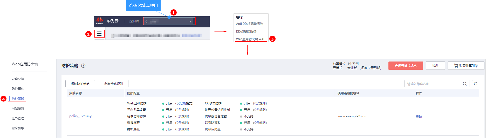
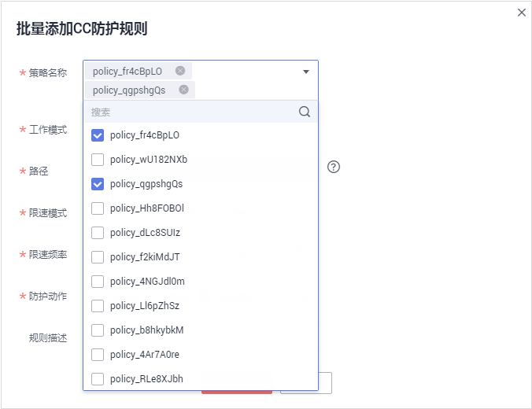

# 批量添加防护规则

您可以通过Web应用防火墙服务批量添加防护规则。

> **须知：**   
>检测版仅支持批量添加误报屏蔽规则。  

## 前提条件

已添加防护网站。

## 操作步骤

1.  [登录管理控制台](https://console.huaweicloud.com/?locale=zh-cn)。
2.  进入防护策略入口，如[图1](#waf_01_0074_fig4185340104311)所示。

    **图 1**  防护策略入口  
    

3.  在页面左上角，单击“所有策略规则“。
4.  在待配置规则列表的左上角，单击“批量添加“，进入对应的规则配置页面。
5.  选择策略名称，在“策略名称“的下拉框中选择策略名，可批量多选，如[图2](#fig196561326114814)所示。

    **图 2**  批量添加防护规则  
    

6.  完成除“策略名称“以外其它参数的配置。
    -   “CC攻击防护“请参见[表1](配置CC攻击防护规则.md#table1173915209149)进行参数配置。
    -   “精准访问防护“请参见[表1](配置精准访问防护规则.md#table2299936310457)进行参数配置。
    -   “黑白名单设置“请参见[表1](配置黑白名单规则.md#table147241231818)进行参数配置。
    -   “地理位置访问控制“请参见[表1](配置地理位置访问控制规则.md#table4696626918715)进行参数配置。
    -   “网页防篡改“请参见[表1](配置网页防篡改规则.md#table2046816299203)进行参数配置。
    -   “防敏感信息泄露“请参见[表1](配置防敏感信息泄露规则.md#table242612276178)进行参数配置。
    -   “误报屏蔽“请参见[表1](配置误报屏蔽规则.md#table15761232696)进行参数配置。
    -   “隐私屏蔽“请参见[表1](配置隐私屏蔽规则.md#table4696626918715)进行参数配置。

7.  单击“确认添加“，批量添加防护规则成功。
    -   规则添加成功后，默认的“规则状态“为“已开启“，若您暂时不想使该策略生效，可在目标策略所在行的“操作“列，单击“关闭“。
    -   当您需要修改添加的规则时，在待修改的规则所在行，单击“修改“，修改规则。
    -   当您需要删除添加的规则时，在待删除的规则所在行，单击“删除“，删除规则。

