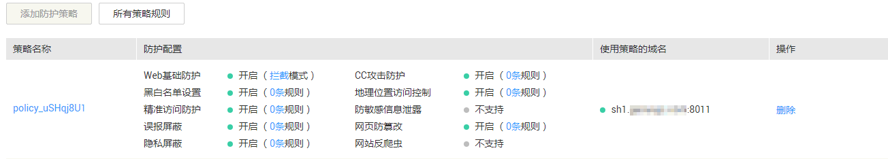
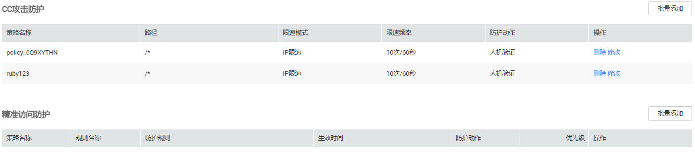
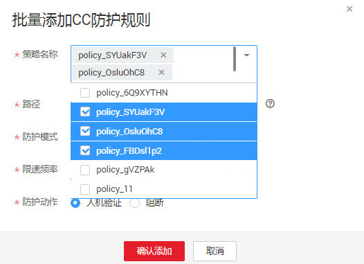

# 批量添加防护规则

该任务指导用户通过Web应用防火墙服务批量添加防护规则。

## 前提条件

-   已获取管理控制台的帐号和密码。
-   已添加防护域名。

## 操作步骤

1.  登录管理控制台（https://console.huaweicloud.com/）。
2.  单击管理控制台左上角的，选择区域或项目。
3.  单击页面上方的“服务列表“，选择“安全  \>  Web应用防火墙“，在左侧导航树中选择“防护策略“，进入“防护策略“页面。
4.  在页面左上角，单击“所有策略规则“，如[图1](#fig126532105511)所示。

    **图 1**  所有策略规则  
    

5.  在待配置规则列表的右上角，单击“批量添加“，进入对应的规则配置页面，如[图2](#fig527945412355)所示。

    **图 2**  所有策略规则页面  
    

6.  选择策略名称，在“策略名称“的下拉框中选择策略名，可批量多选，如[图3](#fig196561326114814)所示。

    **图 3**  批量添加防护规则  
    

1.  完成除“策略名称“以外其它参数的配置。
    -   “CC攻击防护“请参见[表1](配置CC攻击防护规则.md#table19744111819217)进行参数配置。
    -   “精准访问防护“请参见[表1](配置精准访问防护规则.md#table2299936310457)进行参数配置。
    -   “黑白名单设置“请参见[表1](配置黑白名单规则.md#table27095251482)进行参数配置。
    -   “地理位置访问控制“请参见[表1](配置地理位置访问控制规则.md#table4696626918715)进行参数配置。
    -   “网页防篡改“请参见[表1](配置网页防篡改规则.md#table2046816299203)进行参数配置。
    -   “防敏感信息泄露“请参见[表1](配置防敏感信息泄露规则.md#table1156133013104)进行参数配置。
    -   “误报屏蔽“请参见[表1](配置误报屏蔽规则.md#table4696626918715)进行参数配置。
    -   “隐私屏蔽“请参见[表1](配置隐私屏蔽规则.md#table4696626918715)进行参数配置。

2.  单击“确认添加“，批量添加防护规则成功。

    > **说明：**   
    >当您需要修改添加的规则时，在待修改的规则所在行，单击“修改“，修改规则。  
    >当您需要删除添加的规则时，在待删除的规则所在行，单击“删除“，删除规则。  

