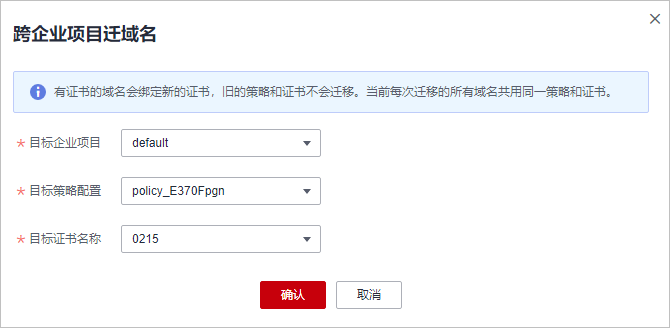

# 批量跨企业项目迁移域名

WAF支持将目标企业项目下的域名迁移到其他企业项目下，迁移后，原企业项目下将不再保留已迁移的域名。

证书和策略不会随域名一起迁移，需要为迁移的域名重新适配证书和策略。

## 前提条件

已添加防护网站。

## 约束条件

-   “云模式“仅专业版、铂金版支持跨企业项目迁移域名。
-   证书和策略不会随域名一起迁移，需要为迁移的域名重新适配证书和策略。

## 操作步骤

1.  [登录管理控制台](https://console.huaweicloud.com/?locale=zh-cn)。
2.  单击管理控制台左上角的，选择区域或项目。
3.  单击页面左上方的，选择“安全与合规  \>  Web应用防火墙 WAF“。
4.  在左侧导航树中，选择“网站设置“，进入“网站设置“页面。
5.  批量勾选需要迁移的域名，在网站列表的右上角，单击“批量迁域名“。

    -   “目标企业项目“：选择需要将域名迁移到的新的企业项目。
    -   “目标策略配置“：当前域名绑定的策略不会一起迁移，需要选择新企业项目下的策略。
    -   “目标证书名称“：当前域名绑定的证书不会一起迁移，需要选择新企业项目下的证书。

    **图 1**  跨企业项目迁域名  
    

