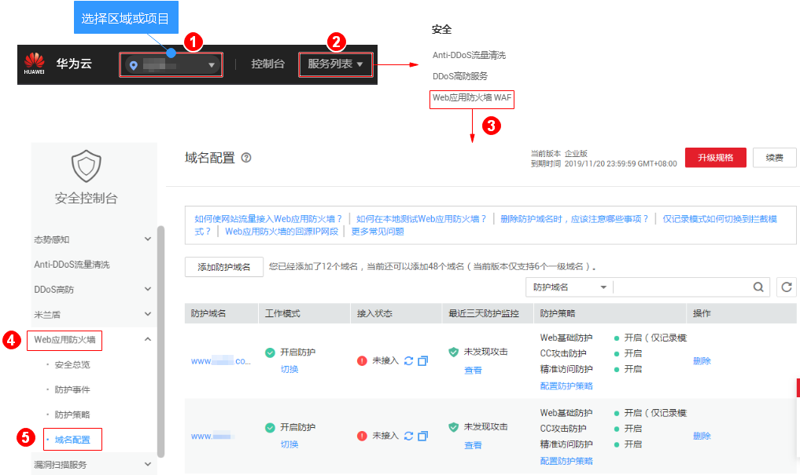
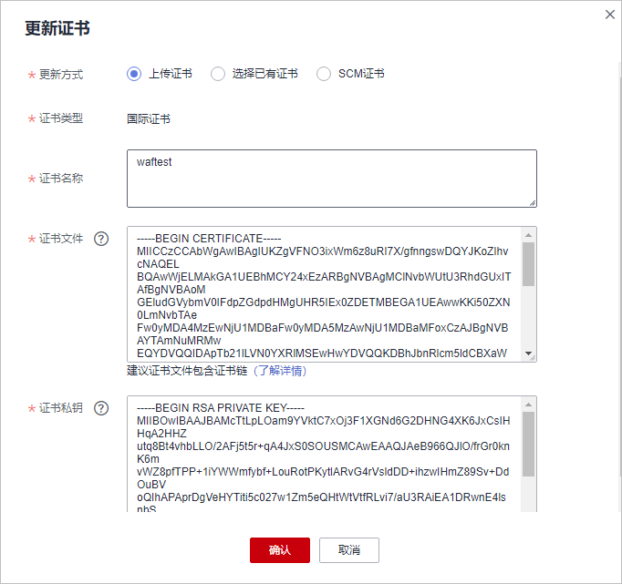
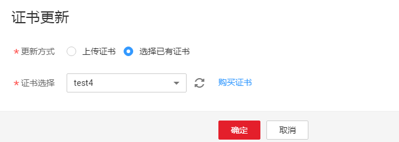

# 更新证书

如果您购买的证书即将到期，为了不影响域名的使用，建议您在到期前重新购买证书，并在WAF中同步更新域名绑定的证书。

> **说明：**   
>-   证书过期后，对源站的影响是覆灭性的，比主机崩溃和网站无法访问的影响还要大，且会造成WAF的防护规则不生效，故建议您在证书到期前及时更新证书。  
>-   域名和证书需要一一对应，泛域名只能使用泛域名证书。如果您没有购买泛域名证书，只有单域名对应的证书，则只能在WAF中按照单域名的方式逐条添加域名进行防护。  

## 前提条件

-   已获取管理控制台的账号和密码。
-   “对外协议“使用了HTTPS协议。

## 操作步骤

1.  [登录管理控制台](https://console.huaweicloud.com/?locale=zh-cn)。
2.  进入域名列表入口，如[图1](#waf_01_0079_fig1373412710218)所示。

    **图 1**  域名列表入口  
    

3.  在目标域名所在行的“防护域名“列中，单击目标域名，进入域名基本信息页面。
4.  在证书所在行的证书名称后，单击，在弹出的“证书更新“对话框中，上传新证书或者选择已有证书。
    -   “更新方式“选择“上传证书“时，在对话框中输入“证书名称“，并将证书内容和私钥内容粘贴到对应的文本框中，如[图2](#fig1518314493518)所示。

        > **说明：**   
        >Web应用防火墙将对私钥进行加密保存，保障证书私钥的安全性。  

        **图 2**  导入证书  
        

        WAF当前仅支持PEM格式证书。如果证书为非PEM格式，请参考[表1](#zh-cn_topic_0154713246_table1184924815910)将证书转换为PEM格式，再上传。

        **表 1**  证书转换命令

        
        <table><thead align="left"><tr id="zh-cn_topic_0154713246_row2847448797"><th class="cellrowborder" valign="top" width="21.990000000000002%" id="mcps1.2.3.1.1">
格式类型

        </th>
        <th class="cellrowborder" valign="top" width="78.01%" id="mcps1.2.3.1.2">
转换方式（Linux系统中操作）

        </th>
        </tr>
        </thead>
        <tbody><tr id="zh-cn_topic_0154713246_row1784719481093"><td class="cellrowborder" valign="top" width="21.990000000000002%" headers="mcps1.2.3.1.1 ">
CER/CRT

        </td>
        <td class="cellrowborder" valign="top" width="78.01%" headers="mcps1.2.3.1.2 ">
将“cert.crt”证书文件直接重命名为“cert.pem”。

        </td>
        </tr>
        <tr id="zh-cn_topic_0154713246_row1484714481196"><td class="cellrowborder" valign="top" width="21.990000000000002%" headers="mcps1.2.3.1.1 ">
PFX

        </td>
        <td class="cellrowborder" valign="top" width="78.01%" headers="mcps1.2.3.1.2 "><ol id="zh-cn_topic_0154713246_ol178472048299"><li>提取私钥命令，以“cert.pfx”转换为“cert.key”为例。
<strong id="zh-cn_topic_0154713246_b78471748295">openssl pkcs12 -in cert.pfx -nocerts -out cert.key -nodes</strong>

        </li><li>提取证书命令（示例：“cert.pfx”转“cert.pem”）：
<strong id="zh-cn_topic_0154713246_b10847164818913">openssl pkcs12 -in cert.pfx -nokeys -out cert.pem</strong>

        </li></ol>
        </td>
        </tr>
        <tr id="zh-cn_topic_0154713246_row15847548495"><td class="cellrowborder" valign="top" width="21.990000000000002%" headers="mcps1.2.3.1.1 ">
P7B

        </td>
        <td class="cellrowborder" valign="top" width="78.01%" headers="mcps1.2.3.1.2 ">
证书转换，以“cert.p7b”转换为“cert.pem”为例。

        
<strong id="zh-cn_topic_0154713246_b884754812912">openssl pkcs7 -print_certs -in cert.p7b -out cert.pem</strong>

        </td>
        </tr>
        <tr id="zh-cn_topic_0154713246_row12849154819915"><td class="cellrowborder" valign="top" width="21.990000000000002%" headers="mcps1.2.3.1.1 ">
DER

        </td>
        <td class="cellrowborder" valign="top" width="78.01%" headers="mcps1.2.3.1.2 ">
提取证书命令，以“privatekey.der”转换为“cert.key”为例。

        
<strong id="zh-cn_topic_0154713246_b118494481997">openssl rsa -inform DER -outform PEM -in privatekey.der -out cert.key</strong>

        </td>
        </tr>
        </tbody>
        </table>

    -   “更新方式“选择“选择已有证书“时，在“证书选择“的下拉框中选择已有的证书，如[图3](#fig14685463111)所示。

        **图 3**  选择已有证书  
        

        > **说明：**   
        >如果没有可使用的证书，可单击“购买证书“，购买新的证书并推送到WAF。WAF支持SCM提供的所有证书类型，可参考[SCM概述](https://support.huaweicloud.com/productdesc-scm/scm_01_0001.html)章节详细了解SSL证书。  

5.  单击“确定“，证书更新完成。

