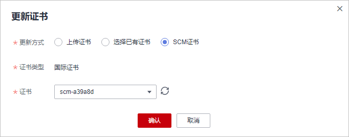

# 更新证书

当防护网站的部署模式为“云模式“或“独享模式“且“对外协议“为“HTTPS“时，您需要上传证书使证书绑定到防护网站。

-   如果您的证书即将到期，为了不影响网站的使用，建议您在到期前重新使用新的证书，并在WAF中同步更新网站绑定的证书。
-   如果您需要更新网站绑定证书的信息，可以在WAF中为网站绑定新的证书。

> **说明：** 
>如果您已开通企业项目，您需要在“企业项目“下拉列表中选择您所在的企业项目并确保已开通操作权限，才能为该企业项目下的域名更新证书。

## 前提条件

-   防护网站的部署模式为“云模式“或“独享模式“。
-   防护网站的“对外协议“使用了HTTPS协议。

## 约束条件

-   域名和证书需要一一对应，泛域名只能使用泛域名证书。如果您没有泛域名证书，只有单域名对应的证书，则只能在WAF中按照单域名的方式逐条添加域名进行防护。
-   WAF当前仅支持PEM格式证书。如果证书为非PEM格式，请参考[6](#li5865132352711)将证书转换为PEM格式，再上传。
-   拥有“SCM Administrator“和“SCM FullAccess“权限的账号才能选择SCM证书。
-   更新证书前，请确认WAF和更新的证书在同一账号下。
-   WAF不支持证书过期时发送告警通知功能，您可以在“证书管理“界面查看证书的过期时间。

## 系统影响

-   证书过期后，对源站的影响是覆灭性的，比主机崩溃和网站无法访问的影响还要大，且会造成WAF的防护规则不生效，故建议您在证书到期前及时更新证书。
-   更新证书不会影响业务，更换过程中会使用旧证书，更新成功后，自动切为新证书，新证书立刻生效。
-   同时更新后端服务器上的证书配置和WAF域名绑定证书的配置会影响网站访问业务，建议您在业务量少时进行更新。

## 操作步骤

1.  [登录管理控制台](https://console.huaweicloud.com/?locale=zh-cn)。
2.  单击管理控制台左上角的，选择区域或项目。
3.  单击页面左上方的，选择“安全与合规  \>  Web应用防火墙 WAF“。
4.  在左侧导航树中，选择“网站设置“，进入“网站设置“页面。
5.  在目标网站所在行的“域名“列中，单击目标网站，进入网站基本信息页面。
6.  在证书所在行的证书名称后，单击，在弹出的“更新证书“对话框中，上传新证书或者选择已有证书。
    -   “更新方式“选择“上传证书“时，在对话框中输入“证书名称“，并将证书内容和私钥内容粘贴到对应的文本框中。

        成功导入的新证书，将添加到“证书管理“页面的证书列表中。有关证书管理的操作，请参见[上传证书](上传证书.md)。

        > **说明：** 
        >Web应用防火墙将对私钥进行加密保存，保障证书私钥的安全性。

        **图 1**  导入证书  
        

        WAF当前仅支持PEM格式证书。如果证书为非PEM格式，请参考[表1](#waf_01_0002_table1292125414516)在本地将证书转换为PEM格式，再上传。

        **表 1**  证书转换命令

        
        <table><thead align="left"><tr id="waf_01_0002_row1029335416459"><th class="cellrowborder" valign="top" width="21.990000000000002%" id="mcps1.2.3.1.1">
格式类型

        </th>
        <th class="cellrowborder" valign="top" width="78.01%" id="mcps1.2.3.1.2">
转换方式

        </th>
        </tr>
        </thead>
        <tbody><tr id="waf_01_0002_row229345416453"><td class="cellrowborder" valign="top" width="21.990000000000002%" headers="mcps1.2.3.1.1 ">
CER/CRT

        </td>
        <td class="cellrowborder" valign="top" width="78.01%" headers="mcps1.2.3.1.2 ">
将“cert.crt”证书文件直接重命名为“cert.pem”。

        </td>
        </tr>
        <tr id="waf_01_0002_row19294654194516"><td class="cellrowborder" valign="top" width="21.990000000000002%" headers="mcps1.2.3.1.1 ">
PFX

        </td>
        <td class="cellrowborder" valign="top" width="78.01%" headers="mcps1.2.3.1.2 "><ul id="waf_01_0002_ul122945545457"><li>提取私钥命令，以“cert.pfx”转换为“key.pem”为例。
<strong id="waf_01_0002_b1294125484517">openssl pkcs12 -in cert.pfx -nocerts -out key.pem -nodes</strong>

        </li><li>提取证书命令，以“cert.pfx”转换为“cert.pem”为例。
<strong id="waf_01_0002_b1629465420458">openssl</strong> <strong id="waf_01_0002_b1529417548459">pkcs12</strong> <strong id="waf_01_0002_b10294145414520">-in</strong> <strong id="waf_01_0002_b20294105444511">cert.pfx</strong> <strong id="waf_01_0002_b1294205444519">-nokeys</strong> <strong id="waf_01_0002_b9294185410455">-out</strong> <strong id="waf_01_0002_b729425411459">cert.pem</strong>

        </li></ul>
        </td>
        </tr>
        <tr id="waf_01_0002_row1529419542456"><td class="cellrowborder" valign="top" width="21.990000000000002%" headers="mcps1.2.3.1.1 ">
P7B

        </td>
        <td class="cellrowborder" valign="top" width="78.01%" headers="mcps1.2.3.1.2 "><ol id="waf_01_0002_ol1729475464511"><li>证书转换，以“cert.p7b”转换为“cert.cer”为例。
<strong id="waf_01_0002_b1629510544452">openssl</strong> <strong id="waf_01_0002_b16295105404518">pkcs7</strong> <strong id="waf_01_0002_b729555444513">-print_certs</strong> <strong id="waf_01_0002_b20295145464510">-in</strong> <strong id="waf_01_0002_b17295145454517">cert.p7b</strong> <strong id="waf_01_0002_b629595411457">-out</strong> <strong id="waf_01_0002_b13295125494519">cert.cer</strong>

        </li><li>将“cert.cer”证书文件直接重命名为“cert.pem”。</li></ol>
        </td>
        </tr>
        <tr id="waf_01_0002_row8295195414451"><td class="cellrowborder" valign="top" width="21.990000000000002%" headers="mcps1.2.3.1.1 ">
DER

        </td>
        <td class="cellrowborder" valign="top" width="78.01%" headers="mcps1.2.3.1.2 "><ul id="waf_01_0002_ul162956542452"><li>提取私钥命令，以“privatekey.der”转换为“privatekey.pem”为例。
<strong id="waf_01_0002_b12295165414514">openssl</strong> <strong id="waf_01_0002_b429514549453">rsa</strong> <strong id="waf_01_0002_b19295165474516">-inform</strong> <strong id="waf_01_0002_b42951954164520">DER</strong> <strong id="waf_01_0002_b529525444512">-outform</strong> <strong id="waf_01_0002_b429525484510">PEM</strong> <strong id="waf_01_0002_b142955543457">-in</strong> <strong id="waf_01_0002_b1029535454514">privatekey.der</strong> <strong id="waf_01_0002_b829675424513">-out</strong> <strong id="waf_01_0002_b1296115410454">privatekey.pem</strong>

        </li><li>提取证书命令，以“cert.cer”转换为“cert.pem”为例。
<strong id="waf_01_0002_b729675419451">openssl</strong> <strong id="waf_01_0002_b19296175424511">x509</strong> <strong id="waf_01_0002_b3296954134515">-inform</strong> <strong id="waf_01_0002_b3296754204513">der</strong> <strong id="waf_01_0002_b17296254134510">-in</strong> <strong id="waf_01_0002_b829645412454">cert.cer</strong> <strong id="waf_01_0002_b929625474518">-out cert.pem</strong>

        </li></ul>
        </td>
        </tr>
        </tbody>
        </table>

        > **说明：** 
        >-   执行openssl命令前，请确保本地已安装[openssl](https://www.openssl.org/)。
        >-   如果本地为Windows操作系统，请进入“命令提示符“对话框后，再执行证书转换命令。

    -   “更新方式“选择“选择已有证书“时，在“证书“下拉框中选择已有的证书。

        **图 2**  选择已有证书  
        

        > **说明：** 
        >如果没有可使用的证书，可单击“购买证书“，购买新的证书并推送到WAF。WAF支持SCM提供的所有证书类型，可参考[SCM概述](https://support.huaweicloud.com/productdesc-ccm/ccm_01_0219.html)章节详细了解SSL证书。

    -   更新方式选择“SCM证书“时，可选择托管在CCM里证书（已签发或者用户上传的证书）。

        > **注意：** 
        >选择的SCM证书需要与目标域名匹配，即该证书绑定的域名与添加到WAF的域名一致。

        **图 3**  选择SCM证书  
        

7.  单击“确认“，证书更新完成。

## 相关操作

[上传证书](上传证书.md)

