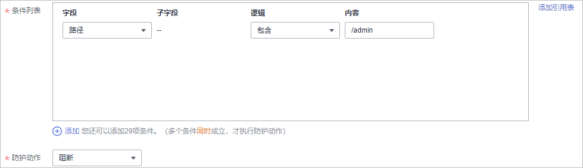

# 条件字段说明

您在设置CC攻击防护规则、精准访问防护规则或全局白名单规则时，需要在规则中配置条件字段，定义要匹配的请求特征。本文介绍了规则匹配条件支持使用的字段及其释义。

## 什么是条件字段

条件字段指需要WAF检测的请求特征。您在设置[CC攻击防护规则](配置CC攻击防护规则防御CC攻击.md)、[精准访问防护规则](配置精准访问防护规则定制化防护策略.md)或[误报屏蔽规则全局白名单（原误报屏蔽）规则](配置全局白名单（原误报屏蔽）规则对误报进行忽略.md)时，通过定义条件字段，指定要检测的请求特征。如果某个请求满足规则中设置的条件，则该请求命中对应规则；WAF会依据规则中设置的规则动作，对请求执行相应处置（例如，放行、拦截、仅记录等）。

**图 1**  条件字段  

条件字段由字段、逻辑、和内容组成。配置示例如下：

-   示例1：“字段“为“路径“、“逻辑“为“包含“、内容为“/admin“，表示被请求的路径包含“/admin“时，则请求命中该规则。
-   示例2：“字段“为“IP“、“逻辑“为“等于“、内容为“192.XX.XX.3“，表示当发起连接的客户端IP为192.XX.XX.3时，则请求命中该规则。

## 支持的条件字段

**表 1**  条件列表配置

<table><thead align="left"><tr id="row4545174315393"><th class="cellrowborder" valign="top" width="27.32726727327267%" id="mcps1.2.5.1.1">
字段

</th>
<th class="cellrowborder" valign="top" width="18.238176182381764%" id="mcps1.2.5.1.2">
子字段

</th>
<th class="cellrowborder" valign="top" width="26.807319268073194%" id="mcps1.2.5.1.3">
逻辑

</th>
<th class="cellrowborder" valign="top" width="27.62723727627237%" id="mcps1.2.5.1.4">
内容（举例）

</th>
</tr>
</thead>
<tbody><tr id="row1545114318391"><td class="cellrowborder" valign="top" width="27.32726727327267%" headers="mcps1.2.5.1.1 ">
路径：设置的防护路径，不包含域名，仅支持精准匹配（需要防护的路径需要与此处填写的路径完全相等。例如，需要防护的路径为“/admin”，该规则必须填写为“/admin”）

</td>
<td class="cellrowborder" valign="top" width="18.238176182381764%" headers="mcps1.2.5.1.2 ">
--

</td>
<td class="cellrowborder" rowspan="11" valign="top" width="26.807319268073194%" headers="mcps1.2.5.1.3 ">
在“逻辑”下拉列表框中选择逻辑关系。

</td>
<td class="cellrowborder" valign="top" width="27.62723727627237%" headers="mcps1.2.5.1.4 ">
<i>/buy/phone/</i>

 须知： 
<ul id="ul207601423193915"><li>路径设置为“/”时，表示防护网站所有路径。</li><li>配置的“路径”的“内容”不能包含特殊字符（' "&lt;&gt;&amp;*#%\?）。</li></ul>

</td>
</tr>
<tr id="row362081410432"><td class="cellrowborder" valign="top" headers="mcps1.2.5.1.1 ">
User Agent：设置为需要防护的扫描器的用户代理。

</td>
<td class="cellrowborder" valign="top" headers="mcps1.2.5.1.2 ">
--

</td>
<td class="cellrowborder" valign="top" headers="mcps1.2.5.1.3 ">
<i>Mozilla/5.0 (Windows NT 6.1)</i>

</td>
</tr>
<tr id="row323411238439"><td class="cellrowborder" valign="top" headers="mcps1.2.5.1.1 ">
IP：设置为需要防护的访问者IP地址。

支持IPv4和IPv6两种格式的IP地址。

 须知： 

仅专业版和铂金版支持IPv6防护。

</td>
<td class="cellrowborder" valign="top" headers="mcps1.2.5.1.2 "><ul id="ul13360125913812"><li>客户端IP</li><li>X-Forwarded-For</li><li>TCP连接IP</li></ul>
</td>
<td class="cellrowborder" valign="top" headers="mcps1.2.5.1.3 "><ul id="ul13143163612400"><li>IPv4，例如：192.168.1.1</li><li>IPv6，例如：fe80:0000:0000:0000:0000:0000:0000:0000</li></ul>
</td>
</tr>
<tr id="row17545184303914"><td class="cellrowborder" valign="top" headers="mcps1.2.5.1.1 ">
Params：设置为需要防护的请求参数。

</td>
<td class="cellrowborder" valign="top" headers="mcps1.2.5.1.2 "><ul id="ul179874773220"><li>所有字段</li><li>任意子字段</li><li>自定义</li></ul>
</td>
<td class="cellrowborder" valign="top" headers="mcps1.2.5.1.3 ">
201901150929

</td>
</tr>
<tr id="row371633435320"><td class="cellrowborder" valign="top" headers="mcps1.2.5.1.1 ">
Referer：设置为需要防护的自定义请求访问的来源。

例如：防护路径设置为“/admin/xxx”，若用户不希望访问者从“www.test.com”访问该页面，则“Referer”对应的“内容”设置为“http://www.test.com”。

</td>
<td class="cellrowborder" valign="top" headers="mcps1.2.5.1.2 ">
--

</td>
<td class="cellrowborder" valign="top" headers="mcps1.2.5.1.3 ">
http://www.test.com

</td>
</tr>
<tr id="row15281420164313"><td class="cellrowborder" valign="top" headers="mcps1.2.5.1.1 ">
Cookie：根据Cookie区分的Web访问者。

</td>
<td class="cellrowborder" valign="top" headers="mcps1.2.5.1.2 "><ul id="ul1318046183318"><li>所有字段</li><li>任意子字段</li><li>自定义</li></ul>
</td>
<td class="cellrowborder" valign="top" headers="mcps1.2.5.1.3 ">
jsessionid

</td>
</tr>
<tr id="row22811220114314"><td class="cellrowborder" valign="top" headers="mcps1.2.5.1.1 ">
Header：设置为需要防护的自定义HTTP首部。

</td>
<td class="cellrowborder" valign="top" headers="mcps1.2.5.1.2 "><ul id="ul0244121419334"><li>所有字段</li><li>任意子字段</li><li>自定义</li></ul>
</td>
<td class="cellrowborder" valign="top" headers="mcps1.2.5.1.3 ">
<i>text/html,application/xhtml+xml,application/xml;q=0.9,image/webp,image/apng,*/*;q=0.8</i>

</td>
</tr>
<tr id="row8327101912481"><td class="cellrowborder" valign="top" headers="mcps1.2.5.1.1 ">
Method：需要防护的自定义请求的方法。

</td>
<td class="cellrowborder" valign="top" headers="mcps1.2.5.1.2 ">
--

</td>
<td class="cellrowborder" valign="top" headers="mcps1.2.5.1.3 ">
GET、POST、PUT、DELETE、PATCH

</td>
</tr>
<tr id="row37275297488"><td class="cellrowborder" valign="top" headers="mcps1.2.5.1.1 ">
Request Line：需要防护的自定义请求行的长度。

</td>
<td class="cellrowborder" valign="top" headers="mcps1.2.5.1.2 ">
--

</td>
<td class="cellrowborder" valign="top" headers="mcps1.2.5.1.3 ">
50

</td>
</tr>
<tr id="row13028247483"><td class="cellrowborder" valign="top" headers="mcps1.2.5.1.1 ">
Request：需要防护的自定义请求的长度。包含请求头、请求行、请求体。

</td>
<td class="cellrowborder" valign="top" headers="mcps1.2.5.1.2 ">
--

</td>
<td class="cellrowborder" valign="top" headers="mcps1.2.5.1.3 ">
--

</td>
</tr>
<tr id="row18406106587"><td class="cellrowborder" valign="top" headers="mcps1.2.5.1.1 ">
Protocol：需要防护的请求的协议。

</td>
<td class="cellrowborder" valign="top" headers="mcps1.2.5.1.2 ">
--

</td>
<td class="cellrowborder" valign="top" headers="mcps1.2.5.1.3 ">
http

</td>
</tr>
</tbody>
</table>

