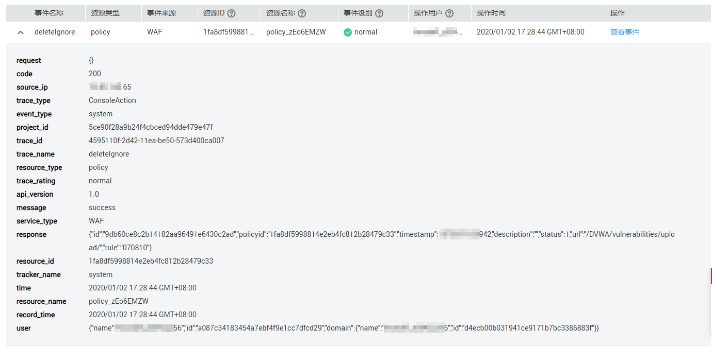
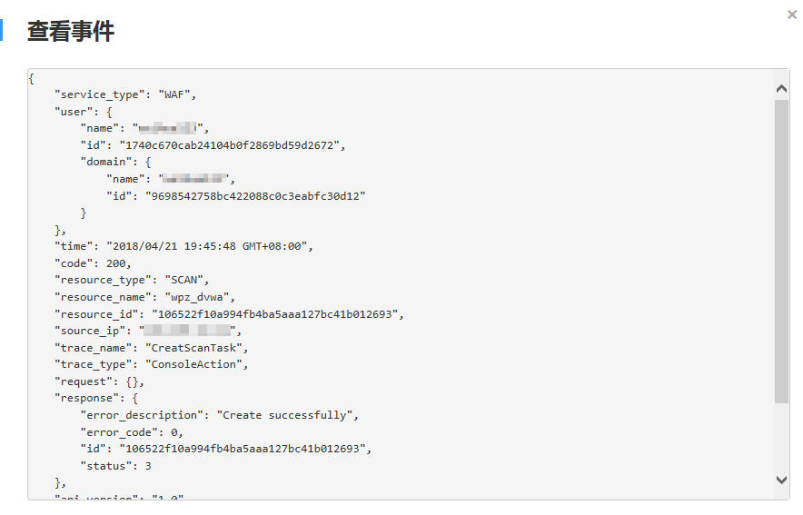

# 查看云审计日志

开启了云审计服务后，系统开始记录WAF资源的操作。云审计服务管理控制台保存最近7天的操作记录。

> **须知：** 
>以下区域购买的WAF支持云审计服务：
>-   华北-北京一
>-   华东-上海二
>-   华南-广州
>-   亚太-香港
>-   亚太-曼谷
>-   亚太-新加坡
>-   非洲-约翰内斯堡
>-   拉美-圣地亚哥

## 查看WAF的云审计日志

1.  [登录管理控制台](https://console.huaweicloud.com/?locale=zh-cn)。
2.  单击管理控制台左上角的，选择区域或项目。
3.  单击页面左上方的，在右方的弹框中选择“管理与部署  \>  云审计服务 CTS“，进入云审计服务信息页面。
4.  单击左侧导航树的“事件列表“，进入事件列表信息页面。
5.  单击事件列表右上方的“Region“，设置对应的操作事件条件。

    当前事件列表支持四个维度的组合查询，详细信息如下：

    -   “事件类型“、“事件来源“、“资源类型“和“筛选类型“。
        -   “事件类型“选择“管理事件“。
        -   “事件来源“选择“WAF“。
        -   “筛选类型“选择“按资源ID“时，还需手动输入某个具体的资源ID。

    -   “操作用户“：在下拉框中选择某一具体的操作用户，此操作用户指用户级别，而非租户级别。
    -   “事件级别“：可选项为“所有事件级别“、“normal“、“warning“、“incident“，只可选择其中一项。
    -   “时间范围“：可在页面右上角选择查询最近1小时、最近1天、最近1周及自定义时间段的操作事件。

6.  单击“查询“，查看对应的操作事件。
7.  在需要查看的记录左侧，单击展开该记录的详细信息，展开记录如[图1](#fig512618236452)所示。

    **图 1**  展开记录  
    

8.  在需要查看的记录右侧，单击“查看事件“，弹出一个窗口，如[图2](#fig111275233454)所示，显示了该操作事件结构的详细信息。

    **图 2**  查看事件  
    

