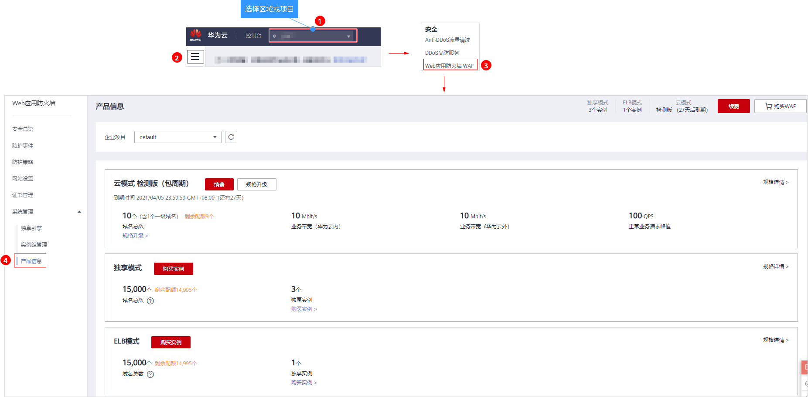

# 查看产品信息

您可以在产品信息界面查看WAF产品信息，包括购买的WAF版本、域名规格等信息。

> **说明：** 
>如果您已开通企业项目，您可以在“企业项目“下拉列表中选择您所在的企业项目，查看该企业项目的产品信息。

## 前提条件

已购买WAF。

## 操作步骤

1.  [登录管理控制台](https://console.huaweicloud.com/?locale=zh-cn)。
2.  进入产品信息页面，如[图1](#waf_01_0288_fig7658182717546)所示。

    **图 1**  进入产品信息页面  
    

3.  在“产品信息“界面，查看购买WAF版本、产品规格、到期时间等信息。

