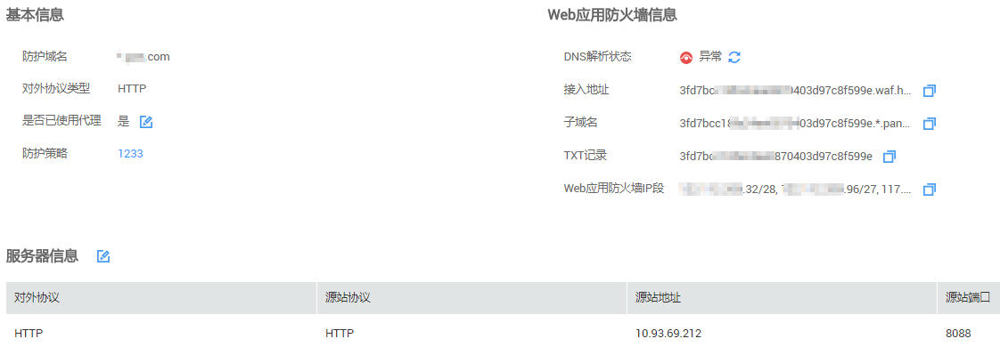

# 查看基本信息

本任务指导用户通过Web应用防火墙查看防护域名的基本信息。

## 前提条件

已获取管理控制台的帐号和密码。

## 操作步骤

1.  登录管理控制台（https://console.huaweicloud.com/）。
2.  单击管理控制台左上角的，选择区域或项目。
3.  单击页面上方的“服务列表“，选择“安全  \>  Web应用防火墙“，在左侧导航树中选择“域名配置“，进入“域名配置“页面，如[图1](#waf_01_0001_zh-cn_topic_0110861354_fig15593418182219)所示。

    **图 1**  域名配置页面  
    

4.  在目标域名所在行的“防护域名“列中，单击目标域名，进入域名基本信息页面。
5.  查看防护域名“基本信息“和“服务器信息“，如[图2](#fig1068529619241)所示。

    **图 2**  查看基本信息  
    

    > **说明：**   
    >-   用户可单击，复制“接入地址“、“子域名“、“TXT记录“、Web应用防火墙IP段。  
    >-   当客户端协议选择HTTPS时，若需要更新“证书“，在证书所在行，单击，在弹出的对话框中，上传新证书或者选择已有证书。  
    >-   若需要修改“是否使用代理“，可单击，在弹出的对话框中，重新配置是否需要使用代理，如果需要使用代理，设置成“是“。  

