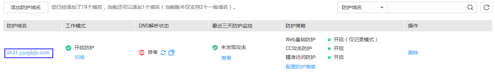
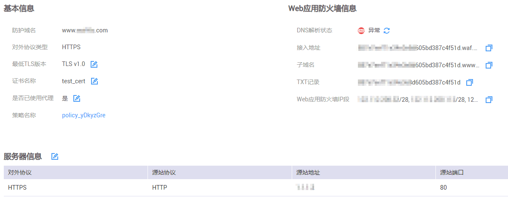
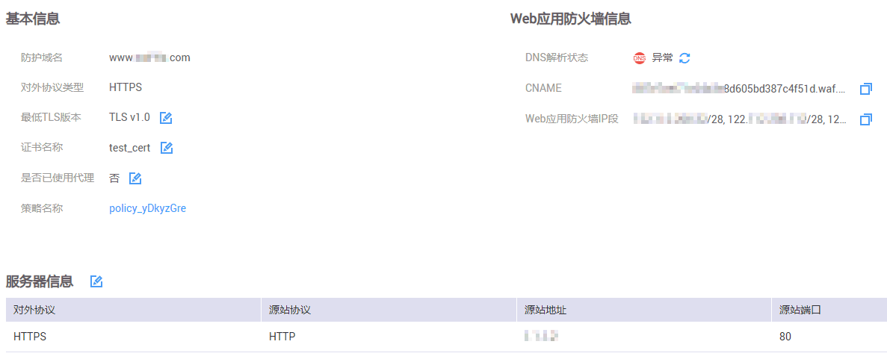

# 查看基本信息

本任务指导用户通过Web应用防火墙查看防护域名的基本信息。

## 前提条件

已获取管理控制台的帐号和密码。

## 操作步骤

1.  登录管理控制台（https://console.huaweicloud.com/）。
2.  单击管理控制台左上角的，选择区域或项目。
3.  单击页面上方的“服务列表“，选择“安全  \>  Web应用防火墙“，在左侧导航树中选择“域名配置“，进入“域名配置“页面，如[图1](#zh-cn_topic_0115673325_zh-cn_topic_0110861354_fig15593418182219)所示，参数说明如[表1](#table1155018311464)所示。

    **图 1**  域名配置页面  
    

    **表 1**  参数说明

    
    <table><thead align="left"><tr id="row7551113184612"><th class="cellrowborder" valign="top" width="37.11%" id="mcps1.2.3.1.1">
参数名称

    </th>
    <th class="cellrowborder" valign="top" width="62.89%" id="mcps1.2.3.1.2">
参数说明

    </th>
    </tr>
    </thead>
    <tbody><tr id="row19551173144613"><td class="cellrowborder" valign="top" width="37.11%" headers="mcps1.2.3.1.1 ">
防护域名

    </td>
    <td class="cellrowborder" valign="top" width="62.89%" headers="mcps1.2.3.1.2 ">
可防护的域名。

    </td>
    </tr>
    <tr id="row655153113465"><td class="cellrowborder" valign="top" width="37.11%" headers="mcps1.2.3.1.1 ">
工作模式

    </td>
    <td class="cellrowborder" valign="top" width="62.89%" headers="mcps1.2.3.1.2 ">
防护模式。

    <ul id="ul662942255114"><li>“开启防护”：开启状态。</li><li>“暂停防护”：关闭状态。</li><li>“Bypass”：该域名的请求直接到达其后端服务器，不再经过WAF。</li></ul>
    </td>
    </tr>
    <tr id="row13551103117464"><td class="cellrowborder" valign="top" width="37.11%" headers="mcps1.2.3.1.1 ">
DNS解析状态

    </td>
    <td class="cellrowborder" valign="top" width="62.89%" headers="mcps1.2.3.1.2 ">
DNS解析状态。

    <ul id="ul16948481100"><li>“异常”：域名未接入WAF或者接入不成功，DNS解析状态异常。</li><li>“正常”：域名接入WAF成功，DNS解析状态正常。</li></ul>
    </td>
    </tr>
    <tr id="row185511331124613"><td class="cellrowborder" valign="top" width="37.11%" headers="mcps1.2.3.1.1 ">
最近三天防护监控

    </td>
    <td class="cellrowborder" valign="top" width="62.89%" headers="mcps1.2.3.1.2 ">
该域名3天内的防护情况。单击“查看”查看具体的防护日志。

    </td>
    </tr>
    <tr id="row555253114618"><td class="cellrowborder" valign="top" width="37.11%" headers="mcps1.2.3.1.1 ">
防护策略

    </td>
    <td class="cellrowborder" valign="top" width="62.89%" headers="mcps1.2.3.1.2 ">
防护策略配置情况。可单击“配置防护策略”配置具体的防护规则，具体的配置方法参见<a href="配置防护规则.md">配置防护规则</a>。

    </td>
    </tr>
    </tbody>
    </table>

4.  在目标域名所在行的“防护域名“列中，单击目标域名，进入域名基本信息页面。
5.  查看防护域名“基本信息“、“Web应用防火墙信息“和“服务器信息“，如[图2](#fig1068529619241)和[图3](#fig1835514173713)所示。

    **图 2**  查看基本信息（使用代理）  
    

    -   您可以单击，复制“接入地址“、“子域名“、“TXT记录“、“Web应用防火墙IP段“。
    -   当客户端协议选择HTTPS时，若需要更新“证书“，在证书所在行的证书名称后，单击，在弹出的对话框中，上传新证书或者选择已有证书。
    -   当客户端协议选择HTTPS时，若需要更新访问源站的“最低TLS版本“，可以单击，在弹出的对话框中，重新选择TLS版本。
        -   默认为TLS v1.0版本，即允许TLS v1.0、TLS v1.1、TLS v1.2的网络协议都可以访问网站。
        -   选择TLS v1.1版本时，允许TLS v1.1、TLS v1.2的网络协议访问网站。
        -   选择TLS v1.2版本时，只允许TLS v1.2的网络协议访问网站。

    -   若需要修改“是否使用代理“，可以单击，在弹出的对话框中，重新配置是否需要使用代理，如果需要使用代理，设置成“是“。

    **图 3**  查看基本信息（未使用代理）  
    

    您可以单击，复制“CNAME“和“Web应用防火墙IP段“。

