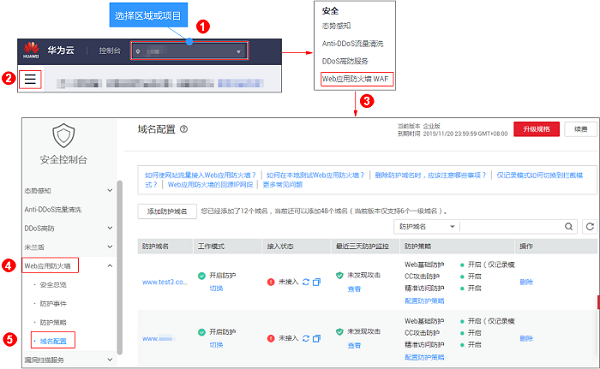
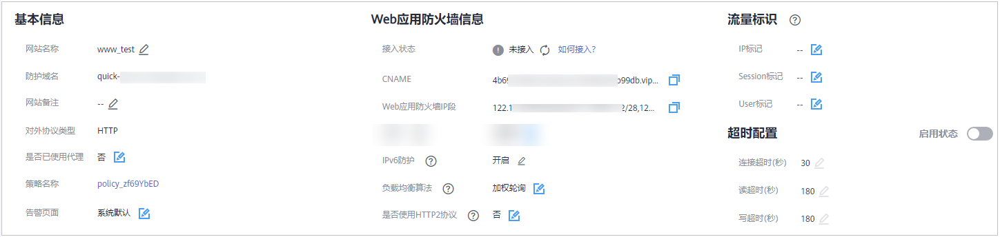

# 查看基本信息

本章节指导用户通过Web应用防火墙查看防护域名的基本信息、切换工作模式、删除防护域名。

## 前提条件

已获取管理控制台的账号和密码。

## 操作步骤

1.  [登录管理控制台](https://console.huaweicloud.com/?locale=zh-cn)。
2.  进入域名列表，如[图1](#fig172535820151)，参数说明如[表1](#table3400125171218)所示。

    **图 1**  进入域名列表入口  
    

    > **说明：**   
    >-   工作模式切换：在“工作模式“列，单击“切换“，选择想要切换的工作模式。  
    >-   检查域名接入状态：在“接入状态“列，单击，刷新域名接入状态。  
    >-   最近三天防护监控：在“最近三天防护监控“列，单击“查看“，查看具体的防护日志。  
    >-   删除防护域名：在“操作“列，单击“删除“，可删除目标防护域名。  

    **表 1**  参数说明

    
    <table><thead align="left"><tr id="row153975521216"><th class="cellrowborder" valign="top" width="37.11%" id="mcps1.2.3.1.1">
参数名称

    </th>
    <th class="cellrowborder" valign="top" width="62.89%" id="mcps1.2.3.1.2">
参数说明

    </th>
    </tr>
    </thead>
    <tbody><tr id="row5397195191213"><td class="cellrowborder" valign="top" width="37.11%" headers="mcps1.2.3.1.1 ">
防护域名

    </td>
    <td class="cellrowborder" valign="top" width="62.89%" headers="mcps1.2.3.1.2 ">
可防护的域名。

    </td>
    </tr>
    <tr id="row43981952121"><td class="cellrowborder" valign="top" width="37.11%" headers="mcps1.2.3.1.1 ">
工作模式

    </td>
    <td class="cellrowborder" valign="top" width="62.89%" headers="mcps1.2.3.1.2 ">
防护模式。单击“切换”，可执行以下三种防护模式的切换：

    <ul id="ul53981652128"><li>“开启防护”：开启状态。</li><li>“暂停防护”：关闭状态。如果大量的正常业务被拦截，比如大量返回418返回码，可以将“工作模式”切换为“暂停防护”。该模式下，WAF对所有的流量请求只转发不检测。该模式存在风险，建议您优先选择误报屏蔽规则处理正常业务拦截问题。</li><li>“Bypass”：该域名的请求直接到达其后端服务器，不再经过WAF。
 说明： 

只有出现以下情况，才能将工作模式切换为“Bypass”：

    <ul id="ul93983591212"><li>当有测试等特殊场景，需要将业务恢复到没有接入WAF的状态，可以通过Bypass功能切换。</li><li>排查网站异常，例如报502、504或其他不兼容等问题。</li><li>在Web应用防火墙前面未使用代理。</li></ul>
    

    
详细操作请参见<a href="切换工作模式.md">切换工作模式</a>。

    </li></ul>
    </td>
    </tr>
    <tr id="row143998501214"><td class="cellrowborder" valign="top" width="37.11%" headers="mcps1.2.3.1.1 ">
接入状态

    </td>
    <td class="cellrowborder" valign="top" width="62.89%" headers="mcps1.2.3.1.2 "><ul id="ul23990531214"><li>“未接入”：域名未接入WAF或者接入不成功。</li><li>“已接入”：域名接入WAF成功。</li></ul>
    </td>
    </tr>
    <tr id="row63991155124"><td class="cellrowborder" valign="top" width="37.11%" headers="mcps1.2.3.1.1 ">
最近三天防护监控

    </td>
    <td class="cellrowborder" valign="top" width="62.89%" headers="mcps1.2.3.1.2 ">
该域名3天内的防护情况。单击“查看”查看具体的防护日志。

    </td>
    </tr>
    <tr id="row239916516127"><td class="cellrowborder" valign="top" width="37.11%" headers="mcps1.2.3.1.1 ">
防护策略

    </td>
    <td class="cellrowborder" valign="top" width="62.89%" headers="mcps1.2.3.1.2 ">
防护策略配置情况。可单击“配置防护策略”配置具体的防护规则，具体的配置方法参见<a href="配置防护规则.md">配置防护规则</a>。

    </td>
    </tr>
    <tr id="row140095131212"><td class="cellrowborder" valign="top" width="37.11%" headers="mcps1.2.3.1.1 ">
操作

    </td>
    <td class="cellrowborder" valign="top" width="62.89%" headers="mcps1.2.3.1.2 ">
单击“删除”，可删除目标防护域名。

    
 说明： 
<ul id="ul74004541216"><li>如果要删除的防护域名已经接入Web应用防火墙，在删除防护域名前，请您先到DNS服务商处将域名重新解析，指向源站服务器IP地址，否则该域名的流量将无法切回服务器，影响正常访问。</li><li>删除域名后，1分钟内生效，且不可恢复，请谨慎删除防护域名。</li></ul>
    

    </td>
    </tr>
    </tbody>
    </table>

3.  在目标域名所在行的“防护域名“列中，单击目标域名，进入域名基本信息页面。
4.  查看防护域名“基本信息“、“Web应用防火墙信息“和“服务器信息“，如[图2](#fig1068529619241)所示。

    **图 2**  查看基本信息  
    

    -   您可以单击，复制“CNAME“、“Web应用防火墙IP段“。
    -   获取“子域名“、“TXT记录“： 在“接入状态“所在行，单击“如何接入？“，在弹出的“接入指导“对话框中，复制“子域名“和“TXT记录“。
    -   当客户端协议选择HTTPS时，若需要更新“证书“，在证书所在行的证书名称后，单击，在弹出的对话框中，上传新证书或者选择已有证书。关于证书更新的详细内容请参见[更新证书](更新证书.md)。
    -   当客户端协议选择HTTPS时，若需要更新访问源站的TLS版本和TLS的加密套件，单击，在弹出的对话框中，重新选择TLS版本和TLS的加密套件。关于配置TLS的详细内容请参见[配置TLS最低版本和加密套件](配置TLS最低版本和加密套件.md)。
    -   若需要修改“是否使用代理“，可以单击，在弹出的对话框中，重新配置是否需要使用代理，如果需要使用代理，设置成“是“。
    -   “告警页面“默认为“系统默认“的页面，您也可以单击，在弹出的对话框中，配置“自定义“或者“重定向“页面。

